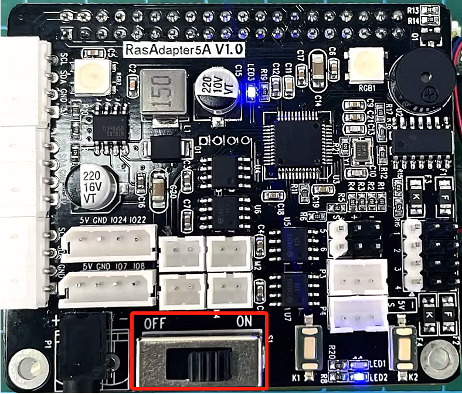

# 学前先看

## 1. 认识MasterPi智能视觉机器人

### 1.1 产品简介

MasterPi是一款基于树莓派开发的智能机器人，它采用麦克纳姆轮底盘，并搭载5DOF机器人和高清摄像头，配合OpenCV能实现色块分拣、目标追踪、视觉巡线、智能搬运等功能。

MasterPi搭载RGB发光超声波传感器，可以控制灯光变化，并能实现自主避障。此外，它还支持拓展多种传感器，实现更多感知的融合。

### 1.2 产品清单

## 2. 图文组装教程

### Step 1：安装小车底盘

1-1

1-2

1-3

### Step 2：安装电池盒

2-1

### Step 3：安装麦轮

3-1

3-2

### Step 4：安装树莓派主板与扩展板

4-1

4-2

4-3

### Step 5：安装机械臂并接线

5-1

5-2

### Step 6：安装上盖

6-1

6-2

## 3. 设备充电、开机及自检

**开机之前请先按照上文"组装教程"内容组装好机器人。**

### 3.1 锂电池充电及安装

由于运输途中电池不能充满，所以在初次开机前，建议先给电池充满电，以下是具体充电方法：

1) 拿出电池充电器，将两节18650的电池（选配）按照正负极对应（正对正，负对负）装到电池充电器中。

:::{Note}
注意！电池正负极切勿装反！再通过数据线将电池充电器（选配）和充电头（5V 3A，需自备）进行连接，最后连接电源。
:::

2) 等待充电完成（适配器指示灯在未通电的状态下为绿色，通电后为红色代表充电中（充电时长约为5个小时左右）、指示灯由红色变为绿色代表充电完成），充电完成后，请尽快拔掉充电器，切勿一直充电。

3) 安装电池前请确保电池盒的开关拨到"**OFF**"档。

4) 将充满电的电池安装到电池盒中，并盖上电池盖。注意！电池正负极切勿装反！

### 3.2 检查摄像头是否连接

在开机之前请先确认摄像头连接线是否已连接牢固（摄像头连接线可接入树莓派主板上4个USB接口的任意一个）。

### 3.3 开机说明

1) 将电池盒的开关拨到"**ON**"档，再将树莓派扩展板的开关由"**OFF**"推动到"**ON**"，此时树莓派的LED1、LED2常亮，稍等片刻后LED2由常亮变为每隔1秒闪亮一次、云台回到初始姿态、蜂鸣器发出"嘀"的一声，即设备成功开机。

树莓派本身也是电脑，开机启动需要一小段时间，开机时间约30秒左右，请耐心等待。

:::{Note}
- LED3为信号指示灯，通电时点亮，设备运行过程中是常亮的状态，树莓派与扩展板通讯时闪烁一次；
- LED2为通信指示灯，设备出厂默认的网络连接模式为直连模式，设备开机成功后LED2每隔1S闪烁一次；若将其设置为局域网模式，LED2则会常亮（关于网络连接模式的设置与介绍，可参照"**[上手试玩\1 手机APP安装和连接]()**"课程进行了解）；
- 设备运行过程中，若LED3灯光变暗，并保持常亮的状态，则表示电源没电了，需要充电。
:::

2) 设备开机成功后，出厂默认为AP直连模式，并将产生一个以HW开头的热点。

### 3.4 启动自检程序

机器人在开机成功后，可通过按键来启动自检服务，用以对机器人的舵机、电机进行检测，可以帮助用户排查接线是否正确。

若启动自检后设备无法按照下文所示内容进行转动，则需参照 "**[学前先看\第2课 动手组装](#anchor_2)**" 重新接线。

1) 按下扩展板上的KEY1按键即可开启自检功能。

2) 舵机与电机将按照下图所示顺序依次转动。

### 3.5 查看电池电量

有以下两种方式可查看：

- #### 3.5.1 通过观察扩展板LED的灯查看

树莓派扩展板上的LED灯亮微弱蓝光时，说明电池电量不足，无法维持开机及玩法运行，需尽快给电池充电。

- #### 3.5.2 通过手机APP画面内查看

在手机APP的回传画面中会直接显示电池的实时电量，当电压小于7V时，电池电量不足，需尽快给电池充电（手机APP体验可前往本章节"**[上手试玩\2. 手机APP试玩]()**"）。

本节结束后，请依次前往本章节"**[5. 偏差调试](#anchor_5)**"对机械臂进行偏差调节（切勿跳过此步骤！）。

## 4.远程桌面工具安装与连接

### 4.1 准备工作

- #### 4.1.1 硬件准备

准备一台笔记本电脑，如使用台式电脑请自备无线网卡 (需支持5G频段) 。

- #### 4.1.2 VNC远程工具的安装

VNC是一款图形化远程控制软件。通过连接树莓派的Wi-Fi热点，可以直接在电脑端控制树莓派，VNC的安装步骤如下：

1) 双击安装程序"**2 软件工具\3.远程连接工具\2.VNC（可视化桌面工具）\Windows版本-\>VNC-Viewer-6.17.731-Windows**"，将安装语言选择为"**English**"，并点击"**OK**"按键。

 
2) 点击"**Next**"按键。

3) 勾选同意协议，并点击"**Next**"按键。

4) 保持默认安装位置，并点击"**Next**"按键。跳转至下一界面时，直接点击"**Install**"按键。

5) 等待片刻后，出现安装完成的提示界面，点击"**Finish**"按键即可。

6) 安装完成，点击图标即可打开VNC。

- #### 4.1.3 设备开机

参照"**[3. 设备充电、开机及自检](#anchor_3)**"课程，打开设备开关，将设备开机。稍等片刻后，扩展板上的LED2会开始闪烁，蜂鸣器会鸣叫一次，代表设备开机成功。

### 4.2 设备连接

1) MasterPi开机成功后，默认连接模式是AP直连模式，此时将会产生一个以"HW"开头的热点，我们可以在电脑端搜索并连接这个热点，如下图所示：

2) 点击连接，输入密码"**hiwonder**"。

3) 连接成功后，打开VNC Viewer，在地址栏输入树莓派默认的IP地址：192.168.149.1，按下回车。如果出现安全连接相关的提示框，点击"Continue"按键即可。 

4) 在账号登录窗口填写所需信息，账号栏（Username）输入"**pi**"，密码栏（Password）输入"**raspberrypi**"，并勾选记住密码（Remember password）。点击"OK"按键后，便可远程打开树莓派桌面。

5) 桌面如下图所示。（如果出现黑屏，只显示鼠标指针，可尝试重启树莓派。）

### 4.3 界面介绍

通过VNC成功连接MasterPi之后，操作界面如下所示：

下表为常用功能说明：

<table class="docutils-nobg" border="1">
<colgroup>
<col  />
<col  />
</colgroup>
<tbody>
<tr>
<td >图标</td>
<td >功能</td>
</tr>
<tr>
<td ></td>
<td >
应用菜单，点击之后可选择不同应用。

</td>
</tr>
<tr>
<td ></td>
<td >系统自带浏览器</td>
</tr>
<tr>
<td ></td>
<td >文件管理器</td>
</tr>
<tr>
<td ></td>
<td >LX终端，点击之后，可在打开界面输入命令行。</td>
</tr>
<tr>
<td ></td>
<td >回收站，可找回近期删除的文件。</td>
</tr>
<tr>
<td ></td>
<td >上位机软件，可通过此软件调整机械臂、调节颜色阈值。</td>
</tr>
<tr>
<td ></td>
<td >点击可使系统桌面显示全屏或退出全屏。</td>
</tr>
<tr>
<td ></td>
<td >退出全屏。</td>
</tr>
<tr>
<td ></td>
<td >
电源，点击可选择关机、重启、退出

</td>
</tr>
</tbody>
</table>

## 5. 偏差调试

### 5.1 判断是否需要调节偏差

机械臂在拼装完成后可能会产生一定小范围的偏差，我们可通过以下步骤来进行检验。

1) 通过VNC远程连接MasterPi，点击系统桌面图标，打开上位机。

2) 点击上位机界面中的"**复位舵机**"按钮。

3) 如果机械臂笔直朝上，则无需调整偏差。如下图所示：

4) 而例如下图这两种情况，则需要调节偏差。

### 5.2 偏差产生的原因

偏差通常在以下情况下产生：

1) 舵机在中位的情况下，安装舵盘时转动了舵机主轴的角度，导致初始位置发生了角度偏差（出厂默认的舵机角度为中位位置）。

2) 舵机安装舵盘时未转动主轴角度，但固定到支撑架方向或角度存在小的偏移，导致细微偏差。

需要注意的是如果不对偏差进行调节，可能会导致机体运动受限，从而影响一些运动效果。

另外，偏差值在100以内（角度30°内），属于正常可调范围。如果产生的偏差较大，超出100，将无法通过软件进行调整，需要将偏差较大的舵机主轴螺丝拆下，旋转至竖直方向的姿态再安装一次。

### 5.3 偏差调节的目标

机械臂上电复位后舵机主轴支架之间需保持平行，也就是舵机所在支架竖直方向上的螺丝要处在同一条直线上。

### 5.4 调节方法

- #### 5.4.1 小幅度偏差调节方法

小幅度偏差即偏差值小于100（偏差角度小于30°）的情况，本节课以调节3号和四号舵机为例进行调节。（已进行"**复位舵机**"操作）

1) 观察机械臂各个位置舵机的姿态。可以看出只需要调节3号和4号舵机的偏差值。

2) 点击"**读取偏差**"，在弹出的偏差提示中点击"**OK**"。

3) 点击ID3和ID4舵机图标下方的小滑杆，使全部舵机处于同一条直线上。

**可多次点击鼠标左键或者滑动鼠标滚轮来微调滑杆数值。**

4) 调节完毕后点击"**保存偏差**"，再点击"**OK**"，将偏差保存到控制板中。

5) 再次点击"**舵机回中**"，观察机械臂偏差调节完成后是否与"[5.3 偏差调节的目标](#anchor_5_3)"一致，若一致，则表示偏差已成功调节。若不一致，针对不一致的地方返回再依次按照步骤进行微调即可。

- #### 5.4.2 大幅度偏差调节方法

大幅度偏差即偏差值大于100（偏差角度大于30°）的情况，本节课以下图为例进行调节。（已进行"**复位舵机**"操作）

1) 观察机械臂各个位置舵机的姿态。可以看出3号舵机有大幅度的偏差，因此需要重新对该舵机进行中位。

2) 将3号舵机的主轴螺丝取下，小幅度的拨开舵机支架，让舵机主轴与舵盘分离。

:::{Note}
拨动支架时，力气不要太大，以免支架发生形变。
:::

3) 拆开车身的钣金支架，拔下3号舵机线。

4) 自备一个中位器，拿出附赠的USB数据线，一端通电，另一端连接中位器，然后以"**红接正，棕接负**"的形式将3号舵机线插入中位器，完成舵机中位。

5) 舵机中位后，将舵机连接线以"红接正，棕接负"的形式接回树莓派扩展板的3号舵机接口，然后舵盘以正"十"字的形式扣回舵机主轴，并将支架装回3号舵机主轴，拧上螺丝。

6) 再次点击"**复位舵机**"，观察机械臂偏差调节完成后是否与"[5.3 偏差调节的目标](#anchor_5_3)"一致，若一致，则表示偏差已成功调节。若存在小幅度偏差，则根据"[小幅度偏差调节方法](#anchor_5_4_2)"内容再进行微调即可。

