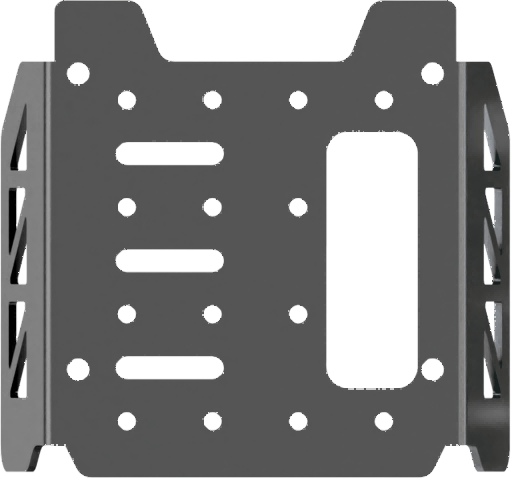
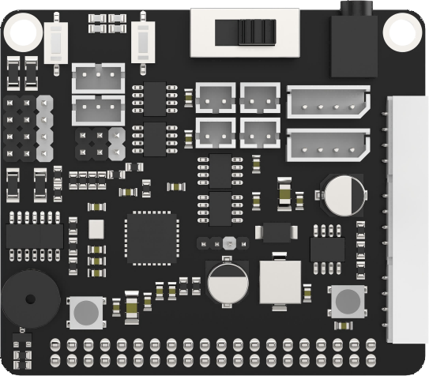
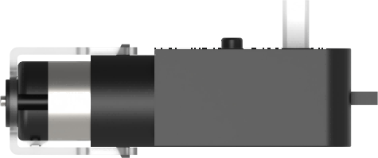
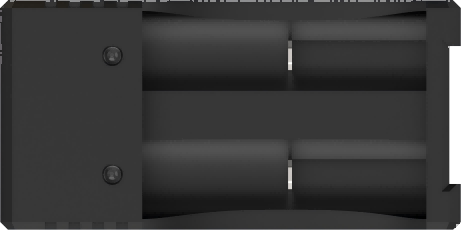
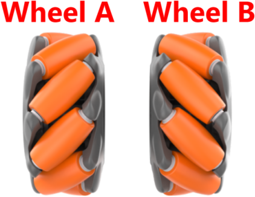
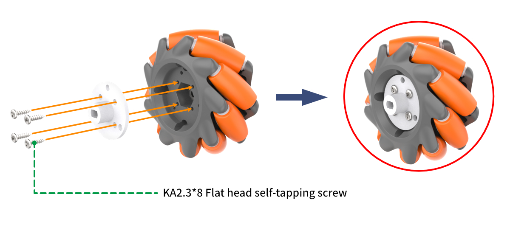
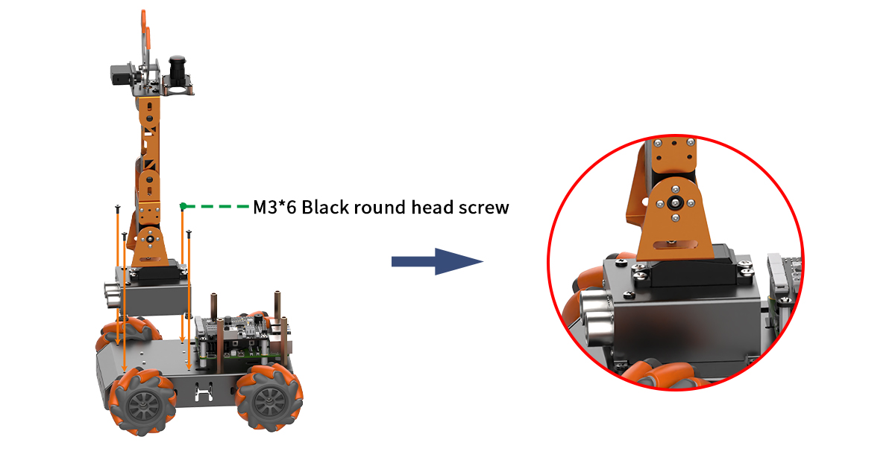
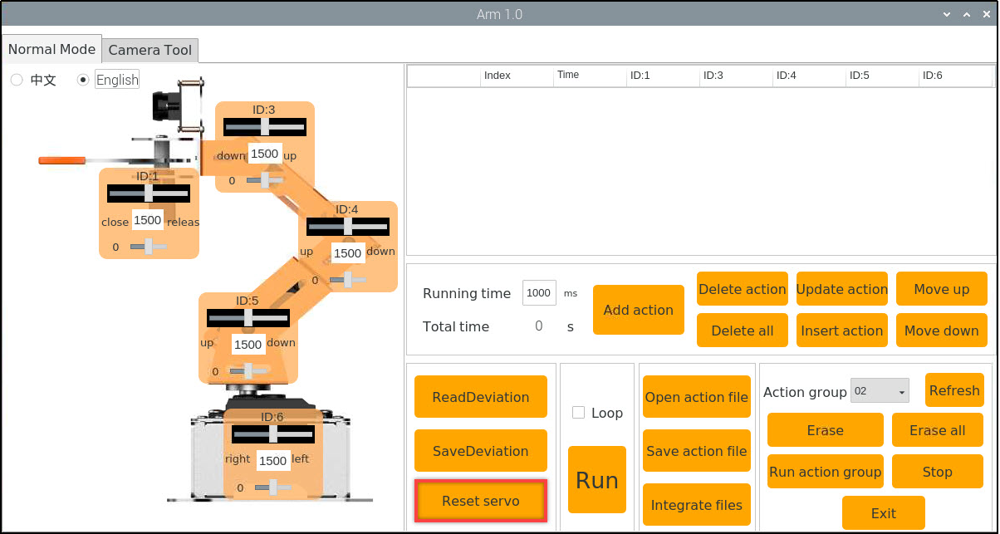

# 1. Getting Ready

## 1.1 Introduction to MasterPi 

**1.1.1 Product Introduction**

MasterPi Intelligent robot is developed on Raspberry Pi. Equipped with mecanum chassis, 5-DOF robot and high definition camera, it is able to implement color sorting, object tracking, line follow, Intelligent transport and etc by OpenCV.
Combining with RGB glowing ultrasonic sensor, MasterPi can control light color and perform automatic obstacle avoidance. In addition, various sensor can be installed on MasterPi for more perception functions.

**1.1.2 Usage Precautions**

Please pay attention to the following points when using and storing this product:

(1) This product contains conductive components. Avoid contact with metal objects when powered on.

(2) After the robot is powered on, do not forcibly move the servo, as this may cause damage.

(3) If the robot runs for an extended period, the servos may become hot. Allow the robot to "rest" and wait for the servos to cool before resuming operation.

(4) Keep your face, glasses, and other body parts away from the robot while it is operating. Do not place fingers within the joint movement range to prevent injury. Also, be cautious of falls from high edges.

(5) The robot's servos are precision components and consumable parts. They may need replacement after long-term or intensive use.

(6) If the product will not be used for an extended period, fully charge the battery, remove it, and store it in a cool, dry place.

**1.1.3 Copyright Notice**

This manual is the property of Shenzhen Hiwonder Technology Co., Ltd. No organization or individual is permitted to reproduce, copy, translate, or distribute any content from this manual without authorization.
Any unauthorized use or infringement of this manual's copyright will be subject to legal action by our company.

**1.1.4 Disclaimer**

The product described in this manual (including hardware, software, etc.) is provided "as is." Every effort has been made to ensure the accuracy of this manual, but we cannot guarantee it is completely free from errors or omissions. This document is regularly reviewed, and we welcome feedback for improvements.
Product features and specifications may change with version upgrades. For the latest product information, please contact customer service when placing your order.
Furthermore, unless explicitly stated by Hiwonder, we are not responsible for any losses resulting from product malfunctions or damage under extreme conditions outside of typical use cases.

## 1.2 Packing List

<table class="docutils-nobg" border="1" style="text-align:center;">
  <thead>
    <tr>
      <th style="text-align: center">No.</th>
      <th style="text-align: center;width:33%">Product Name</th>
      <th style="text-align: center">Quantity</th>
      <th style="text-align: center">Picture</th>
    </tr>
  </thead>
  <tbody>
    <tr>
      <td>1</td>
      <td>MasterPi robotic arm(assembled)</td>
      <td>1</td>
      <td></td>
    </tr>
    <tr>
      <td>2</td>
      <td>MasterPi chassis</td>
      <td>1</td>
      <td></td>
    </tr>
    <tr>
      <td>3</td>
      <td>MasterPi Tail extension bracket</td>
      <td>1</td>
      <td></td>
    </tr>
    <tr>
      <td>4</td>
      <td>Raspberry Pi 5</td>
      <td>1</td>
      <td></td>
    </tr>
    <tr>
      <td>5</td>
      <td>Raspberry Pi 5 expansion board</td>
      <td>1</td>
      <td></td>
    </tr>
    <tr>
      <td>6</td>
      <td>Active heatsink+Thermal silicone pads</td>
      <td>1</td>
      <td></td>
    </tr>
    <tr>
      <td>7</td>
      <td>Raspberry Pi boardcard reader</td>
      <td>1</td>
      <td></td>
    </tr>
    <tr>
      <td>8</td>
      <td>32G TF card</td>
      <td>1</td>
      <td></td>
    </tr>
    <tr>
      <td>9</td>
      <td>TT motor</td>
      <td>4</td>
      <td></td>
    </tr>
    <tr>
      <td>10</td>
      <td>Battery case</td>
      <td>1</td>
      <td></td>
    </tr>
    <tr>
      <td>11</td>
      <td>Micro USB cable</td>
      <td>1</td>
      <td></td>
    </tr>
    <tr>
      <td>12</td>
      <td>Charger</td>
      <td>1</td>
      <td></td>
    </tr>
    <tr>
      <td>13</td>
      <td> Lithium baterries </td>
      <td>2</td>
      <td></td>
    </tr>
    <tr>
      <td>14</td>
      <td>Orange mecanum wheel</td>
      <td>4</td>
      <td></td>
    </tr>
    <tr>
      <td>15</td>
      <td>White wheel coupling</td>
      <td>3</td>
      <td></td>
    </tr>
    <tr>
      <td>16</td>
      <td>4pin wire</td>
      <td>1</td>
      <td></td>
    </tr>
    <tr>
      <td>17</td>
      <td>Ribbon</td>
      <td>10</td>
      <td></td>
    </tr>
    <tr>
      <td>18</td>
      <td>3*3cm blocks</td>
      <td>3</td>
      <td></td>
    </tr>
    <tr>
      <td>19</td>
      <td>Screwdriver</td>
      <td>1</td>
      <td></td>
    </tr>
    <tr>
      <td>20</td>
      <td>Accessory bag (M4*50 Double-pass copper column*6 M2.5*5+6 Single-pass nylon column*6 M2.5*16 Double-pass nylon column*6 M4*8 Round head screw*12 M3*4 Flat head screw*8 M3*6 Black round head screw*8 M4*8 Round head screw*8 KA2.3*8 Flat head self-tapping screw*20 M2.3*20 Round head self-tapping screw*8 M3*25 Round head screw*12 M3*6*0.5 Gasket*8 M3 Nut*12 M2*4 Round head screw*6 R -3075 Black Nylon rivet*2 R -3055 Black Nylon rivet*2 A2*6 Round head self-tapping screw*4 M2*6 Round head screw*4)</td>
      <td>1</td>
      <td></td>
    </tr>
  </tbody>
</table> 

## 1.3 Introduction to Raspberry Pi 5

Raspberry Pi, known as "树莓派" in Chinese, abbreviated as RPi or RasPi/RPI. It is a credit-card sized computer developed by the Raspberry Pi Foundation in the UK. It is hoped that it can help children worldwide to learn programming and understand how computers work. The Raspberry Pi can connect to a keyboard, mouse, and Internet cable. It also features a TV output interface for analog video signals and an HDMI high-definition video output interface. It is a capable little device that enables people of all ages to explore computing and to learn how to program in languages like Python. And it is capable of doing everything you'd expect a desktop computer to do, from browsing the internet and playing high-definition video, to making spreadsheets, word-processing, and playing games.

Raspberry Pi icon

**1.3.1 Brief Introduction of Raspberry Pi 5**

Raspberry Pi 5 features a 64-bit quad-core Cortex A76 processor with 2.4 GHz operating frequency. Compared to the Raspberry Pi 4, the CPU performance has increased by 2 to 3 times. Apart from the significant improvement in graphics performance with the 800MHz VideoCore VII GPU, it also supports dual 4Kp60 display output via HDMI, and advanced camera through restructuring Raspberry Pi Image Signal Processor. It provides consumers with a smooth desktop experience and opens up new applications for industrial customers.

This is the first full-sized Raspberry Pi computer, utilizing chips built internally by Raspberry Pi. RP1 provides the majority of the I/O functions for Raspberry Pi 5 and achieves a significant leap in peripheral performance and functionality. The total USB bandwidth has more than doubled, thus speeding up the transfer rate to external UAS drives and other high-speed peripherals. The dedicated dual-channel 1Gbps MIPI camera and display interface on earlier models have been replaced by a pair of quad-channel 1.5Gbps MIPI transceivers, tripling the total bandwidth and supporting a maximum of two cameras or displays in any combination. By supporting SDR104 high-speed mode, the peak performance of the SD card is doubled. This platform introduces a single-channel PCI Express 2.0 interface for the first time, providing support for high-bandwidth peripherals.

**1.3.2 Hardware Structure and Feature**

* **Hardware structure of Raspberry Pi 5 is as pictured**

* **Main features**

(1) Four Arm Cortex-A76 cores @ 2.4GHz, with hardware AES encryption support, 512KB L2 cache per core, and a 2MB L3 cache;

(2) 4GB or 8GB LPDDR4X-4267 SDRAM;

(3) Dual 4Kp60 HDMI display output, supporting HDR, and a 4Kp60 HEVC decoder;

(4) VideoCore VII Graphics, support OpenGL-ES 3.1、Vulkan 1.2;

(5) Raspberry Pi Image sensor processor;

(6) Raspberry Pi connector for PCIe (one 2.0 port, additional HAT is needed);

(7) 802.11ac Dual-band Wi-Fi and Bluetooth 5.0 (support BLE);

(8) Gigabit Ethernet;

(9) Two USB2.0, two USB 3.0 (capable of achieving full throughput simultaneously);

(10) Poe support (additional HAT is needed);

(11) Two-lane 4-lane MIPI CSI/DSI connector, support 2x display; or 2x camera; or one display + one camera;

(12) Raspberry Pi 40 pin GPIO connector;

(13) fan port;

(14) Real-time clock;

(15) Power supply key;

* **Advantages**

(1) Powerful computational performance;

(2) Open-source hardware and ease of use;

(3) Compared to Microsoft systems, tools are free;

(4) A low-cost development platform and troubleshooting tool;

(5) All applications can be opened without internet access;

(6) Compact size, equivalent to the size of a credit card;

It is precisely because of these advantages that people around the world choose Raspberry Pi more often to learn programming skills, build hardware projects, undertake home automation projects, and even use them in industrial applications.

**1.3.3 Dimension Diagram (unit: mm)**

**1.3.4 The Use of Raspberry Pi**

(1）Web server

The Raspberry Pi can stay around the clock because it only requires very little power. No need for cooling fans or large amounts of electricity; accessing web pages through the internet or solely within a local network is also sufficiently fast.

(2）Laptop

The Raspberry Pi can be used as the "brain" of a laptop, just need to equip it with a computer screen.

(3）Home theater set-top box

There are many free operating systems that can turn the Raspberry Pi into a set-top box that can run your favorite content.

(4）Game simulator

Use the free RetroPie OS on any Raspberry Pi to play Game Boy, arcade, SNES and other games.

(5）Monitor

With simple steps and an external camera, a simple monitoring system can be built.

(6）Wi-Fi extender

If you cannot get a good Wi-Fi signal in some rooms of your home, your Raspberry Pi can help by turning into an extender. On the Raspberry Pi's built-in Wi-Fi, only a USB Wi-Fi adapter is required to repeat the signal.

(7）Music streamer and multi-room audio

Using the right software and some Raspberry Pi, you can create an inexpensive sound system to play music in different locations in your home.

As mentioned above, Raspberry Pi is not only a small developer, but also a "caring companion" in life.

## 1.4 Burn Raspberry Pi Image

Raspberry Pi can work after operating system is installed to SD card. System image and tools can be found in the same folder.

**1.4.1 Preparation**

**(1) Hardware:**

Prepare a card reader, SD card (over 16GB) and a computer (WIN10).

**(2) Software:**

Install SD card formatting tool, SD Card Formatter and image burning tool, Win32DiskImager. This section uses these two tools as examples for illustration.

**1.4.2 Format SD Card** 

:::{Note}

if SD card is empty, you can skip this step.

:::

(1) Insert SD card to card reader, and then connect it to your computer.

(2) Open SD Card Formatter. Select corresponding card, and then click "**Format**".

(3) If window below appears, click "Yes". It takes time to format. Please be patient!

**1.4.3 Burn Image**

(1) Open Win32DiskImager. Click on  to select system image. (TurboPi image can be found in the same folder. Download and extract the image before operation. The following pictures are just for reference, please subject to the actual TurboPi's system image.) In "**Device**" bar, select boot of SD card. Next, click "**Write**".

:::{Note}

the storage path for image file cannot contain Chinese.

:::

(2) Click "**Yes**" when the following window pops up.

(3) Once "Write Successful" prompt shows up, the image is written successfully. If error is reported, please close firewall, and then reinsert SD card to operate again.

:::{Note}

if you are asked to whether to format partition after writing image, just ignore it.

:::

## 1.5 Robot Assembly

Step 1: Install Robot Car Chassis

1-1

1-2

1-3

Step 2: Install Battery Case

2-1

Step 3: Install Mecanum Wheels

3-1

3-2

Step 4: Install Raspberry Pi Board and Expansion Board

4-1

4-2

Step 5: Install Robotic Arm and Connect Wiring

5-1

5-2

Step 6: Install Top Cover

6-1

6-2

## 1.6 Charging and Power-On Status Description

**1.6.1 Lithium Battery Charging and Installation**

Due to the battery not being fully charged during transportation for safety, it is recommended to fully charge the battery before the first use. The detailed charging method is as follows:

(1) Take out the battery charger, and install two 18650 batteries (optional purchase) into it. The positive and negative terminals must be matched correctly to avoid short circuits or damage to the device. 

:::{Note}
Please do not reverse the polarity of the battery! Then connect the battery charger (optional purchase) to the charging head (5V 3A, needed to be prepared by yourself) with the data cable. Finally, connect the power supply.
:::

(2) Wait for the charging to complete. The adapter indicator will be green when not powered on, and red when charging is in progress, which takes about 5 hours. The indicator will turn from red to green indicating the charging is complete. Once the charging is complete, please unplug the charger as soon as possible. Do not leave it charging continuously.

(3) Please ensure the battery box is being switched to "OFF" before installing the battery.

(4) Install the fully charged battery into the battery box and cover it with the battery lid. Please do not reverse the polarity of the battery! 

**1.6.2 Check Camera Connection**

Before turning on the device, please ensure that the camera connector wire is securely connected to any of the 4 USB interfaces on the Raspberry Pi 5. 

**1.6.3 Startup Instruction**

(1) Switch the battery box to "ON", and push the switch on the Raspberry Pi expansion board from "OFF" to "ON". The LED1 and LED2 on the Raspberry Pi will remain on. After a short while, LED2 will change from being constantly on to flashing every 1 second. The pan-tilt will return to its initial position, and the buzzer will make a "beep" sound, indicating that the device has successfully powered on.

:::{Note}

The Raspberry Pi itself is also a computer and takes a short period to start up. The boot-up time is approximately 30 seconds, so please wait with the patient.

:::

:::{Note}

* LED1 is the signal indicator, which lights up when the device is powered on and remains on during operation. When the Raspberry Pi communicates with the expansion board, it will flash once.
* LED2 is the communication indicator. The default network connection mode of the device before delivery is AP mode. After successful startup, it will flash every 1 second. If it is set to LAN mode, LED2 will remain on. For information on network connection mode settings and introductions, please refer to the tutorials in the same chapter as this section.
* During device operation, if the LED1 and LED2 lights dim and remain constantly on, it indicates that the power supply is low and needs to be charged.
:::

(2) After successful startup, the device defaults to AP mode before delivery and generates a hotspot starting with "HW".

**1.6.4 Activate Self-check Program**

After successful startup, the MasterPi can initiate the self-check service by pressing a button. This is used to detect the servos and motors of the MasterPi, helping you troubleshoot wiring issues.

If the device cannot rotate according to the instructions provided in the following text after starting the self-check program, please refer to "[1. Getting Ready\ 1.5 Robot Assembly](#anchor_2)" to rewire.

(1) Press the LEY1 on the expansion board to activate the self-check function.

(2) The servos and motors will rotate in the following sequence as shown below.

**1.6.5 Check Battery Level**

There are two methods to check the battery level. 

* **observe the LED light on the expansion board** 

When the LED light on the Raspberry Pi expansion board emits a weak blue light, it indicates that the battery power is low and cannot sustain the device startup and game. The battery needs to be charged as soon as possible.

* **check the battery level within the app** 

In the app's live camera feed, the real-time battery power will be directly displayed. When the voltage is less than 7V, the battery power is low and needs to be charged as soon as possible. Please refer to "" in this chapter for detailed information on app control.

After completing this section, please proceed to "[1.7 Remote Desktop Tool Installation and Connection](#anchor_1_7) and [1.8.3 The Standard of Deviation Adjustment](#anchor_5_3)" in this chapter to adjust the deviation of the robotic arm. Do not skip this step!

## 1.7 Remote Desktop Installation and Connection

**1.7.1 Preparation**

* **Hardware**

Prepare a computer. If you are using desktop computer, wireless network card is required.The network card should support 5G band.

* **Install VNC**

VNC is a graphical remote desktop control software. Through connecting your computer to the WiFi generated by Raspberry Pi, you can control Raspberry Pi. Installation of VNC is as below.

(1) Double-click the installation program "VNC-Viewer-6.17.731-Windows" in the same directory as this section. Select the installation language as "English" and lick "OK".

(2) Click "**Next**".

(3) Tick **"I accept the terms in the License Agreement"**. Then click **"Next"**.

(4) Remain default location where the software is installed. Click **"Next"** to proceed next interface. Then directly click **"Install"**.

(5) When the installation completes, click **"Finish"**.

(6) Clickto open VNC.

* **Start Robot**

Start Robot When LED1 on expansion board starts flickering and buzzer emits one beep, robot boots up successfully.

**1.7.2 Connect to Robot**

(1) After turning Robot on successfully, the default mode is AP direct connection mode. Robot generates a WiFi starting with HW. Connect your computer to this WiFi.

(2) Input password. The password is **"hiwonder"**.

(3) After connection, open VNC Viewer. Input the default IP address of Raspberry Pi, **192.168.149.1**, and then press Enter. If you receive security warning, select **"Continue"**.

(4) Input username and password. **(Username: pi  Password: raspberrypi)**. Click **"OK"** to enter Raspberry Pi desktop.

(5) The desktop is as pictured. If black screen occurs or only cursor leaves on the screen, restart Raspberry Pi.

**1.7.3 Introduction to Desktop**

The desktop is as pictured after connecting Robot through VNC successfully.

The following table demonstrates common functions:

<table  class="docutils-nobg" border="1" style="text-align:center;">
<colgroup>
<col  />
<col  />
</colgroup>
<tbody>
<tr>
<td >Icon</td>
<td >Function</td>
</tr>
<tr>
<td ></td>
<td >
Application menu. Click to select different applications.

</td>
</tr>
<tr>
<td ></td>
<td >Browser.</td>
</tr>
<tr>
<td ></td>
<td >File manager.</td>
</tr>
<tr>
<td ></td>
<td >LX terminal. Click to input command line in the opened interface.</td>
</tr>
<tr>
<td ></td>
<td >Trash. You can find the files deleted here.</td>
</tr>
<tr>
<td ></td>
<td >PC software. You can adjust pan tilt and adjust color threshold on it.</td>
</tr>
<tr>
<td ></td>
<td >Full screen or exit full screen.。</td>
</tr>
<tr>
<td ></td>
<td >Exit full screen.</td>
</tr>
<tr>
<td ></td>
<td >
Shut down, reboot and logout

</td>
</tr>
</tbody>
</table>

## 1.8 Adjust Pan-Tilt

**1.8.1 Whether the deviation needs to be adjusted**

The robotic arm may generate a certain deviation after assembling and you can check it by the following steps: 

(1) Connect MasterPi through VNC. Then click  on system desktop and open PC software. 

(2)  Click "Reset servo" on the PC software interface.

(3) If the robotic arm is straight up, there is no need to adjust the deviation. As the figure shown below:

(4) The deviation needs to be adjusted if the following two situations occur.

**1.8.2 The Causes of Deviation** 

The deviation usually is caused in the following situations:

(1) When the servo is in the initial position, the angle of the servo main shaft is rotated during installing the servo horn, resulting in angular deviation generating in initial position. The default servo angle is in the middle position before delivery.

(2) The angle of the main shaft is not rotated when installing the servo horn, but if there is a small deviation in the direction or angle of the brackets fixed on the servo during installing the brackets, which also cause a slight deviation.  

It should be noted that if the deviation is not adjusted, it may limit the robot movement, thus affecting some sports effects.
In addition, the deviation value within 100 ( an angle of 30°) is in the normal adjustable range. If the value is larger than 100, it can not be adjusted by software. The main shaft screw of the servo with large deviation needs to be removed and rotated to the vertical position and then installed again.  

**1.8.3 The Standard of Deviation Adjustment**

After powering on the robotic arm, it will reset to the original position. At this time, the servo brackets needs to be parallel, that is, the screws in the vertical direction of the bracket where the servos are located should be in the same straight line.

**1.8.4 Adjustment Method**

* **Small Deviation Adjustment** 

The small deviation means that value is less than 100 (deviation angle is less than 30°). This lesson takes adjusting No.3 servo as an example. ("Servo reset" operation has been performed) 

(1) Observe the posture of the each servo. It can be seen that No.3 and No.4 servos need to be adjusted. 

(2) Click "Read deviation" and then click "OK" in the pops-up prompt window. 

(3) Click the small slider bar under the ID3 servo and ID4 servos to make all servos in the same straight line.

:::{Note}

Left-click multiple times to adjust the slider accurately.

:::

(4) After the adjustment is complete, click "save deviation" and "OK" to save the deviation into the controller.

(5) Click "reset servo" again and observe whether the deviation adjustment of the robotic arm is consistent with the standard explained in "[1.8.3 the standard of deviation adjustment](#anchor_5_3)". If yes, it means the deviation has been adjusted successfully. If not, return to step 1 and then follow the steps to make fine adjustment.  

* **Large Deviation Adjustment** 

Large deviation means that the value is larger that 100 (the deviation angle is larger than 30°). This lesson takes the following figure as example to adjust. (The "Reset servo" operation has been performed ) 

(1) Observe the posture of the each servo. It can be seen that No.3 servo has large deviation, so it needs to be reinstalled.

(2) Remove the screw on No.3 servo main shaft and the opposite black rivet, then take the metal servo horn off.

:::{Note}
Avoid applying excessive force when adjusting the bracket to prevent deformation.
:::

(3) Remove the metal bracket of the chassis and disconnect the No.3 servo cable.

(4) Connect the No.3 servo cable to the expansion board (red to positive, brown to negative) to center the servo.

(5) Then, reconnect the servo cable to the No.3 servo interface on the expansion board (red to positive, brown to negative). Align the servo horn in a "+" position and attach it back to the servo main shaft. Reinstall the bracket onto the No.3 servo main shaft and tighten the screw.

(6) Click "servo reset" again and check if the robotic arm aligns with the standard described in "[1.8.3 The Standard of Deviation Adjustment](#anchor_5_3)" If it does, the deviation has been successfully adjusted. For minor deviations, follow the steps in "[1.8.4 Adjustment Method -> Small Deviation Adjustment](#anchor_5_4_2)" for fine-tuning.
