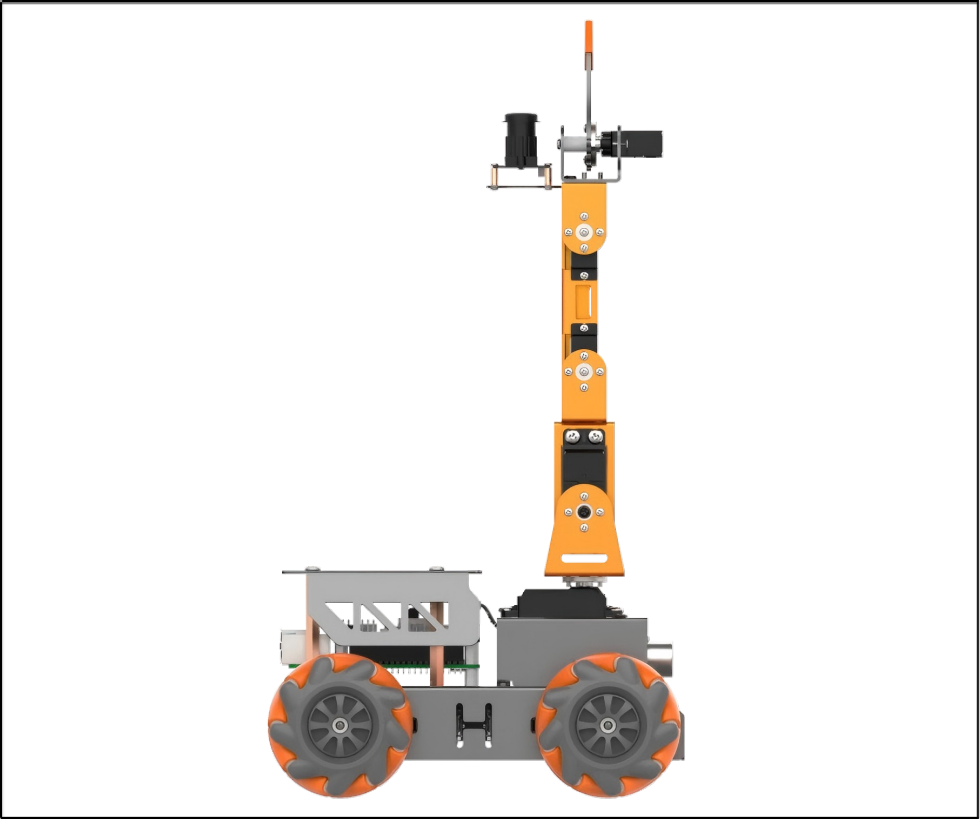
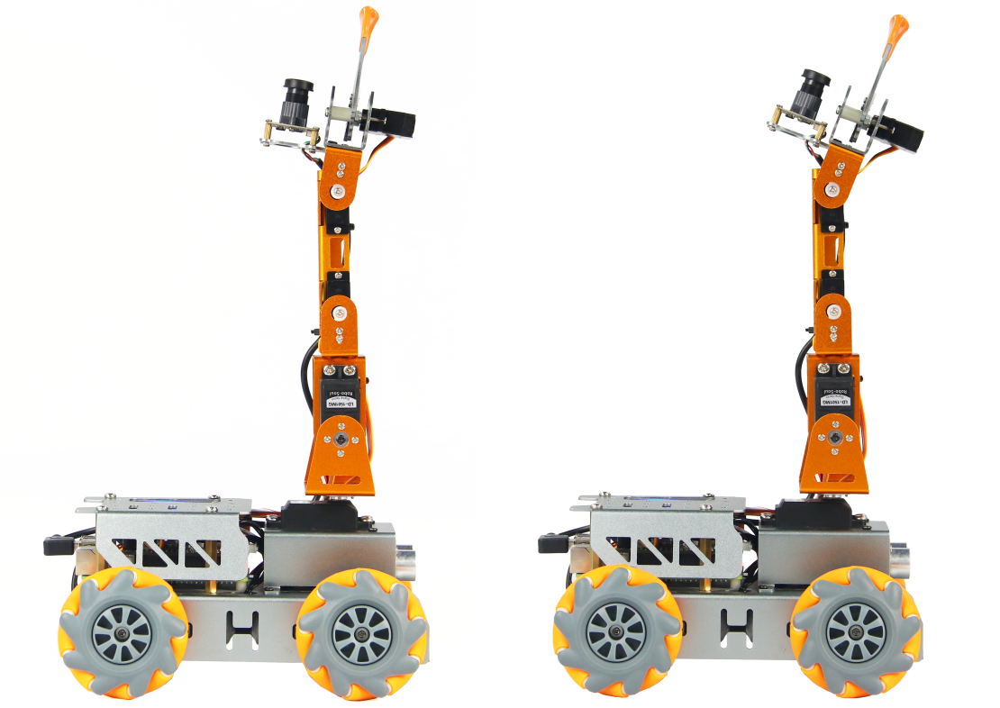

# 1. Getting Ready

## 1. Introduction to MasterPi 

### 1.1 Product Introduction

MasterPi Intelligent robot is developed on Raspberry Pi. Equipped with mecanum chassis, 5-DOF robot and high definition camera, it is able to implement color sorting, object tracking, line follow, Intelligent transport and etc by OpenCV.
Combining with RGB glowing ultrasonic sensor, MasterPi can control light color and perform automatic obstacle avoidance. In addition, various sensor can be installed on MasterPi for more perception functions.

### 1.2 Packing List

### 1.3 Usage Precautions

Please pay attention to the following points when using and storing this product:

(1) This product contains conductive components. Avoid contact with metal objects when powered on.

(2) After the robot is powered on, do not forcibly move the servo, as this may cause damage.

(3) If the robot runs for an extended period, the servos may become hot. Allow the robot to "rest" and wait for the servos to cool before resuming operation.

(4) Keep your face, glasses, and other body parts away from the robot while it is operating. Do not place fingers within the joint movement range to prevent injury. Also, be cautious of falls from high edges.

(5) The robot's servos are precision components and consumable parts. They may need replacement after long-term or intensive use.

(6) If the product will not be used for an extended period, fully charge the battery, remove it, and store it in a cool, dry place.

### 1.4 Copyright Notice

This manual is the property of Shenzhen Hiwonder Technology Co., Ltd. No organization or individual is permitted to reproduce, copy, translate, or distribute any content from this manual without authorization.
Any unauthorized use or infringement of this manual's copyright will be subject to legal action by our company.

### 1.5 Disclaimer

The product described in this manual (including hardware, software, etc.) is provided "as is." Every effort has been made to ensure the accuracy of this manual, but we cannot guarantee it is completely free from errors or omissions. This document is regularly reviewed, and we welcome feedback for improvements.
Product features and specifications may change with version upgrades. For the latest product information, please contact customer service when placing your order.
Furthermore, unless explicitly stated by Hiwonder, we are not responsible for any losses resulting from product malfunctions or damage under extreme conditions outside of typical use cases.

## [2.Introduction to Raspberry Pi and Image Burining]()

## 3. Robot Assembly

### Step 1: Install Robot Car Chassis

1-1

1-2

1-3

### Step 2: Install Battery Case

2-1

### Step 3: Install Mecanum Wheels

3-1

3-2

### Step 4: Install Raspberry Pi Board and Expansion Board

4-1

4-2

4-3

### Step 5: Install Robotic Arm and Connect Wiring

5-1

5-2

### Step 6: Install Top Cover

6-1

6-2

## 4. Charging and Power-On Status Description

### 4.1 Lithium Battery Charging and Installation

Due to the battery not being fully charged during transportation for safety, it is recommended to fully charge the battery before the first use. The detailed charging method is as follows:

(1) Take out the battery charger, and install two 18650 batteries (optional purchase) into it. The positive and negative terminals must be matched correctly to avoid short circuits or damage to the device. 

:::{Note}
Please do not reverse the polarity of the battery! Then connect the battery charger (optional purchase) to the charging head (5V 3A, needed to be prepared by yourself) with the data cable. Finally, connect the power supply.
:::

(2) Wait for the charging to complete. The adapter indicator will be green when not powered on, and red when charging is in progress, which takes about 5 hours. The indicator will turn from red to green indicating the charging is complete. Once the charging is complete, please unplug the charger as soon as possible. Do not leave it charging continuously.

(3) Please ensure the battery box is being switched to "OFF" before installing the battery.

(4) Install the fully charged battery into the battery box and cover it with the battery lid. Please do not reverse the polarity of the battery! 

### 4.2 Check Camera Connection

Before turning on the device, please ensure that the camera connector wire is securely connected to any of the 4 USB interfaces on the Raspberry Pi 5. 

### 4.3 Startup Instruction

(1) Switch the battery box to "ON", and push the switch on the Raspberry Pi expansion board from "OFF" to "ON". The LED1 and LED2 on the Raspberry Pi will remain on. After a short while, LED2 will change from being constantly on to flashing every 1 second. The pan-tilt will return to its initial position, and the buzzer will make a "beep" sound, indicating that the device has successfully powered on.

:::{Note}

The Raspberry Pi itself is also a computer and takes a short period to start up. The boot-up time is approximately 30 seconds, so please wait with the patient.

:::

:::{Note}

* LED1 is the signal indicator, which lights up when the device is powered on and remains on during operation. When the Raspberry Pi communicates with the expansion board, it will flash once.
* LED2 is the communication indicator. The default network connection mode of the device before delivery is AP mode. After successful startup, it will flash every 1 second. If it is set to LAN mode, LED2 will remain on. For information on network connection mode settings and introductions, please refer to the tutorials in "" in the same chapter as this section.
* During device operation, if the LED1 and LED2 lights dim and remain constantly on, it indicates that the power supply is low and needs to be charged.
  :::

(2) After successful startup, the device defaults to AP mode before delivery and generates a hotspot starting with "HW".

### 4.4 Activate Self-check Program

After successful startup, the MasterPi can initiate the self-check service by pressing a button. This is used to detect the servos and motors of the MasterPi, helping you troubleshoot wiring issues.

If the device cannot rotate according to the instructions provided in the following text after starting the self-check program, please refer to "[Getting Ready\ 3.Robot Assembly](#anchor_2)" to rewire.

(1) Press the LEY1 on the expansion board to activate the self-check function.

(2) The servos and motors will rotate in the following sequence as shown below.

### 4.5 Check Battery Level

There are two methods to check the battery level. 

**4.5.1 observe the LED light on the expansion board**

When the LED light on the Raspberry Pi expansion board emits a weak blue light, it indicates that the battery power is low and cannot sustain the device startup and game. The battery needs to be charged as soon as possible.

**4.5.2 check the battery level within the app**

In the app's live camera feed, the real-time battery power will be directly displayed. When the voltage is less than 7V, the battery power is low and needs to be charged as soon as possible. Please refer to "" in this chapter for detailed information on app control.

After completing this section, please proceed to "[5. Remote Desktop Tool Installation and Connection]() and [6.3 The Standard of Deviation Adjustment](#anchor_5_3)" in this chapter to adjust the deviation of the robotic arm. Do not skip this step!

## [5.Remote Desktop Installation and Connection]()

## 6. Adjust Pan-Tilt

### 6.1 Whether the deviation needs to be adjusted

The robotic arm may generate a certain deviation after assembling and you can check it by the following steps: 

(1) Connect MasterPi through VNC. Then click  on system desktop and open PC software. 

(2)  Click "Reset servo" on the PC software interface.

(3) If the robotic arm is straight up, there is no need to adjust the deviation. As the figure shown below:

(4) The deviation needs to be adjusted if the following two situations occur.

### 6.2 The Causes of Deviation 

The deviation usually is caused in the following situations:

(1) When the servo is in the initial position, the angle of the servo main shaft is rotated during installing the servo horn, resulting in angular deviation generating in initial position. The default servo angle is in the middle position before delivery.

(2) The angle of the main shaft is not rotated when installing the servo horn, but if there is a small deviation in the direction or angle of the brackets fixed on the servo during installing the brackets, which also cause a slight deviation.      It should be noted that if the deviation is not adjusted, it may limit the robot movement, thus affecting some sports effects.
In addition, the deviation value within 100 ( an angle of 30°) is in the normal adjustable range. If the value is larger than 100, it can not be adjusted by software. The main shaft screw of the servo with large deviation needs to be removed and rotated to the vertical position and then installed again.  

### 6.3 The Standard of Deviation Adjustment

After powering on the robotic arm, it will reset to the original position. At this time, the servo brackets needs to be parallel, that is, the screws in the vertical direction of the bracket where the servos are located should be in the same straight line.

### 6.4 Adjustment Method

**6.4.1 Small Deviation Adjustment** 

The small deviation means that value is less than 100 (deviation angle is less than 30°). This lesson takes adjusting No.3 servo as an example. ("Servo reset" operation has been performed) 

(1) Observe the posture of the each servo. It can be seen that No.3 and No.4 servos need to be adjusted. 

(2) Click "Read deviation" and then click "OK" in the pops-up prompt window. 

(3) Click the small slider bar under the ID3 servo and ID4 servos to make all servos in the same straight line.

:::{Note}

Left-click multiple times to adjust the slider accurately.

:::

(4) After the adjustment is complete, click "save deviation" and "OK" to save the deviation into the controller.

(5) Click "reset servo" again and observe whether the deviation adjustment of the robotic arm is consistent with the standard explained in "[6.3 the standard of deviation adjustment](#anchor_5_3)". If yes, it means the deviation has been adjusted successfully. If not, return to step 1 and then follow the steps to make fine adjustment.  

**6.4.2  Large Deviation Adjustment**

Large deviation means that the value is larger that 100 (the deviation angle is larger than 30°). This lesson takes the following figure as example to adjust. (The "Reset servo" operation has been performed ) 

(1) Observe the posture of the each servo. It can be seen that No.3 servo has large deviation, so it needs to be reinstalled.

(2) Remove the screw on No.3 servo main shaft and the opposite black rivet, then take the metal servo horn off.

:::{Note}
Avoid applying excessive force when adjusting the bracket to prevent deformation.
:::

(3) Remove the metal bracket of the chassis and disconnect the No.3 servo cable.

(4) Connect the No.3 servo cable to the expansion board (red to positive, brown to negative) to center the servo.

(5) Then, reconnect the servo cable to the No.3 servo interface on the expansion board (red to positive, brown to negative). Align the servo horn in a "+" position and attach it back to the servo main shaft. Reinstall the bracket onto the No.3 servo main shaft and tighten the screw.

(6) Click "servo reset" again and check if the robotic arm aligns with the standard described in "[6.3 The Standard of Deviation Adjustment](#anchor_5_3)" If it does, the deviation has been successfully adjusted. For minor deviations, follow the steps in "[6.4.1 Small Deviation Adjustment](#anchor_5_4_2)" for fine-tuning.
