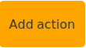
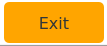
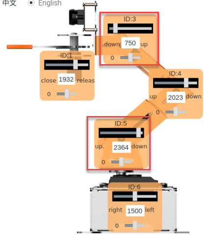

#  7. PC Software Learning

## 1. Start PC software

### 1.1 Start with Software (recommended for beginner)

**1.1.1 Start with Software (recommended for beginner)**

(1) Double-click Arm icon on desktop. 


(2) Click "Execute" in the pop-up interface to open PC software.


**1.1.2 Start with command line**

(1) Click  on desktop to open the LX terminal. 

(2) Enter command in terminal to open PC software.

```bash
python3 MasterPi/masterpi_pc_software/Arm.py
```

### 1.2 The Interface distribution of PC Software 

The interface distribution is as follow:


It can be divided into 4 parts: 


**1.2.1 Servo Control Area**

This area displays the selected servo icons. The servo position can be adjusted by dragging corresponding slider.

| Icon                                                         | Function Instruction                                         |
| ------------------------------------------------------------ | ------------------------------------------------------------ |
|  | It represents the servo ID number. Take ID1 as an example.   |
|  | Used to adjust the servo angle. The minimum value is 0 and the maximum value is 1500. |
|  | Used to adjust the servo deviation. The minimum value is -150 and the maximum value is 150. |

**1.2.2 Action Data List** 

Action data list displays the execution time of each action in the current action group and the value of each servo in each action. 


| Icon                                                         | Function Instruction                                                                                                                                                           |
| ------------------------------------------------------------ |--------------------------------------------------------------------------------------------------------------------------------------------------------------------------------|
|  | Action number                                                                                                                                                                  |
|  | The time it takes to execute the action.                                                                                                                                       |
|  | The corresponding action value under this ID. Double-click  to modify the value directly. |

**1.2.3 Action Group Setting Area**

<table class="docutils-nobg" border="1">
<colgroup>
<col  />
<col  />
</colgroup>
<tbody>
<tr>
<td>Icon</td>
<td>Function Instruction</td>
</tr>
<tr>
<td></td>
<td>The time for running a single action. You can click it to modify. </td>
</tr>
<tr>
<td></td>
<td>Total time for running action group.</td>
</tr>
<tr>
<td></td>
<td>Add the servo value in servo control area to the last line of the action data list as a new action.</td>
</tr>
<tr>
<td></td>
<td>Delete the selected action in action data list.</td>
</tr>
<tr>
<td></td>
<td>Delete all the actions in action data list.</td>
</tr>
<tr>
<td></td>
<td><p>Update the selected value in action data list.</p>
<p>（Servo value is replaced with the current servo value in servo control area. The action running time is replaced with the time set in "running time".）</p></td>
</tr>
<tr>
<td></td>
<td><p>Insert a line of action in front of the selected action.</p>
<p>(The action time is "Running time(ms)" and the angle value is the servo value in servo control area.)</p></td>
</tr>
<tr>
<td></td>
<td>Exchange the position of the selected action with the previous line.</td>
</tr>
<tr>
<td></td>
<td>Exchange the position of the selected action with the next line.</td>
</tr>
<tr>
<td></td>
<td><p>Click "run" to run the action in action data list once.</p>
<p>(If check "Loop", the robot will run the action repeatedly)</p></td>
</tr>
<tr>
<td></td>
<td><p>Click it to open action file to add the selected action group data to action data list.</p>
<p>（Action group file path："MasterPi-&gt;action_groups"）</p></td>
</tr>
<tr>
<td></td>
<td><p>Save the current action in action data list to the specified location.</p>
<p>（Action group file path："MasterPi-&gt;action_groups"）</p></td>
</tr>
<tr>
<td></td>
<td>After opening an action group, click "Integrate files" and then open another action group file, which can integrate two action group files into a new action group.</td>
</tr>
<tr>
<td></td>
<td>Display the saved action groups in the PC software.</td>
</tr>
<tr>
<td></td>
<td>Click "Refresh" to refresh action group option bar.</td>
</tr>
<tr>
<td></td>
<td>Delete the current action group file.</td>
</tr>
<tr>
<td></td>
<td>(Cautious) delete all action group files .</td>
</tr>
<tr>
<td></td>
<td>Execute the action group (the selected number) once.</td>
</tr>
<tr>
<td></td>
<td>Stop the executing action group.</td>
</tr>
<tr>
<td></td>
<td>Exit the current PC software interface.</td>
</tr>
</tbody>
</table>

**1.2.4 Deviation Setting Area (the function buttons in this area just for reference)**

| Icon                                                         | Function Instruction                                         |
| ------------------------------------------------------------ | ------------------------------------------------------------ |
|  | Click it to automatically read the saved deviation.          |
|  | Click it to save the deviation adjusted by PC software to the robot. |
|  | Click it to restore all the servo values in servo control area to 1500. |

## 2. Call Action Group

MasterPi already has built-in action groups before delivery. The action groups are saved in **"/home/pi/MasterPi/action_groups "**. You can view and call the built-in action group through PC software and the specific operation steps are as follow:

### 2.1 Operation Steps

(1)  Power on the robot and use VNC Viewer to connect to the remote desktop.


(2) Double-click on system desktop, and then click "Execute" in pop-up prompt window to enter PC software, as the figure shown below:


(3) Then, click "Open action file" and select the action group to be executed, then click "Open".


(4) Now, action data list will display the servo value and running time of each action. (The screenshot shown below just display part of actions)


(5) Click "Run" to perform all actions in action data list. If want to perform the current action group repeatedly, you can click "loop". 


### 2.2 Import External Action Group

If want to call external action group, you can refer to the following operation steps. This section will import an action group "shake_hand.d6a" as example. (The action group file must end in ".d6a")

(1) Insert a U disk with action file into any one of USB ports of Raspberry Pi, and then paste the action file to the system desktop, as the figure shown below: 


(2) Then, double clickand click "execute" to open PC software.

(3) Click "Open action file". Find the action group file to be imported and click "Open".


(4) At this time, action data list will display the servo value and running time of each action.


### 2.3 Program Execution

All action group files can be executed through program calls. (Action files must be saved in the **"/home/pi/MasterPi/action_groups"** directory to be called.)

(1) Click  in the upper-left corner of the system desktop to open the terminal.


(2) Enter the command "cd MasterPi/functions/" to navigate to the functions directory.

```bash
cd MasterPi/functions/
```

(3) Enter the command "sudo vim action_group_control_demo.py", and press enter to open the program.

```bash
sudo vim action_group_control_demo.py
```

(4) Locate the highlighted code in the opened program, as shown in the figure below.


From the code, it can be seen that the action group executed by the program is "stand." To replace it with another action group, simply change 'stand' in the parentheses to the name of the desired action group. (Action files must be saved in the "/home/pi/MasterPi/action_groups" directory to be called.)

(5) Press "Esc" key, then type ":q"(note the colon before "q") and press enter to exit.

```bash
:q
```

(6) Enter the command `python3 action_group_control_demo.py` and press Enter to call the "stand" action group.


## 3. Action Group Programming

The value set in this section is for reference only. You can adjust it according to the actual situation.

### 3.1 Project Outcome

Create an action group to perform "grasp downwards and place on the left side".

### 3.2 Action Realization 

**3.2.1 Create Actions** 

(1) Click "Open action file" and select "start.6da." action file. Then click "open" to set an initial posture for MasterPi.

(2) Click "" button in front of number "1" in action data list to run No.1 action, which updates the servo angle value to the servo control area.


(3) Drag the slider of No.5 servo to move the robotic arm down to block. The servo value is set to 1818.


(4) The time is set to 1200ms. Click "Add action" to get the second action.


(5) To make the action smoother, each action is followed by a transition action. Based on the previous lesson, modify the running time to 300ms, and then click "Add action" to get the third action.


(6) Next, drag the sliders of No.4 and No.5 servos to make the gripper close to the top of block.


(7) Set the running time to 800ms and click "Add action" to get No.4 action.


(8) Add a transition action and set the running time to 200ms. Then click "Add action" to get No.5 action.


(9) Then drag the slider of No.1 servo to make the gripper open.


(10) Set the running time to 400ms and click "Add action" to get No.6 action.


(11) Add a transition action and set the running time to 200ms. Then click "Add action" to get No.7 action.


(12) Drag the slider of No.3 and No.5 servo to 750 and 2364 to make robotic arm grasp the block. 



(13) Set the running time to 800ms and click "Add action" to get No.8 action.


(14) Then, add a transition action and set the running time to 200ms. 


(15) Adjust No.1 servo to make robotic arm grasp the block.


(16) Set the running time to 300ms and click "Add action" to get No.10 action.


(17) Add a transition action and set the running time to 200ms to get No.11 action.


(18) After grasping the block, drag the slider of No.5 servo to raise robotic arm.


(19) Then set the running time to 1000ms and click "Add action" to get No.12 action.


(20) Add a transition action and set the running time to 300ms.


(21) Now, robotic arm will move the block to the left side. Drag the slider of No.6 servo to set the servo value to 2500.


(22) Set the running time to 1500ms and click "Add action" to get No.14 action.


(23) Then add a transition action and set the running time to 300ms to get No.15 action.


(24) After the block is transported to the left side, drag the slider of No.5 servo to place it down.


(25) Set the running time to 800ms and click "Add action" action to get No.16 action.


(26) Then add a transition action and set the running time to 300ms.


(27) Now, drag the slider of No.1 servo to release the block.


(28) Set the running time to 400ms and click "Add action" to get No.18 action.


(29) Then add a transition action and set the running time to 200ms to get No.19 action.


(30) After releasing the block, drag the slider of No.1 servo to close gripper, and then adjust the value of No.5 servo to raise robotic arm. 


(31) Set the running time to 500ms and click "Add action" to get No.20 action.


(32) Then add a transition action and set the running time to 300ms.


(33) Finally, make robotic arm back to the initial posture. Click "  " button in front of number "1" to run No.1 action. Then set the running time to 1500ms and click "Add action" to get No.22 action.


**3.2.2 Save Action**

You'd better save the action for later debugging and management. Click "Save action file" and name the file "Hiwonder" as an example, and then click "Save". 


## 4.  Integrate Action File

This section takes No.1and Hiwonder action groups as an example.

### 4.1 Project Outcome

Learn how to integrate action groups to realize the combination of the actions.

### 4.2 Project Realization

(1) Open PC software and click "Integrate files".


(2) Select No.1 action group in the pop-up window, and then click "Open".


At this time, you can view all the actions of No.1 action group in action data list.


(3) Then, click "Integrate files" gain. Select "Hiwonder" action group and click "Open".


Now, all the actions of No.1 and Hiwonder action groups are displayed in action data list. Two action groups are integrated into a new action group.


(4) Click "Run" to run the integrated action group online once.


(5) Click "Save action file" to save the integrated action group for later debugging. Here name this action group "Hiwonder1".

