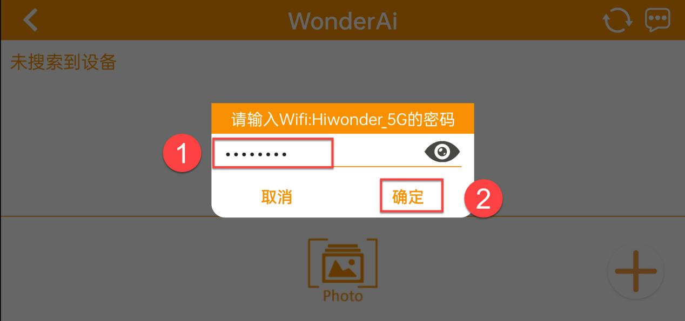
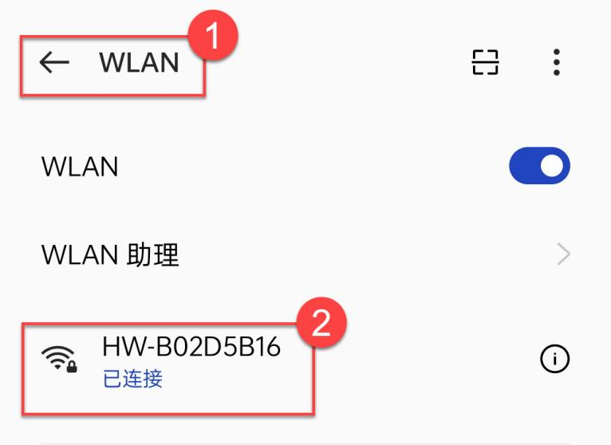
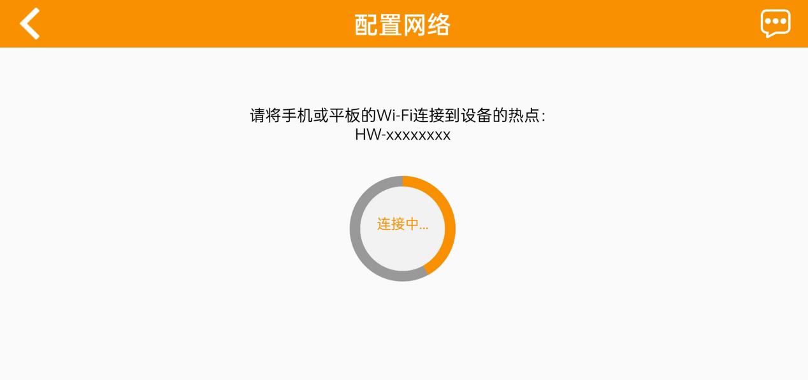
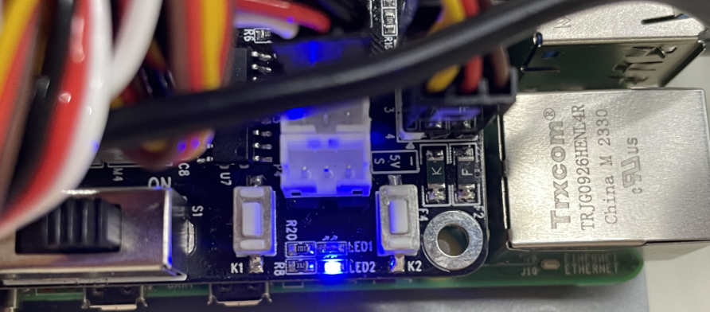

# 树莓派机器人网络配置课程

## 1. 机器人网络配置课程

本节以MasterPi视觉麦轮车为例，内容一致适用于树莓派系列其他产品。

### 1.1 网络配置说明

机器人网络配置分为两种模式：

**AP模式**：开发板能够开启热点被手机连接上。（但不能联通外部网络）

**STA模式**：开发板能够主动去连接指定的热点/Wi-Fi。（可联通外部网络）

机器人默认为 AP 直连模式，用户无论是选择 AP 直连还是 STA 局域网模式，机器人玩法功能都一致。

这里建议用户先学习直连模式的配置方法进行相应功能的体验，局域网模式可根据需求来选看。

### 1.2 直连模式

- #### 1.2.1 通过手机APP切换

以**安卓系统**为例进行演示，此操作流程同样适用于iOS系统。

1.  打开手机APP"**WonderPi**"，依次点击"**初级套件**"、"**MasterPi**"。


2.  点击界面右下方的"**+**"按键，选择"**直连模式**"。


:::{Note}
如需采用局域网模式进行连接，可参考目录[1.3 局域网模式连接](#anchor_1_3)。
:::

3.  点击"**去连接设备热点**"按键，前往设置界面，连接机器人生成的热点。


4.  热点名称以"**HW**"为开头，热点密码为"**hiwonder**"。


:::{Note}
iOS系统下，需等待手机状态栏显示Wi-Fi图标后再返回APP，否则可能会搜索不到设备。若出现搜索不到设备的情况，可点击APP界面右上方的刷新图标。
:::

5.  返回手机APP，点击对应的机器人图标，进入模式选择界面。


:::{Note}
若出现"网络不可用，是否继续连接"提示弹窗，点击"保持连接"按键即可。
:::

6.  若提示"**是否切换并进入搜到的产品界面**"，说明产品版本选择错误（步骤1）。可点击"**确定**"按键，直接切换至正确版本的模式选择界面。


7.  模式选择界面如下图所示：


如需了解各个模式的具体使用方法，可查看前面的文档。

<p id="anchor_1_2_2"></p>

- #### 1.2.2 通过网络配置文件切换

1)  启动机器人，将其连接至远程控制软件VNC。

2)  双击系统桌面的图标，打开命令行终端。

3)  输入如下指令并按下回车，进入配置文件目录。

```bash
cd hiwonder-toolbox/
```

4)  输入如下指令并按下回车，打开配置文件。

```bash
vim hiwonder_wifi_conf.py
```

5. 配置文件默认为AP直连模式，当所有代码都注释掉即为AP直连模式。


6. 如果周围有多台设备，则可通过修改"**HW_WIFI_AP_SSID**"和"**HW_WIFI_AP_PASSWORD**"，自行按需设置名称和密码以作区分，以名称"**HW-Robot**"和密码"**hiwonder**"为例,输入如下图所示：


7. 确认输入无误后，按下"**ESC**"键，再输入"**:wq**"，退出并保存文件。


8. 接着，输入如下指令并按下回车，打开另外一个配置文件。

```bash
vim hw_wifi.py
```

9. 修改"**HW_WIFI_AP_GATEWAY**"的数值，设置新的IP地址，以"**192.168.149.2**"为例。


10. 确认输入无误后，按下"**ESC**"键，再输入"**:wq**"，退出并保存文件。

11. 输入命令"**sudo systemctl restart hw_wifi.service**"，重启机器人WiFi服务。

```bash
sudo systemctl restart hw_wifi.service
```

12. 等待服务重启完成，可以看到热点已经修改完成。


13. 打开远程控制软件VNC，在搜索栏输入新的IP地址，点击搜索到的连接图标。输入登录用户名"**pi**"和密码"**raspberrypi**"，再点击"**OK**"即可进入系统桌面。


<p id="anchor_1_3"></p>

### 1.3 局域网模式

:::{Note}
1.  如果需要用手机配置局域网，则需要先开启手机定位服务。
2.  无法通过系统的网络配置直接切换到局域网模式，因为wifi进行过特殊配置，需按照[通过网络配置文件切换](#anchor_1_2_2)操作进行相关的网络配置。
:::

- #### 1.3.1 通过手机APP切换

:::{Note}
局域网模式下手机需先开启定位服务。
:::

1.  先将手机连接至Wi-Fi，这里以连接"**Hiwomder_5G**"Wi-Fi为例。（支持双频的路由器，在双频分开设置的情况下，Wi-Fi 名默认会区分开，像这个 Hiwonder是 2.4G 频段，Hiwonder_5G 就是 5G 频段的）


2.  打开手机APP"**WonderPi**"，依次点击"**初级套件**"、"**MasterPi**"。


3.  然后单击右下角"**+**"按钮，选择"**局域网模式**"。


4.  此时APP会提示输入你所连接Wi-Fi的密码（请确认密码是否输入正确，如果输入错误会导致连接失败），输入完成后点击"**确定**"。



5.  再点击"**去连接设备热点**"。


6.  此时手机会自动跳转到Wi-Fi连接页面，找到"**HW**"开头的热点，输入密码"**hiwonder**"，完成之后点击"**返回**"按钮。



7.  此时可以看到APP已经开始进行连接。



8.  稍等片刻，主界面会显示机器人的图标，同时扩展板上的LED也会保持常亮。




9.  长按APP中的机器人图标，可以查看分配给机器人的IP地址和设备ID。


10. 我们在远程桌面连接工具上搜索它的IP地址，就可以与远程桌面工具进行连接了。

11. 如需将局域网模式切换回直连模式，可长按扩展板上的KEY1按键，直至蓝灯闪烁即为切换完成。

- #### 1.3.2 通过网络配置文件切换

1)  启动机器人，将其连接至远程控制软件NoMachine。

2)  双击系统桌面的图标，打开命令行终端。

3)  输入如下指令并按下回车，进入配置文件目录。

```bash
cd hiwonder-toolbox/
```

4)  输入如下指令并按下回车，打开配置文件。

```bash
vim hiwonder_wifi_conf.py
```

5. 首先，需要修改"**HW_WIFI_MODE**"的数值为2，1代表直连模式，2代表局域网模式，3代表直连共享模式。

```py
HW_WIFI_MODE = 2    #wifi的工作模式，1为AP模式，2为STA模式
```

6. 然后，需要修改"**HW_WIFI_STA_SSID**"和"**HW_WIFI_STA_PASSWORD**"，设置成路由器Wi-Fi的名称和密码。

:::{Note}
选择5G信号的Wi-Fi，传输速率会更高，如连接普通Wi-FiI感觉卡顿，可以重新修改选择5G信号的Wi-Fi。**
:::


7. 确认输入无误后，按下"**ESC**"键，再输入"**:wq"**，退出并保存文件。

```bash
:wq
```

8. 输入如下命令，重启机器人Wi-Fi服务。

```bash
sudo systemctl restart hw_wifi.service
```

9. 如需切换为直连模式，重新编辑该配置文件，将所有行都注释掉，然后保存并重启机器人即可。
