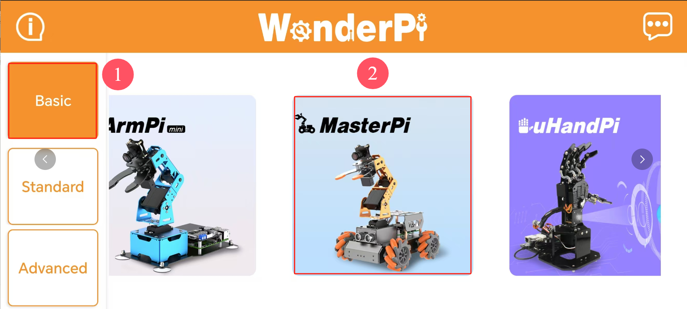
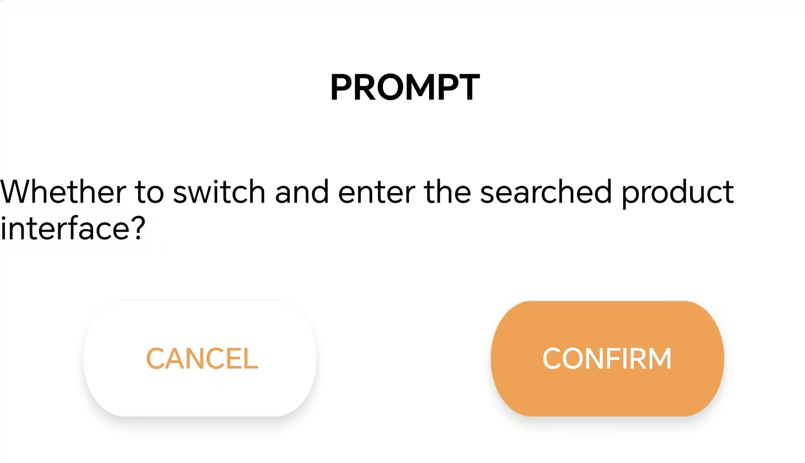

# 7. Raspberry Pi Series Robot Network Configuration Instruction

## 7.1 Network Configuration Overview

This tutorial uses the MasterPi Pi5 version as an example, and it applies to other Pi5 models in this series as well.

The robot's network can be configured in two modes:

**① AP Mode:** The controller creates a hotspot that can be connected to by a smartphone. (Note: This mode does not connect to the external internet.)

**② STA mode:** The controller connects directly to a specified hotspot/Wi-Fi network. (This mode allows access to the external internet.)

By default, the robot operates in AP (direct connection) mode. The features and functions of the robot remain the same whether in AP mode or STA (local area network) mode.

## 7.2 AP Direct Connection Mode

**7.2.1 Mode Switching through Phone**

Using **the Android system** as an example, these instructions also apply to iOS.

(1) Open the "WonderPi" app on your phone. Then, go to "Basic" and select "MasterPi".



(2) Tap the "+" button in the bottom right corner of the screen, and choose **"Direct Connection Mode".**


:::{Note}
If you prefer to connect in LAN mode, refer to [7.3 Connecting in LAN Mode (optional)](#anchor_1_3).
:::

(3) Tap **"Connect to Device Hotspot"**. This will take you to your phone's settings to connect to the hotspot created by the robot.


(4) Look for a hotspot name starting with "HW". The password is "hiwonder".


:::{Note}
for iOS: Wait until the Wi-Fi icon  appears in your phone's status bar before returning to the app. If you don't see the device listed, you can refresh by tapping the refresh icon  in the upper-right corner of the app.
:::

(5) Return to the app, and tap the robot icon to enter the mode selection screen.


:::{Note}
If a pop-up message appears saying "Network Unavailable, Continue Connection?", simply tap "Keep Connection".
:::

(6) If you see a prompt asking **"Switch to and Enter Found Device Screen?",** it indicates that an incorrect product version was selected in Step 1. Tap "OK" to switch directly to the correct version's mode selection screen.



(7)  The mode selection screen appears as shown below:


For details on each mode, refer to the documentation provided earlier.

<p id="anchor_1_2_2"></p>

**7.2.2 Switching via Network Configuration File**

(1) Power on the robot and connect it to the remote control software, VNC.

(2) Double-click the terminal icon  on the desktop to open the command line terminal.

(3) Enter the command and press Enter to navigate to the configuration file directory.

```bash
cd hiwonder-toolbox/
```

(4) Enter the and press Enter to open the configuration file.

```bash
vim hiwonder_wifi_conf.py
```

:::{Note}
The configuration file defaults to AP Direct Connection Mode. If all code lines are commented out, it will be set to AP Direct Connection Mode.
:::


(5) If there are multiple devices nearby, you can modify **"HW_WIFI_AP_SSID"** and **"HW_WIFI_AP_PASSWORD"** to set a unique name and password for each device. For example, use **"HW-Robot"** as the name and **"hiwonder"** as the password, as shown below.


(6) After verifying the entries, press the ESC key, then type **:wq** to save and exit the file.

```bash
:wq
```

(7) Change the value of **"HW_WIFI_AP_GATEWAY"** to set a new IP address, such as **'192.168.149.2'** for example.

```bash
vim hw_wifi.py
```

(8) After confirming the entries, press the ESC key, then type ":wq" to save and exit the file.


(9) After confirming the entries, press the ESC key, then type **":wq"** to save and exit the file.

(10) Enter the command **"sudo systemctl restart hw_wifi.service"** to restart the robot's Wi-Fi service.

```bash
sudo systemctl restart hw_wifi.service
```

(11) Wait for the service to restart. You should see that the hotspot has been successfully updated.


(12) To connect using VNC, enter the new IP address in the search bar, and click on the connection icon that appears. Log in with the username "pi" and password "raspberry", then click"OK"to access the system desktop. (For the Pi5 version, the username is the same as the 4B version, but the password is **"raspberrypi"**.)


<p id="anchor_1_3"></p>

## 7.3 Connecting in LAN Mode (optional)

:::{Note}
* To configure the LAN mode using a smartphone, you must first enable the phone's location services.

* Switching to LAN mode cannot be done directly through the system's network settings, as the Wi-Fi has custom configurations. Please follow the instructions in Section 3.2 to switch modes using the network configuration file.
:::

7.3.1 Switching via the Mobile App

:::{Note}
For LAN mode, please enable location services on your smartphone.
:::

(1) First, connect your phone to Wi-Fi. In this example, we connect to **"Hiwonder_5G"** Wi-Fi. (For dual-band routers with separated frequencies, the Wi-Fi names may differ, such as **"Hiwonder"** for the 2.4G band and **"Hiwonder_5G"** for the 5G band.)


(2) Open the "WonderPi" app on your phone, then select **"Basic"** and "MasterPi".


(3) Tap the "+" button in the bottom right corner, and choose **"LAN Mode".**


(4) The app will prompt you to enter the password for the connected Wi-Fi network. (Please ensure the password is correct, as an incorrect password will result in connection failure.) After entering the password, tap "OK".


(5) Tap "Connect to Device Hotspot".


(6) Your phone will automatically navigate to the Wi-Fi settings page. Find the hotspot starting with "HW" and enter the password "hiwonder". Once connected, tap the "Return" button.


(7) The app will now begin the connection process.


(8) After a short wait, the robot's icon will appear on the main screen, and the LED on the expansion board will remain steadily lit.


(9) Press and hold the robot icon in the app to view the robot's assigned IP address and device ID.


(10) Use a remote desktop tool to search for the robot's IP address and connect to the remote desktop.

(11) To switch back to direct connection mode from LAN mode, press and hold the KEY1 button on the expansion board until the blue LED flashes, indicating that the switch is complete.

**7.3.2 Switching via Network Configuration File**

(1) Power on the robot and connect it to the remote control software, NoMachine.

(2) Click the terminal icon  at the top of the system screen to open the command line terminal.

(3) Enter the command and press Enter to access the configuration file directory.

```bash
cd hiwonder-toolbox
```

(4) Enter the command and press Enter to open the configuration file

```bash
vim hiwonder_wifi_conf.py
```

(5) First, change the value of "HW_WIFI_MODE" to 2:

① 1 represents Direct Connection Mode

② 2 represents LAN Mode

③ 3 represents Direct Sharing Mode

```python
HW_WIFI_MODE = 2    #wifi的工作模式，1为AP模式，2为STA模式
```

(6) Next, modify **"HW_WIFI_STA_SSID"** and **"HW_WIFI_STA_PASSWORD"** to match your router's Wi-Fi name and password.

:::{Note}
 Selecting a 5G Wi-Fi signal will provide higher transfer speeds. If there is lag on standard Wi-Fi, consider switching to a 5G signal.
:::


(7) After confirming the entries are correct, press the ESC key, then type **":wq"** to save and exit the file.

```bash
:wq
```

(8) Enter the command to restart the robot's Wi-Fi service.

```bash
sudo systemctl restart hw_wifi.service
```

(9) To switch back to Direct Connection Mode, edit the configuration file again, comment out all lines, save, and restart.
