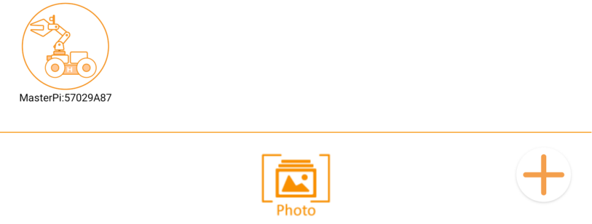
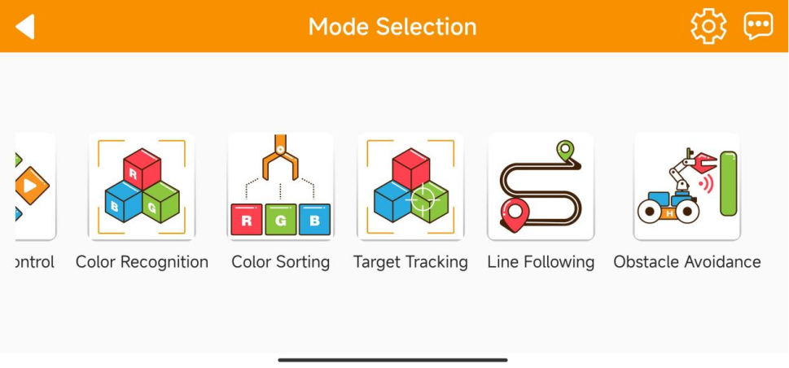
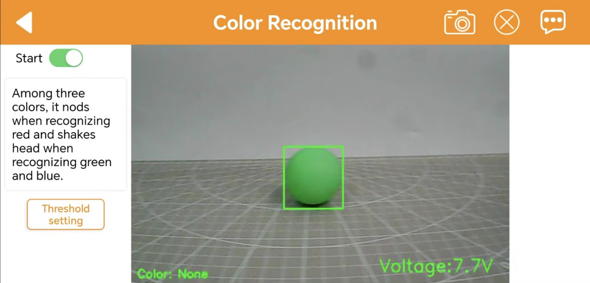
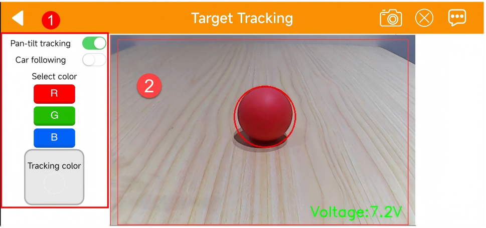
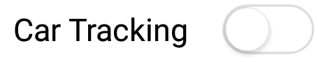
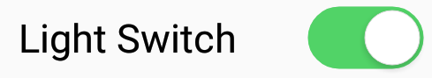

# 2. Quick User Experience

## [1.APP Installation and Connection]()

## 2. APP Control

### 2.1 Getting ready

Turn the MasterPi on. Please refer to "[Getting Ready\6. Adjust Pan-Tilt]()" to adjust the deviation of the robotic arm.

Then, follow the tutorials in "[Quick User Experience\1. APP Installation and Connection]()" to install the app and connect to the MasterPi.

### 2.2 Start Games

After connecting, click MasterPi icon to enter the mode selection interface.

In the mode selection interface, click the icon corresponding to the game to enter the game interface.

**2.2.1 Robot Control**

(1) This game allows you to control the movement of the car and the RGB light on the ultrasonic sensor in real time. The interface consists of four parts, and the descriptions and function icons of each part are shown below:

The interface of "Robot Control" can be divided into three parts. The left side of the interface can control the movement of the robotic arm by dragging the slider. Other function icons can refer to the following table:

| Icon | **Corresponding Function** |
|:------------:|:----------------------------:|
|  | Drag to control MasterPi’s movement. |
|  | Control the rotation direction of MasterPi. |
|  | Control MasterPi back to the initial posture. |
|  | The battery voltage of the MasterPi will be displayed in the lower right corner of the image. Note: when the battery voltage is less than 7V, please charge it as soon as possible. |

The real-time image transmitted by camera indicates voltage value of MasterPi’s battery. Note: when the battery voltage is less than 7V, please charge it as soon as possible.

The right side of the interface can be used to control the angle of 5 servos so as to control the movement of the robotic arm. 

If you want to back to the games option interface, you can click the blank area, then the title bar will appear. Next, clickat the left side. 

**2.2.2 Color Recognition** 

This game can recognize red, green, and blue. The robotic arm will nod when it detects red and shake its head when it detects blue or green.

:::{Note}

* Please start this game under a well-lit environment, but try to keep it from direct light.
* When recognizing, please do not have the same or similar colored object within the detected range to avoid interference.
* If the recognition effect is not good enough, please refer to  "[Quick User Experience\ 3.Color Threshold Adjustment]()".
:::

(1) Click "Color Recognition" to enter this game. Its interface consists three parts:

① The status bar is located at the top of the interface.

② The left side of the interface is the area for enabling, disabling the game and adjusting the color threshold.

③ The right side of the interface is the area for displaying the live camera feed.

(2) Clicking the "Start Recognition" allows you to place red, blue, and green objects one by one in front of the camera. Take green as an example. When green is detected, the MasterPi will highlight the recognized green area in the feedback image. The buzzer will emit a "beep" sound, then the camera will perform a "head-shaking" action.

The green will be recognized and highlighted in the live camera feed.

The buzzer will emit a "beep" sound, and the recognized color will be displayed in the lower left corner.

| Recognized Color | Outcome                                                      |
| ---------------- | ------------------------------------------------------------ |
| Red              | The buzzer emits a "beep" sound, and the camera nods its head. |
| Green            | The buzzer emits a "beep" sound, and the camera shakes its head. |
| Blue             | The buzzer emits a "beep" sound, and the camera shakes its head. |

(3) If want to back to mode selection interface, you can arbitrarily click the blank area in interface, then click .

**2.2.3 Color Sorting**

Click "Color Sorting" to enter the game interface. After starting the game, the car's camera can recognize different color blocks to perform corresponding actions.

:::{Note}

* When recognizing QR codes, it is important to maintain an optimal distance between the QR code image and the camera. It is 35cm.

* Please start this game under a well-lit environment, but try to keep it from direct light.

:::

① The left side of the interface is the game switch area.

②  The right side of the interface is the live camera feed.

(1) Click the "Start Recognition" to select different color blocks, and the MasterPi will perform corresponding actions upon recognizing different color blocks.

| Recognized Color | Outcome                                                      |
| ---------------- | ------------------------------------------------------------ |
| Red              | The buzzer emits a "beep" sound and places the red block at coordinates (-15, 14, 2). |
| Green            | The buzzer emits a "beep" sound and places the green block at coordinates (-18, 9, 3). |
| Blue             | The buzzer emits a "beep" sound and places the blue block at coordinates (-18, 0, 2). |

(2) If want to back to mode selection interface, you can arbitrarily click the blank area in interface, then click.

**2.2.4 Target Tracking**

Click "Target Tracking" to enter the game interface. Once activated, this game enables the car to move along with the target color as it moves.

:::{Note}

* Please start this game under a well-lit environment, but try to keep it from direct light.
* When recognizing, please do not have the same or similar colored object within the detected range to avoid interference.
* If the recognition effect is not good enough, please refer to  "[Quick User Experience\ 3. Color Threshold Adjustment]().
:::

(1) Please select both "Pan-tilt Tracking" and "Car Following" simultaneously for car tracking.

① The status bar is located at the top of the interface.

② The tracking switch area is located on the left side of the interface

③ The camera live feed area is located on the right side of the interface.

(2) Click the "Pan-tilt Tracking", and select the target color to activate the tracking game. MasterPi's camera will move with the selected color target, while the car body remains stationary. Then, click the "Car Body Following" to activate the car body following game. MasterPi's car body and pan-tilt will follow the movement of the selected color target.

|                                             Button Icon                                             | Function Instruction |
|:------------------------------------------------------------------------------------------------:|:--:|
|  | Start or close pan-tilt tracking. |
|    | Start or close pan-tilt tracking. |
|  | Select the targeted color. |
|    | Display the information of targeted color. |

(3) If want to back to mode selection interface, you can arbitrarily click the blank area in interface, then click .

**2.2.5 Line Following** 

Click "Line Following" to enter this game. After activating it, the MasterPi will move forward along a black or red line.

:::{Note}

* Please start this game under a well-lit environment, but try to keep it from direct light.
* When recognizing, please do not have the same or similar colored object within the detected range to avoid interference.
* If the recognition effect is not good enough, please refer to  "[Quick User Experience\3.Color Threshold Adjustment]().
  :::

① The status bar is located at the top of the interface.

② The line tracking switch area is located on the left side of the interface

③ The camera live feed area is located on the right side of the interface.

(1) Click "Start following" to enter this game and select color. Then MasterPi will follow the targeted line. 

|                                             Icon Button                                             | Function Instruction |
|:------------------------------------------------------------------------------------------------:|:--:|
|  | Start or stop this game |
|   | Select the targeted color |
|   | Display the selected tracking color. |

(2) If want to back to mode selection interface, you can arbitrarily click the blank area in interface, then click.

2.2.6 Obstacle Avoidance

Click "Obstacle Avoidance" to enter the game interface. After this game is activated, the car can use ultrasonic to detect obstacles ahead to avoid them.

:::{Note}
Do not detect object at close range for a long time
:::

① The left side of the interface includes the obstacle avoidance game switch and the obstacle threshold setting area.

② The middle of the interface is the camera transmission image area.

③ The right side of the interface includes the setting area for the RGB light and motor speed.

(1) Click "Start avoidance". MasterPi will move forwards and it will turn left when detecting obstacle ahead. Then continue moving forward until there is no obstacle.

|                                             Button Icon                                             | Function Instruction |
|:------------------------------------------------------------------------------------------------:|:--:|
|  | Start this game. |
|    | Set obstacle threshold. |
|    | Turn on or off RGB light. |
|    | Adjust RGB light color. |
|                       | Adjust motor speed. |

(2) If want to back to mode selection interface, you can arbitrarily click the blank area in interface, then click.

## [3. Adjust Color Threshold]()

