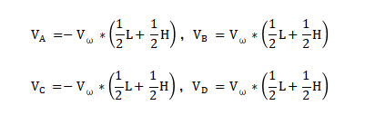

# 3. Mecanum Wheel Car Motion Control Course

## 3.1 The Motion of Mecanum Wheels Car

### 3.1.1  Preface 

MasterPi uses omnidirectional movement mecanum wheels. According to the the included angle 45° between the roller and axle of the mecanum wheels, the wheels can be divided into wheel A and wheel B which are in mirror-image relationship with each other, as the figure shown below:


Featuring 360° movement, flexibility and stability, the mecanum wheel is a successful omnidirectional wheels. The combination of four mecanum wheels can be more flexible to realize the omnidirectional movement.

### 3.1.2 Working Principle

* **Mecanum Wheel Hardware Structure** 


The mecanum wheel is composed of rollers and axle. The axle is as the main bracket of the whole wheel and a series of rubberized external rollers obliquely attached to the whole circumference of its rim. The rollers at its rim oriented at an angle of 45° to the wheel circumference.
There are several configuration methods of four mecanum wheels, such as AAAA, BBBB, AABB, ABAB, BABA. Not all combination methods of the wheels enable robot car move forward, backward, and sideways, etc. The combination of MasterPi's wheels are ABAB, which can realize omnidirectional movement.


* **Mecanum Wheel Physical Characteristics** 

The omni-directional motion of the vehicle is achieved as the vector summation of propelling forces on the ground-engaging rollers can be in any direction by adjusting the wheel rotation direction and torque magnitude of the four wheels.

Due to the rollers at its rim oriented at an certain angle to the wheel circumference, the mecanum wheels can slip in sideways direction. The generatrix of small rollers are special. When the mecanum wheel revolves around its fixed axle, the envelope of each small roller is a cylindrical surface so that the wheel can roll forward continuously.


(1) V<sub>x</sub>：The velocity of the Mecanum wheel in the X-axis direction (typically front-to-back);

(2) V<sub>y</sub>：The velocity of the Mecanum wheel in the Y-axis direction (typically left-to-right);

(3) V<sub>ω</sub>：The angular velocity of the Mecanum wheel chassis (the speed at which the chassis rotates around its own center);

(4) V<sub>A</sub>、V<sub>B</sub>、V<sub>C</sub>、V<sub>D</sub>：The real-time velocities of the four wheels of the Mecanum wheel;

The motion of the right front wheel within the plane can be decomposed into:

(5) VBx：The velocity of the Mecanum wheel in the X-axis direction (typically front-to-back)

(6) VBy：The velocity of the Mecanum wheel in the Y-axis direction (typically left-to-right);

(7) L：The distance between the wheel centers of the left and right wheels;

(8) H：The distance between the wheel centers of the front and rear wheels;

(9) θ<sub>ω</sub>：The angle formed between the chassis center of gravity and the right front wheel center is 45°.

Based on these parameters, we can conduct the kinematic analysis of the mecanum wheel chassis.

### 3.1.3 Kinematic Analysis Formula Calculation

To simplify the kinematic mathematical model, the following two idealized assumptions are made:

(1) The omni-wheels do not slip on the ground, and the ground provides sufficient friction;

(2) The four wheels are distributed at the four corners of a rectangle or square, with the wheels being parallel to each other.

Here, we decompose the rigid body motion of the vehicle into three components. By calculating the velocities of the four wheels when the vehicle moves along the X+, Y+ directions and rotates along the Z+ direction, we can merge the formulas to determine the wheel speeds required for the "**translation + rotation**" motion composed of these three simple movements.

Where VA、VB、VC、VD are the wheel speeds of wheels A, B, C, and D(the motor speeds); VX is the vehicle's velocity along the X-axis, Vy is the velocity along the Y-axis, and Vω is the rotational speed along the Z-axis; <sup>1</sup>&frasl;<sub>2</sub>L is half of the vehicle's track width L, and <sup>1</sup>&frasl;<sub>2</sub>H is half of the wheelbase H. 

(1) The velocity components of each wheel when the robot translates along the X-axis can be calculated using the following formula:


VA、VB、VC、VD are the real-time speeds of the four mecanum wheels;  is the speed of the mecanum wheels along the X-axis.

(2) The velocity components of each wheel when the robot translates along the Y-axis can be calculated using the following formula:


Vy is the speed of the mecanum wheels along the Y-axis.

(3) The velocity components of each wheel when the robot rotates along the Z-axis can be calculated using the following formula:



 is the angular velocity of the mecanum wheel chassis (the rotational speed around its own center.)

(4) By combining the velocities along the X, Y, and Z directions, four wheel speeds can be calculated based on the vehicle's motion state:


## 3.2 Move Forward

### 3.2.1 Working Principle

According to the characteristic of mecanum wheel, when the car moves forward, the four wheels must rotate clockwise. The force analysis is shown in the following figure: 


According to physical kinematics, when forces are equal and opposite to each other, they will counteract each other. Any force can be decomposed into two perpendicular vectors. Suppose the speed of wheel A and wheel B rotates at the same speed, a right force decomposed by wheel A and a left force decomposed by wheel B will counteract each other, which the direction of resultant velocity is forward. 
Based on Newton's second law (F=ma), if the direction of acceleration is forward, the final resultant force is also forward.

<p id="anchor_2_2"></p>

### 3.2.2 Operation Steps

It should be case sensitive when entering command, and the "**Tab**" key can be used to complete the keywords.

(1) Power on the robot and use VNC Viewer to connect to the remote desktop.


(2) Click  or press "**Ctrl+Alt+T**" to enter the LX terminal.


(3) Enter command to come to the directory of game programmings.

```bash
cd MasterPi/mecanum_control/
```

(4) Enter command and press "**Enter**" to start game.

```bash
python3 car_forward_demo.py
```

(5) If want to exit the game, press "**Ctrl+C**" in terminal. If fail to exit, please keep trying until the program is closed. 


### 3.2.3 Project Outcome

After starting the game, MasterPi will move forward.


### 3.2.4 Program Analysis

The source code of the program is located in: **[/home/pi/MasterPi/mecanum_control/car_forward_demo.py](../_static/source_code/car_forward_demo.zip)**

<span id="anchor_2_4_1" ></span>

* **Import Parameter Module** 

| **Import module** | **Function**                                                 |
| ----------------- | ------------------------------------------------------------ |
| import sys        | Importing the Python sys module is used for getting access to the relevant function and variables |
| import time       | Importing the Python time module is used for time-related functionalities, such as delay operations. |
| import signal     | The receiving and processing of the signal                   |
| common.mecanum    | The control module related to mecanum wheel chassis          |

* **Program Logic and Corresponding Code Analysis** 

(1) Import Function Library

During initialization, the function library needs to be first imported for subsequent calling. For the detailed content of importing, please refer to "[**2.4.1 Import Parameter Module**](#anchor_2_4_1)".

{lineno-start=1}

```python
#!/usr/bin/python3
# coding=utf8
import sys
import time
import signal
import common.mecanum as mecanum
```

(2) Check Python Version

{lineno-start=8}

```python
if sys.version_info.major == 2:
    print('Please run this program with python3!')
    sys.exit(0)
```

sys.version_info.major is used to check the major version of Python. If the version is equal to 2, the program will print a message and exit the program. 

(3) Call the mecanum.MecanumChassis() function

{lineno-start=24}

```python
chassis = mecanum.MecanumChassis()
```

The call to `mecanum.MecanumChassis()` constructor creates an object of the MecanumChassis class and assigns it to the chassis variable.

(4) Motor Control

{lineno-start=38}

```python
	if __name__ == '__main__':
    while start:
        chassis.set_velocity(50,90,0) # 控制机器人移动函数,线速度50(0~100)，方向角90(0~360)，偏航角速度0(-2~2)(The function controls the movement of a robot at the linear velocity of 50 ranging from 0 to 100, the direction angle of 90 ranging from 0 to 360, and the yaw rate of 0 ranging from -2 to 2.)
        time.sleep(1)
        
    chassis.set_velocity(0,0,0)  # 关闭所有电机(close all motors)
    print('已关闭')
```

Control motors primarily using the set_velocity function. There are three parameters in this function. Take the code `chassis.set_velocity(50,90,0)` as an example:

① The first parameter `50` represents the motor speed, its unit is mm/s and it ranges from -100 to 100. When the value is negative, the motor rotates counterclockwise.

② The second parameter `90` represents the movement direction of car, its unit is degree and it ranges from 0 to 360. The value of 90°refer to move forward. 270°refers to move backward. 0°refers to move to the right. 180°refers to move the left. Other movement directions are obtained according to the same reference method.  

③ The third parameter `0` represents the rotation speed of the car, its unit is  radians per second and it ranges from -2 to 2. When the parameter value is positive, the car will rotate clockwise. When the parameter value is negative, the car will rotate counterclockwise.

### 3.2.5 Function Extension

The default movement speed is 50. In this section, the car speed will be modified to 90. Please refer to the following specific steps: 

(1) Click  to enter LX terminal.

(2) Enter command and press "**Enter**" to come to the directory of game programmings.

```bash
cd MasterPi/mecanum_control
```

(3) Enter command and press "**Enter**" to open program file.

```bash
sudo vim car_forward_demo.py
```

(4) Enter the command and press "**Enter**" to call the line number. You can set it based on your own needs.

```bash
: set number
```

(5) Find the code to be modified and press "**i**" to enter the editing mode.


(6)  In `chassis.set_velocity` function, the first parameter represents the motor speed and we modify it to 90. After modifying, press "**Esc**" and enter "**:wq**", and then press "**Enter**" to save and exit. 

```bash
:wq
```

:::{Note}
The adjustable range of speed is "**-100~100**". When the value is positive, the motor will rotate clockwise. When the value is negative, the motor will rotate counterclockwise. When the positive value is changed to negative value, it may change the movement direction. Therefore, it is recommended to modify the value between 0 and 100.
:::

(7) After modifying, please refer to the content of "[**3.2.2 Operation Steps**](#anchor_2_2)" to check the outcome.


## 3.3 Turning

### 3.3.1 Working Principle
According to the characteristics of mecanum wheel , running (all at the same speed) both wheels on one side in one direction while the other side in the opposite direction, will result in a stationary rotation of the chassis car.

Therefore, when the left mecanum wheels rotate clockwise and the right mecanum wheels rotate counterclockwise, the chassis car will be counterclockwise stationary rotation. When the left mecanum wheels rotate clockwise and the right wheels rotates counterclockwise, the chassis car will be clockwise stationary rotation. 

The force analysis of two situation is as follow:


<p id="anchor_3_2"></p>

### 3.3.2 Operations Steps

:::{Note}
The entered command should be case sensitive and "**Tab**" key can be used to fill in keyword.
:::

(1) Power on the robot and use VNC Viewer to connect to the remote desktop.


(2) Click  or press "**Ctrl+Alt+T**" to enter the LX terminal.

(3) Enter command to come to the directory of game programmings.

```bash
cd MasterPi/mecanum_control/
```

(4) Enter command and press "**Enter**" to start game.

```bash
python3 car_turn_demo.py
```

(5) If want to exit the game, you can press "**Ctrl+C**". If fail to exit, please try multiple times.

### 3.3.3 Project Outcome

After starting the game, MasterPi will be clockwise stationary rotation, and then counter clockwise stationary rotation. 


### 3.3.4 Program Analysis

The source code of the program is located in: **[/home/pi/MasterPi/mecanum_control/car_turn_demo.py](../_static/source_code/car_turn_demo.zip)**

<span id="anchor_3_4_1"></span>

* **Import Parameter Module** 

| **Import module** | **Function** |
| ----------- | ------------ |
| import sys  | Importing the Python sys module is used for getting access to the relevant function and variables |
| import time | Importing the Python time module is used for time-related functionalities, such as delay operations. |
| import signal | The receiving and processing of the signal |
| common.mecanum | The control module related to mecanum wheel chassis |

* **Program Logic and Corresponding Code Analysis** 

(1)  Import Function Library

During initialization, the function library needs to be first imported for subsequent calling. For the detailed content of importing, please refer to "[**3.3.4 Program Analysis -> Import Parameter Module**](#anchor_3_4_1)".

{lineno-start=1}

```python
#!/usr/bin/python3
# coding=utf8
import sys
import time
import signal
import common.mecanum as mecanum
```
(2) Check Python Version

{lineno-start=8}

```python
if sys.version_info.major == 2:
    print('Please run this program with python3!')
    sys.exit(0)
```

The call to `mecanum.MecanumChassis()` constructor creates an object of the `MecanumChassis` class and assigns it to the chassis variable.

(3) Call the mecanum.MecanumChassis（）Function

{lineno-start=25}

```python
chassis = mecanum.MecanumChassis()
```

The call to mecanum.MecanumChassis() constructor creates an object of the MecanumChassis class and assigns it to the chassis variable.

(4) Motor Control

{lineno-start=39}

```python
	if __name__ == '__main__':
    while start:
        chassis.set_velocity(0,90,0.3)# 顺时针旋转,控制机器人移动函数,线速度0(0~100)，方向角90(0~360)，偏航角速度0.3(-2~2)(The function controls the movement of a robot at the linear velocity of 0 ranging from 0 to 100, the direction angle of 90 ranging from 0 to 360, and the yaw rate of 0.3 ranging from -2 to 2.)
        time.sleep(3)
        chassis.set_velocity(0,90,-0.3)# 逆时针旋转(rotate counterclockwise)
        time.sleep(3)
    chassis.set_velocity(0,0,0)  # 关闭所有电机(close all motors)
    print('已关闭')
```

Control motor through set_velocity function. There are three parameters in function. Take the code `chassis.set_velocity(0,90,0.3)` as an example:

① The first parameter `0` represents the motor speed, its unit is mm/s and it ranges from -100 to 100. When the value is negative, the motor rotates counterclockwise.

② The second parameter `90` represents the movement direction of car, its unit is degree and it ranges from 0 to 360. The value of 90°refer to move forward. 270°refers to move backward. 0°refers to move to the right. 180°refers to move the left. Other movement directions are obtained according to the same reference method.  

③ The third parameter`0.3` represents the rotation speed of the car, its unit is 5°/s and it ranges from -2 to 2. When the parameter value is positive, the car will rotate clockwise. When the parameter value is negative, the car will rotate counterclockwise.

### 3.3.5 Function Extension

The default rotation speed of moving forwards is 0.3. This section will modify the clockwise rotation speed of car to 0.5 and the specific operation steps are as follow:

(1) Click  to enter the LX terminal.

(2) Enter command and press "**Enter**" to come to the directory of game programmings.

```bash
cd MasterPi/mecanum_control/
```

(3) Enter command and press "**Enter**" to open the program file. 

```bash
sudo vim car_turn_demo.py
```

(4) Find the code to be modified and press "**i**" to enter the editing mode.


(5) In `set_velocity` function, the third parameter represents the rotation speed of the car and we modify it to 0.5. After modifying, press "**Esc**" and enter "**:wq**", and then press "**Enter**" to save ans exit.


```bash
:wq
```

:::{Note}
The adjustable range of speed is "**-2~2**". When the value is positive, the car will rotate clockwise. When the value is negative, the car will rotate counterclockwise. It is recommended to adjust the value slightly 
:::

## 3.4 Movement

### 3.4.1 Working Principle

According to the characteristics of meacanum wheel, when all wheels rotate clockwise, the car will move forward; when all wheels rotate counterclockwise, the car will move backwards. When two A wheels rotate counterclockwise and two B wheels rotate clockwise, the car will move sideways to the left; when two wheels B rotates counterclockwise and wheels A rotates clockwise, the car will move sideways to the right. The force analysis for moving forwards, backwards and sideways is shown in the following figure:  


According to physical kinematics, when forces are equal and opposite to each other, they will counteract each other. Any force can be decomposed into two perpendicular vectors. Suppose the speed of wheel A and wheel B rotates at the same speed, a right force decomposed by wheel A and a left force decomposed by wheel B will counteract each other, which the direction of resultant velocity is forward. 

Based on Newton's second law (F=ma), if the direction of acceleration is forward, the final resultant force is also forward. 

<p id="anchor_4_2"></p>

### 3.4.2 Operation Steps

:::{Note}
The entered command should be case sensitive and "**Tab**" key can be used to fill in keyword.
:::

(1) Power on the robot and use VNC Viewer to connect to the remote desktop.


(2) Click  or press "**Ctrl+Alt+T**" to enter the LX terminal.

(3) Enter command to come to the directory of game programmings.

```bash
cd MasterPi/mecanum_control/
```

(4) Enter command and press "**Enter**" to start game. 

```bash
python3 car_move_demo.py
```

(5) If want to exit the game, you can press "**Ctrl+C**". If fail to exit, please try multiple times.

### 3.4.3 Project Outcome

After starting the game, MasterPi will move forward, sideways to the right, backwards, sideways to the left in sequence.


### 3.4.4 Program Analysis 

The source code of program is located in: ：**[/home/pi/MasterPi/mecanum_control/car_move_demo.py](../_static/source_code/car_move_demo.zip)**

<span id="anchor_4_5_1" class="anchor"></span>

* **Import Parameter Module** 

| **Import module** | **Function**                                                 |
| ----------------- | ------------------------------------------------------------ |
| import sys        | Importing the Python sys module is used for getting access to the relevant function and variables |
| import time       | Importing the Python time module is used for time-related functionalities, such as delay operations. |
| import signal     | The receiving and processing of the signal                   |
| common.mecanum    | The control module related to mecanum wheel chassis          |

* **Program Logic and Corresponding Code Analysis** 

(1) Import Function Library

During initialization, the function library needs to be first imported for subsequent calling. For the detailed content of importing, please refer to "[**3.3.4 Program Analysis -> Import Parameter Module**](#anchor_3_4_1)".

{lineno-start=1}

```python
#!/usr/bin/python3
# coding=utf8
import sys
import time
import signal
import common.mecanum as mecanum
```

(2)  Check Python Version

{lineno-start=8}

```python
if sys.version_info.major == 2:
    print('Please run this program with python3!')
    sys.exit(0)
```

sys.version_info.major is used to check the major version of Python. If the version is equal to 2, the program will print a message and exit the program. 

(3) Call the mecanum.MecanumChassis() Function

{lineno-start=25}

```python
chassis = mecanum.MecanumChassis()
```
The call to `mecanum.MecanumChassis()` constructor creates an object of the MecanumChassis class and assigns it to the chassis variable .

(4) Motor Control

{lineno-start=39}

```python
	if __name__ == '__main__':
    while start:
        chassis.set_velocity(50,90,0) # 控制机器人移动函数,线速度50(0~100)，方向角90(0~360)，偏航角速度0(-2~2)(The function controls the movement of a robot at the linear velocity of 50 ranging from 0 to 100, the direction angle of 90 ranging from 0 to 360, and the yaw rate of 0 ranging from -2 to 2.)
        time.sleep(1)
        chassis.set_velocity(50,0,0)
        time.sleep(1)
        chassis.set_velocity(50,270,0)
        time.sleep(1)
        chassis.set_velocity(50,180,0)
        time.sleep(1)
    chassis.set_velocity(0,0,0)  # 关闭所有电机(close all motors)
    print('已关闭')
```
Control motor through set_velocity function. There are three parameters in function. Take the code `chassis.set_velocity(50,90,0)` as an example:

① The first parameter `50` represents the motor speed, its unit is mm/s and it ranges from -100 to 100. When the value is negative, the motor rotates counterclockwise.

②  The second parameter `90` represents the movement direction of car, its unit is degree and it ranges from 0 to 360. The value of 90°refer to move forward. 270°refers to move backward. 0°refers to move to the right. 180°refers to move the left. Other movement directions are obtained according to the same reference method.  

③ The third parameter `0` represents the rotation speed of the car, its unit is 5°/s and it ranges from -2 to 2. When the parameter value is positive, the car will rotate clockwise. When the parameter value is negative, the car will rotate counterclockwise.

### 3.4.5 Function Extension

After starting the game, MasterPi will move forward, sideways to the right, backwards, sideways to the left in sequence.

(1) Click  to enter the LX terminal.

(2) Enter command and press "**Enter**" to come to the directory of game programmings.

```bash
cd MasterPi/mecanum_control/
```

(3) Enter command and press "**Enter**" to open the program file. 

```bash
sudo vim car_move_demo.py
```

(4)  Find the code to be modified and press "**i**" to enter the editing mode.


(5) In "**chassis.set_velocity**" function, the first parameter represents the motor speed and we modify it to 90. After modifying, press "**Esc**" and enter "**:wq**", and then press "**Enter**" to save and exit.


```bash
:wq
```

:::{Note}
The adjustable range of speed is from -100 to 100. When the value is positive, the motor will rotate clockwise. When the value is negative, the car will rotate counterclockwise. It is recommended to adjust the value slightly. 
:::

(6) After modifying, please refer to the content of "[**3.4.2 Operation Steps**](#anchor_4_2)" to check the outcome.

## 3.5 Oblique Movement

### 3.5.1 Working Principle

According to the characteristics of mecanum wheel , when wheel A does not move and wheel B rotates clockwise, the car moves to the left front. When wheel B rotates counterclockwise, the car moves to the right rear. When the wheel B does not move and wheel A rotates clockwise, the car will move to the front right. When the wheel A rotates counterclockwise, the car move to the left rear. The force analysis for oblique movement: 


<p id="anchor_5_2"></p>

### 3.5.2 Operation Steps

:::{Note}
The entered command should be case sensitive and "**Tab**" key can be used to fill in keyword.
:::

(1) Power on the robot and use VNC Viewer to connect to the remote desktop.


(2) Clickor press "**Ctrl+Alt+T"** to enter the LX terminal.

(3) Enter command to come to the directory of game programmings.

```bash
cd MasterPi/mecanum_control/
```

(4) Enter command and press "**Enter**".

```bash
python3 car_slant_demo.py
```

(5) If want to exit the game, you can press "**Ctrl+C**". If fail to exit, please try multiple times.

### 3.5.3 Project Outcome

After starting the game, MasterPi will move to the right front, to the right rear, to the left rear, and to the front left in sequence.


### 3.5.4 Program Analysis

The source code of program is located in: **[/home/pi/MasterPi/mecanum_control/car_slant_demo.py](../_static/source_code/car_slant_demo.zip)**

<span id="anchor_5_5_1" ></span>

* **Import Parameter Module** 

| **Import module** | **Function**                                                 |
| ----------------- | ------------------------------------------------------------ |
| import sys        | Importing the Python sys module is used for getting access to the relevant function and variables |
| import time       | Importing the Python time module is used for time-related functionalities, such as delay operations. |
| import signal     | The receiving and processing of the signal                   |
| common.mecanum    | The control module related to mecanum wheel chassis          |

* **Program Logic and Corresponding Code Analysis** 

(1) Import Function Library

During initialization, the function library needs to be first imported for subsequent calling. For the detailed content of importing, please refer to **"[3.5.4 Program Analysis \ Import Parameter Module](#anchor_5_5_1)"**.

{lineno-start=1}

```python
#!/usr/bin/python3
# coding=utf8
import sys
import time
import signal
import common.mecanum as mecanum
```

(2) Check Python Version

{lineno-start=8}

```python
if sys.version_info.major == 2:
    print('Please run this program with python3!')
    sys.exit(0)
```

sys.version_info.major is used to check the major version of Python. If the version is equal to 2, the program will print a message and exit the program. 

(3) Call the mecanum.MecanumChassis() Function

{lineno-start=25}

```python
chassis = mecanum.MecanumChassis()
```

The call to `mecanum.MecanumChassis()` constructor creates an object of the `MecanumChassis` class and assigns it to the chassis variable.

(4) Motor Control

{lineno-start=39}

```python
	if __name__ == '__main__':
    while start:
        chassis.set_velocity(50,45,0) # 控制机器人移动函数,线速度50(0~100)，方向角45(0~360)，偏航角速度0(-2~2)(The function controls the movement of a robot at the linear velocity of 50 ranging from 0 to 100, the direction angle of 45 ranging from 0 to 360, and the yaw rate of 0 ranging from -2 to 2.)
        time.sleep(1)
        chassis.set_velocity(50,315,0)
        time.sleep(1)
        chassis.set_velocity(50,225,0)
        time.sleep(1)
        chassis.set_velocity(50,135,0)
        time.sleep(1)
    chassis.set_velocity(0,0,0)  # 关闭所有电机(close all motors)
    print('已关闭')
```

Control motor through set_velocity function. There are three parameters in function. Here takes an example of the code `chassis.set_velocity(50,45,0)`:

① The first parameter `50` represents the motor speed, its unit is mm/s and it ranges from -100 to 100. When the value is negative, the motor rotates counterclockwise.

② The second parameter `45` represents the movement direction of car, its unit is degree and it ranges from 0 to 360. The value of 90°refer to move forward. 270°refers to move backward. 0°refers to move to the right. 180°refers to move the left. Other movement directions are obtained according to the same reference method.  

③ The third parameter `0` represents the rotation speed of the car, its unit is 5°/s and it ranges from -2 to 2. When the parameter value is positive, the car will rotate clockwise. When the parameter value is negative, the car will rotate counterclockwise.

### 3.5.5 Function Extension

The default angle of oblique movement is 45°and the value can be modified to adjust the angle. This section will modify the value to 60 and the specific operation steps are as follow:

(1) Click  or press "**Ctrl+Alt+T**" to enter the LX terminal.

(2) Enter command and press "**Enter**" to come to the directory of game programmings.

```bash
cd MasterPi/mecanum_control/
```

(3) Enter command and press "**Enter**" to open the program file. 

```bash
sudo vim car_slant_demo.py
```

(4) Find the code to be modified and press "**i**" to enter the editing mode.


(5) In `set_velocity` function, the second parameter represents the directional angle of moving forwards and we modify it to 60. After modifying, press "**Esc**" and enter "**:wq**", and then press "**Enter**" to save and exit.

```bash
:wq
```

:::{Note}
The adjustable range of the directional angle is from 0 to 360. 0 refers to move to the right; 90 refers to move forwards; 180 refers to move to the left; 270 refers to move backwards.
:::

(6) After modifying, please refer to the content of "[**3.5.2 Operation Steps**](#anchor_5_2)" to check the outcome.

## 3.6 Drifting Movement

### 3.6.1 Working Principle

According to the characteristic of mecanum wheel characteristics, when the front two wheels do not move, the rear wheel A rotates clockwise and the rear wheel B rotates counterclockwise, the car drift clockwise. The force analysis for car drifting is shown in the following figure:


According to physical kinematics, when forces are equal and opposite to each other, they will counteract each other. Any force can be decomposed into two perpendicular vectors. Take counterclockwise drifting as example. Suppose the speed of wheel A and wheel B rotates at the same speed, a upward force decomposed by wheel A and a downward force decomposed by wheel B will counteract each other, which the direction of resultant velocity is to the right. 
Based on Newton's second law (F=ma), if the direction of acceleration is to the right, so the final resultant force is also to the right. At this time, if the front wheel does not move, the car will drift.     

<p id="anchor_3_6_2"></p>

### 3.6.2 Operation Steps

:::{Note}
The entered command should be case sensitive and "**Tab**" key can be used to fill in keyword.
:::

(1) Power on the robot and use VNC Viewer to connect to the remote desktop.


(2) Click  or press "**Ctrl+Alt+T**" to enter the LX terminal.

(3) Enter command to come to the directory of game programmings.

```bash
cd MasterPi/mecanum_control/
```

(4) Enter command and press "**Enter**" to start game.

```bash
python3 car_drifting_demo.py
```

(5) If want to exit the game, you can press "**Ctrl+C**". If fail to exit, please try multiple times.

### 3.6.3 Project Outcome

After starting game, MasterPi will drift clockwise first, then counterclockwise. 


### 3.6.4 Program Analysis 

The source code of program is located in：**[/home/pi/MasterPi/mecanum_control/car_drifting_demo.py](../_static/source_code/car_drifting_demo.zip)**

<span id="anchor_6_2" class="anchor"></span>

* **Import Parameter Module** 

| **Import module** | **Function**                                                 |
| ----------------- | ------------------------------------------------------------ |
| import sys        | Importing the Python sys module is used for getting access to the relevant function and variables |
| import time       | Importing the Python time module is used for time-related functionalities, such as delay operations. |
| import signal     | The receiving and processing of the signal                   |
| common.mecanum    | The control module related to mecanum wheel chassis          |

* **Program Logic and Corresponding Code Analysis** 

(1) Import Function Library

During initialization, the function library needs to be first imported for subsequent calling. For the detailed content of importing, please refer to **"[3.6.4 Program Analysis -> Import Parameter Module](#anchor_6_2)".**

{lineno-start=1}

```python
#!/usr/bin/python3
# coding=utf8
import sys
import time
import signal
import common.mecanum as mecanum
```

(2) Check Python Version

{lineno-start=8}

```python
if sys.version_info.major == 2:
    print('Please run this program with python3!')
    sys.exit(0)
```
sys.version_info.major is used to check the major version of Python. If the version is equal to 2, the program will print a message and exit the program. 

(3) Call the mecanum.MecanumChassis() Function

{lineno-start=25}

```python
chassis = mecanum.MecanumChassis()
```
The call to `mecanum.MecanumChassis()` constructor creates an object of the `MecanumChassis` class and assigns it to the chassis variable.

(4) Motor Control

{lineno-start=39}

```python
	if __name__ == '__main__':
    while start:
        chassis.set_velocity(50,45,0) # 控制机器人移动函数,线速度50(0~100)，方向角45(0~360)，偏航角速度0(-2~2)(The function controls the movement of a robot at the linear velocity of 50 ranging from 0 to 100, the direction angle of 45 ranging from 0 to 360, and the yaw rate of 0 ranging from -2 to 2.)
        time.sleep(1)
        chassis.set_velocity(50,315,0)
        time.sleep(1)
        chassis.set_velocity(50,225,0)
        time.sleep(1)
        chassis.set_velocity(50,135,0)
        time.sleep(1)
    chassis.set_velocity(0,0,0)  # 关闭所有电机(close all motors)
    print('已关闭')
```
Control motor through set_velocity function. There are three parameters in function. This is an example of the code `chassis.set_velocity(50,90,0)` as an example:

① The first parameter `50` represents the motor speed, its unit is mm/s and it ranges from -100 to 100. When the value is negative, the motor rotates counterclockwise.

② The second parameter `180` represents the movement direction of car, its unit is degree and it ranges from 0 to 360. The value of 90°refer to move forward. 270°refers to move backward. 0°refers to move to the right. 180°refers to move the left. Other movement directions are obtained according to the same reference method.  

③ The third parameter `0.3` represents the rotation speed of the car, its unit is 5°/s and it ranges from -2 to 2. When the parameter value is positive, the car will rotate clockwise. When the parameter value is negative, the car will rotate counterclockwise.

### 3.6.5 Function Extension

The default speed of rotation is 0.3. This section will modify the rotation speed of clockwise drifting to 0.5 and the specific operation steps are as follow:

(1) Click  to enter the LX terminal.

(2) Enter command and press "**Enter**" to come to the directory of game programmings.

```bash
cd MasterPi/mecanum_control/
```

(3) Enter command and press "**Enter**" to open the program file. 

```bash
sudo vim car_drifting_demo.py
```

(4) Find the code to be modified and press "**i**" to enter the editing mode.


(5) In `set_velocity` function, the third parameter represents the rotation speed of the car and we modify it to 0.5. After modifying, press "**Esc**" and enter "**:wq**", and then press "**Enter**" to save and exit.


```bash
:wq
```

:::{Note}
The adjustable range of speed is from -2 to 2. When the value is positive, the car will rotate clockwise. When the value is negative, the car will rotate counterclockwise. It is recommended to adjust the value slightly.
:::

(6) After modifying, please refer to the content of "[**3.6.2 Operation Steps**](#anchor_3_6_2)" to check the outcome.
