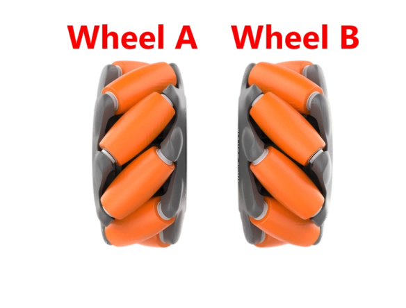
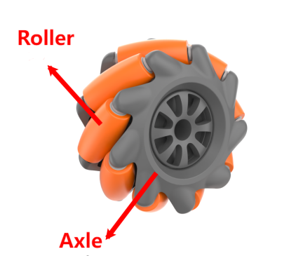

# 麦轮小车运动控制课程

## 1.麦轮小车运动介绍

### 1.1 前言

MasterPi底座车轮采用的是全方位移动的麦克纳姆轮（以下简称为麦轮）。根据麦轮的夹角45度朝向不同，可以分为互为镜像关系的A轮和B轮，如下图所示：



麦轮具有万向性，灵活性，平稳性等特点，是一种很成功的全方位轮，通过这4个麦轮的组合，可以更灵活方便的实现MasterPi全方位的移动功能。

### 1.2 原理说明

- #### 1.2.1 麦轮硬件结构及物理特性



麦轮整体结构由轮毂和辊子构成，轮毂是整个轮子的主体支架，辊子则是安装在轮毂上的鼓状物，麦轮的轮毂轴与辊子转轴呈 45度角。麦轮一般是四个一组使用，两个左旋轮（A轮），两个右旋轮（B轮），A轮和B轮具有对称性。

4个麦轮的组合方式有AAAA，BBBB，AABB，ABAB，BABA等，并不是所有的组合都可以实现前进、后退、旋转、左移、右移等功能，而MasterPi的麦轮组合方式是ABAB，是一种可以实现全方位移动的组合。


- #### 1.2.2 麦轮物理特性

麦轮依靠各自机轮的方向和速度，这些力的最终合成在任何要求的方向上产生一个合力矢量从而保证了这个平台在最终的合力矢量的方向上能自由地移动，而不改变机轮自身方向。

由于它的轮缘上斜向分布着许多小辊子，故轮子可以横向滑移。小辊子的母线很特殊，当轮子绕着固定的轮心轴转动时，各个小辊子的包络线为圆柱面，所以该轮能够连续地向前滚动。

在进行运动学分析时，我们可以考虑麦克纳姆轮的运动学模型，其中包括以下参数：


1) V<sub>x</sub>：麦轮在X轴（通常是前后）方向的速度；

2) V<sub>y</sub>：麦轮在Y轴（通常是左右）方向的速度；

3) V<sub>ω</sub>：麦轮底盘的角速度（即底盘绕自身中心旋转的速度）；

4) V<sub>A</sub>、V<sub>B</sub>、V<sub>C</sub>、V<sub>D</sub>：麦轮四个轮子的实时速度；

右前轮在平面内的运动可以分解为：

5) VBx：麦轮在X轴（通常是前后）方向的速度；

6) VBy：麦轮在Y轴（通常是左右）方向的速度；

7) L：表示左右车轮轮心间距；

8) H：表示前后车轮轮心间距；

9) θ<sub>ω</sub>：为底盘车身重心与右前轮心与形成的夹角，为45°。

基于这些参数，我们可以进行麦克纳姆轮底盘的运动学分析。

### 1.3 运动学分析公式计算

为简化运动学数学模型，做下列两点理想化假设：

- 全向轮不与地面打滑，同时地面有足够摩擦力；

- 4个轮子分布在长方形或者正方形的4个角上，轮子之间相互平行。

在这里我们将小车的刚体运动线性分解为三个分量，那么只需计算输出麦轮底盘在沿X+、Y+方向平移，Z+方向运动时四个轮子的速度，就可以通过公式的合并，计算出这三种简单运动所合成的"平动+旋转"运动时所需要的四个轮子的转速。

其中V<sub>A</sub>、V<sub>B</sub>、V<sub>C</sub>、V<sub>D</sub>分别为A、B、C、D四个轮子的转速，也就是电机的转速；V<sub>X</sub>为小车沿着X轴平移速度，V<sub>y</sub>为小车沿着Y轴平移速度，V<sub>ω</sub>为小车沿Z轴的旋转速度；$\frac{1}{2}$L为小车轮距L的一半，$\frac{1}{2}$H为小车轴距H的一半。

1) 机器人沿着X轴平移时每个轮子的速度分量可以通过以下公式计算：


其中V<sub>A</sub>、V<sub>B</sub>、V<sub>C</sub>、V<sub>D</sub>：四个麦轮的实时速度；麦轮在X轴方向的速度。

2) 机器人沿着Y轴平移时每个轮子的速度分量可以通过以下公式计算：


其中V<sub>y</sub>麦轮在Y轴方向的速度。

3) 机器人沿着Z轴旋转时每个轮子的速度分量可以通过以下公式计算：


其中：$麦轮底盘的角速度（即地盘绕自身中心旋转的速度）。

4) 将X、Y、Z三个方向的速度合并，即可根据小车的运动状态解算除四个轮子的转速：


## 2. 小车前进运动

### 2.1 实验原理


根据麦克纳姆轮的特性，我们的小车要前进时，四个轮子都必须正转，如以下受力分析图：


根据物理运动学知识可知，大小相等，方向相反的力可以互相抵消。

假设A轮和B轮正转的速度一样快，那么A1轮和A2轮分解出向右的力与B1轮和B2轮分解出向左的力刚好互相抵消，只剩下A1轮、A2轮、B1轮和B2轮向前方向的力。

合力方向向前，根据牛顿第二运动定律（**F=ma**）可知，加速度方向向前，则最终合速度"**V合**"方向也向前。

<p id="anchor_2_2"></p>

### 2.2 玩法开启及关闭步骤

指令的输入需严格区分大小写和空格，关键字可按键盘"Tab"键进行补齐。

1) 将设备开机，并参照课程资料的"**[学前先看\4.远程工具安装与连接](https://docs.hiwonder.com/projects/MasterPi/en/latest/docs/1.getting_ready.html#id11)**"内容，通过VNC远程连接工具连接。


2) 点击系统桌面左上角的图标，或按下快捷键"**Ctrl+Alt+T**"打开LX终端。


3) 输入切换到玩法程序目录所在指令，并按下回车。

```commandline
cd MasterPi/mecanum_control/
```

4) 输入玩法执行指令，回车。

```commandline
python3 car_forward_demo.py
```

5) 如需关闭此玩法，只需终端界面中按下"**Ctrl+C**"，若关闭失败，可重复此操作，直至程序关闭。


### 2.3 实现效果

玩法开启后，MasterPi就会开始一直前进。

### 2.4 功能延伸

**程序默认前进的速度是50，我们可以尝试调节小车的速度，这里我们把速度修改为90**，具体的修改步骤如下：

1) 点击系统桌面左上角的图标，或按下快捷键"**Ctrl+Alt+T**"打开LX终端。

2) 输入切换到玩法程序所在目录的指令，按下回车。

```commandline
cd MasterPi/mecanum_control
```

3) 输入打开程序文件的指令,并按下回车。

```commandline
sudo vim car_forward_demo.py
```

4) 输入指令，按下回车，将行号调出来（用户根据需要自行设置即可）。

```commandline
: set number
```

5) 找到要修改的代码部分，按下键盘的"**i**"键，当出现左下角框出内容时，即进入编辑模式。


6) 在"**chassis.set_velocity()**"函数中，第一个参数代表电机的速度，这里我们修改为90，修改完成后，按下键盘的"**Esc**"键，并输入指令，按下回车，即可完成保存与退出此程序。

```commandline
:wq
```

:::{Note}
速度的调整范围是"-100~100"，为正数时电机正转，为负数时电机反转。在修改成负数时可能会改变小车的移动方向，这里建议大家修改范围在"0~100"之间。
:::

7) 修改完成后，可按照"[2.2 玩法开启及关闭步骤](#anchor_2_2)"内容，再次运行程序，查看修改后的效果。

### 2.5 程序简析

该程序的源代码位于：**/home/pi/MasterPi/mecanum_control/car_forward_demo.py**

<span id="anchor_2_5_1" class="anchor"></span>

- #### 2.5.1 导入参数模块

| **导入模块** | **作用** |
| ------------ | -------- |
|   import sys   |   导入了Python的sys模块，用于访问系统相关的功能和变量    |
|  import time   | 导入了Python的time模块，用于时间相关的功能，例如延时操作 |
| import signal  |                    用于接收、处理信号              |
| common.mecanum |              与麦克纳姆轮底盘有关的控制模块              |

- #### 2.5.2 程序逻辑及对应的代码分析

程序逻辑流程图如下图所示。


从上图得到，程序的逻辑流程主要分为导入功能库、调用相关函数、电机控制，以下的文档内容将依照上述程序逻辑流程图进行编写。

- **导入功能库**

在初始化的这一步，首先就需要将功能库导入进来，方便后续程序的调用，关于导入进来的内容。可以前往[导入参数模块](#anchor_2_5_1)进行查看。

```python
#!/usr/bin/python3
# coding=utf8
import sys
import time
import signal
import common.mecanum as mecanum
```

- **获取Python版本号**

```python
if sys.version_info.major == 2:
    print('Please run this program with python3!')
    sys.exit(0)
```

使用 sys.version_info.major 来获取当前 Python 解释器的主版本号。如果主版本号为 2，则输出一条提示信息并退出程序。

- **调用mecanum.MecanumChassis（）函数**

```python
chassis = mecanum.MecanumChassis()
```

调用 mecanum.MecanumChassis() 构造函数创建了一个 MecanumChassis 类的对象，并将其赋值给变量 chassis

- **电机控制**

```python
if __name__ == '__main__':
    while start:
        chassis.set_velocity(50,90,0) # 控制机器人移动函数,线速度50(0~100)，方向角90(0~360)，偏航角速度0(-2~2)
        time.sleep(1)
        
    chassis.set_velocity(0,0,0)  # 关闭所有电机
    print('已关闭')
```

主要通过chassis.set_velocity()函数来控制电机。该函数中有三个参数，以代码"**chassis.set_velocity(50,90,0)**"为例：

1) 第一个参数"**50**"，为电机的线速度，范围是"**-100~100**"，数值为负数时电机是反转。

2) 第二个参数"**90**"，为小车移动的方向角，单位是度，范围是"**0~360**"，其中90度是小车的前方，270度小车的后方，0度是右，180度左，其他方向角度以此类推。

3) 第三个参数"**0**"，为小车的偏航角速度，范围是"**-2.0~2.0**"，0是无角速度，正数是顺时针转动，负数是逆时针转动，绝对值越大转动速度越快。

## 3. 小车转向运动

### 3.1 实验原理
根据麦克纳姆轮的特性，当小车左边的轮子反转，右边的轮子正转时，小车会原地逆时针旋转；当小车左边的轮子正转，右边的轮子反转时，小车会原地顺时针旋转。

两种情况的受力分析图如下：


- 当左轮反转,右轮正转时:

左轮向后推,右轮向前拉。这会导致小车整体逆时针旋转。

- 当左轮正转,右轮反转时:

左轮向前拉,右轮向后推。这会导致小车整体顺时针旋转。

这是因为麦轮的特性决定了,当左右轮子转动方向不同时,会产生一个旋转力矩,从而使整个小车进行原地旋转。左右轮子转动方向的差异,会产生一个扭转力矩,使小车围绕自身中心轴进行旋转。通过控制左右轮子的转速和转向,就可以实现小车的原地旋转。

<p id="anchor_3_2"></p>

### 3.2 玩法开启及关闭步骤

:::{Note}
指令的输入需严格区分大小写和空格，另外可按键盘"Tab"键进行关键词补齐。
:::

1) 将设备开机，并参照课程资料的"**[学前先看\4.远程工具安装与连接](https://docs.hiwonder.com/projects/MasterPi/en/latest/docs/1.getting_ready.html#id11)**"内容，通过VNC远程连接工具连接。


2) 点击系统桌面左上角的图标，或按下快捷键"**Ctrl+Alt+T**"打开LX终端。


3) 输入玩法程序目录所在的指令，并按下回车。

```commandline
cd MasterPi/mecanum_control/
```

4) 输入玩法执行指令，并按下回车。

```commandline
python3 car_turn_demo.py
```

5) 如需关闭此玩法，只需要在LX终端界面中按下"**Ctrl+c**"。如果关闭失败，可多次按下。


### 3.3 实现效果

玩法开启后，MasterPi小车先原地顺时针旋转，再原地逆时针旋转。

### 3.4 功能延伸

程序默认前进的偏移速度是0.3，我们可以尝试调节小车旋转的速度，这里我们把顺时针速度修改为0.5，具体的修改步骤如下：

1) 点击桌面左上角图标，或按下快捷键"**Ctrl+Alt+T**"打开LX终端。

2) 输入进到玩法程序所在目录的指令，按下回车。

```commandline
cd MasterPi/mecanum_control/
```

3) 输入打开程序文件的指令，并按下回车。

```commandline
sudo vim car_turn_demo.py
```

4) 找到要修改的代码部分，按下键盘的"i"键进入编辑模式。

5) 在"**chassis.set_velocity()**"函数中，第三个参数代表小车偏移的速度，这里我们修改为0.5，修改完成后，按下键盘的"**Esc**"键，并输入指令，按下回车，即可完成保存与退出操作。

```commandline
:wq
```

:::{Note}
速度的调整范围是"-2.0~2.0"，为正数时小车顺时针旋转，为负数时小车逆时针旋转。修改时建议根据实际情况小幅度调节。
:::

6) 修改完成后，可按照"[3.2 玩法开启及关闭步骤](#anchor_3_2)"内容，再次运行程序，查看修改后的效果。

### 3.5 程序简析

该程序的源代码位于：**/home/pi/MasterPi/mecanum_control/car_turn_demo.py**

<span id="anchor_3_5_1" class="anchor"></span>

- #### 3.5.1 导入参数模块

|  **导入模块**  |                         **作用**                         |
|:--------------:|:--------------------------------------------------------:|
|   import sys   |   导入了Python的sys模块，用于访问系统相关的功能和变量    |
|  import time   | 导入了Python的time模块，用于时间相关的功能，例如延时操作 |
| import signal  |                    用于接收、处理信号                    |
| common.mecanum |              与麦克纳姆轮底盘有关的控制模块              |

- #### 3.5.2 程序逻辑及对应的代码分析

程序逻辑流程图如下图所示。


从上图得到，程序的逻辑流程主要分为导入功能库、调用相关函数、电机控制，以下的文档内容将依照上述程序逻辑流程图进行编写。

- **导入功能库**

在初始化的这一步，首先就需要将功能库导入进来，方便后续程序的调用，关于导入进来的内容。可以前往[导入参数模块](#anchor_3_5_1)进行查看。

```python
#!/usr/bin/python3
# coding=utf8
import sys
import time
import signal
import common.mecanum as mecanum
```
- **获取Python版本号**

```python
if sys.version_info.major == 2:
    print('Please run this program with python3!')
    sys.exit(0)
```

使用 sys.version_info.major 来获取当前 Python 解释器的主版本号。如果主版本号为 2，则输出一条提示信息并退出程序。

- **调用mecanum.MecanumChassis（）函数**

```python
chassis = mecanum.MecanumChassis()
```

调用 mecanum.MecanumChassis() 构造函数创建了一个 MecanumChassis 类的对象，并将其赋值给变量 chassis

- **电机控制**

```python
if __name__ == '__main__':
    while start:
        chassis.set_velocity(0,90,0.3)# 顺时针旋转,控制机器人移动函数,线速度0(0~100)，方向角90(0~360)，偏航角速度0.3(-2~2)
        time.sleep(3)
        chassis.set_velocity(0,90,-0.3)# 逆时针旋转
        time.sleep(3)
    chassis.set_velocity(0,0,0)  # 关闭所有电机
    print('已关闭')
```

主要通过set_velocity函数来控制电机。该函数中有三个参数，以代码"**chassis.set_velocity(0,90,0.3)**"为例：

1) 第一个参数"**0**"，表示的是电机的速度，单位是毫米每秒，范围是"**-100~100**"，数值为负数时电机是反转。

2) 第二个参数"**90**"，代表的是小车移动的方向，单位是度，范围是"**0~360**"，其中90度是小车的前方，270度小车的后方，0度是右，180度左，其他方向角度以此类推。

3) 第三个参数"**0.3**"，代表的是小车的偏航角速度，范围是"**-2.0~2.0**"，0是无角速度，正数是顺时针转动，负数是逆时针转动，绝对值越大转动速度越快。

## 4. 小车前后左右移动

### 4.1 实验原理

根据麦克纳姆轮的特性，当小车轮子全部正转时，小车前进；当小车轮子全部反转时，小车后退；当A轮全部反转，B轮正转时，小车左平移；当B轮全部反转，A轮正转时，小车右平移。小车前后左右的运动受力分析图如下：


根据物理运动学知识可知，大小相等，方向相反的力可以互相抵消，假设A轮和B轮正转的速度一样快，那么A轮分解出向右的力和B轮分解出向左的力刚好互相抵消，合力方向向前，根据牛顿第二运动定律（**F=ma**）可知，加速度方向向前，则最终合速度方向"**V合**"也向前。其他方向的速度解析也是以同样的思路来推导。

- 前进和后退:

当所有轮子都正转时,小车会向前移动；当所有轮子都反转时,小车会向后移动。

这是因为四个轮子的推力方向一致,从而带动整个小车前进或后退

- 左平移:

当左侧两个轮子全部反转,右侧两个轮子全部正转时，左侧轮子向后推,右侧轮子向前

拉，这会产生一个向左的力矩,使小车向左平移。

- 右平移:

当右侧两个轮子全部反转,左侧两个轮子全部正转时，右侧轮子向后推,左侧轮子向前

拉，这会产生一个向右的力矩,使小车向右平移。

总的来说,麦轮小车能够灵活移动,关键在于控制四个轮子的转动方向和速度。通过协

调左右轮子的转动,就可以实现前后左右各种方向的移动。这就是麦轮小车的独特优势所在。

<p id="anchor_4_2"></p>

### 4.2 玩法开启及关闭步骤

:::{Note}
指令的输入需严格区分大小写和空格，另外可按键盘"Tab"键进行关键词补齐。
:::

1) 将设备开机，并参照课程资料的"**[学前先看\4.远程工具安装与连接](https://docs.hiwonder.com/projects/MasterPi/en/latest/docs/1.getting_ready.html#id11)**"内容，通过VNC远程连接工具连接。


2) 点击系统桌面左上角的图标，或按下快捷键"**Ctrl+Alt+T**"打开LX终端。


3) 输入玩法程序目录所在的指令并按下回车。
```commandline
cd MasterPi/mecanum_control/
```

4) 输入玩法执行指令，并按下回车。
```commandline
python3 car_move_demo.py
```

5) 如需关闭此玩法，只需要在LX终端界面中按下"**Ctrl+c**"。如果关闭失败，可多次按下。


### 4.3 实现效果

玩法开启后，MasterPi小车将按照前进，右平移，后退，左平移的顺序移动。

### 4.4 功能延伸

程序默认前进的速度是50，我们可以尝试调节小车的速度，这里我们把左平移的速度修改为90，具体的修改步骤如下：

1) 点击桌面左上角图标，或按下快捷键"**Ctrl+Alt+T**"打开LX终端。

2) 输入进到玩法程序所在目录的指令，按下回车。

```commandline
cd MasterPi/mecanum_control/
```

3) 输入打开程序文件的指令，并按下回车。

```commandline
sudo vim car_move_demo.py
```

4) 找到要修改的代码部分，按下键盘的"i"键进入编辑模式。

5) 在"**chassis.set_velocity**"函数中，第一个参数代表电机的速度，这里我们修改为90，修改完成后，按下键盘的"**Esc**"键，并输入指令，按下回车，即可完成保存与退出操作。

```commandline
:wq
```

:::{Note}
速度的调整范围是"-100~100"，为正数时电机正转，为负数时电机反转。在修改成负数时可能会改变小车的移动方向，这里建议大家修改范围在"0~100"之间
:::

6) 修改完成后，再继续"[4.2 玩法开启及关闭步骤](#anchor_4_2)"内容，即可查看修改好的效果。

### 4.5 程序简析

该程序的源代码位于：**/home/pi/MasterPi/mecanum_control/car_move_demo.py**

<span id="anchor_4_5_1" class="anchor"></span>

- #### 4.5.1 导入参数模块

|  **导入模块**  |                         **作用**                         |
| :------------: | :------------------------------------------------------: |
|   import sys   |   导入了Python的sys模块，用于访问系统相关的功能和变量    |
|  import time   | 导入了Python的time模块，用于时间相关的功能，例如延时操作 |
| import signal  |                    用于接收、处理信号                    |
| common.mecanum |              与麦克纳姆轮底盘有关的控制模块              |

- #### 4.5.2 程序逻辑及对应的代码分析

程序逻辑流程图如下图所示。


从上图得到，程序的逻辑流程主要分为导入功能库、调用相关函数、电机控制，以下的文档内容将依照上述程序逻辑流程图进行编写。

- **导入功能库**

在初始化的这一步，首先就需要将功能库导入进来，方便后续程序的调用，关于导入进来的内容。可以前往[导入参数模块](#anchor_4_5_1)进行查看。

```python
#!/usr/bin/python3
# coding=utf8
import sys
import time
import signal
import common.mecanum as mecanum
```

- **获取Python版本号**

```python
if sys.version_info.major == 2:
    print('Please run this program with python3!')
    sys.exit(0)
```

使用 sys.version_info.major 来获取当前 Python 解释器的主版本号。如果主版本号为 2，则输出一条提示信息并退出程序。

- **调用mecanum.MecanumChassis()函数**

```python
chassis = mecanum.MecanumChassis()
```
调用 mecanum.MecanumChassis() 构造函数创建了一个 MecanumChassis 类的对象，并将其赋值给变量 chassis

- **电机控制**

```python
if __name__ == '__main__':
    while start:
        chassis.set_velocity(50,90,0) # 控制机器人移动函数,线速度50(0~100)，方向角90(0~360)，偏航角速度0(-2~2)
        time.sleep(1)
        chassis.set_velocity(50,0,0)
        time.sleep(1)
        chassis.set_velocity(50,270,0)
        time.sleep(1)
        chassis.set_velocity(50,180,0)
        time.sleep(1)
    chassis.set_velocity(0,0,0)  # 关闭所有电机
    print('已关闭')
```
主要通过set_velocity函数来控制电机。该函数中有三个参数，以代码"**chassis.set_velocity(50,90,0)**"为例：

1) 第一个参数"**50**"，表示的是电机的速度，单位是毫米每秒，范围是"**-100~100**"，数值为负数时电机是反转。

2) 第二个参数"**90**"，代表的是小车移动的方向，单位是度，范围是"**0~360**"，其中90度是小车的前方，270度小车的后方，0度是右，180度左，其他方向角度以此类推。

3) 第三个参数"**0**"，代表的是小车的偏航角速度，范围是"**-2.0~2.0**"，0是无角速度，正数是顺时针转动，负数是逆时针转动，绝对值越大转动速度越快。

## 5. 小车斜向运动

### 5.1 实验原理

根据麦克纳姆轮的特性，当小车A轮不动，B轮正转时，小车朝左前方移动；B轮反转时，小车朝右后方移动。当小车B轮不动，A轮正转时，小车朝右前方移动；A轮反转时，小车朝左后方移动。小车斜向移动受力分析图如下：

- 当A轮不动,B轮正转时:

B轮向前推动,A轮不动，这会产生一个向左前方的力矩,使小车朝左前方移动。

- 当B轮不动,A轮正转时:

A轮向前拉动,B轮不动，这会产生一个向右前方的力矩,使小车朝右前方移动。

- 当A轮不动,B轮反转时:

B轮向后拉动,A轮不动，这会产生一个向右后方的力矩,使小车朝右后方移动。

- 当B轮不动,A轮反转时:

A轮向后推动,B轮不动，会产生一个向左后方的力矩,使小车朝左后方移动。

总的来说,通过控制左右两侧轮子的转动方向和速度,可以产生不同的力矩,从而使小车产生斜向运动。这就是麦轮小车灵活移动的关键所在。

<p id="anchor_5_2"></p>

### 5.2 玩法开启及关闭步骤

:::{Note}
指令的输入需严格区分大小写，另外可按键盘"**Tab**"键进行关键词补齐。
:::

1) 将设备开机，并参照课程资料的"**[学前先看\4.远程工具安装与连接](https://docs.hiwonder.com/projects/MasterPi/en/latest/docs/1.getting_ready.html#id11)**"内容，通过VNC远程连接工具连接。


2) 点击系统桌面左上角的图标，或按下快捷键"**Ctrl+Alt+T**"打开命令行终端。


3) 输入玩法程序目录所在指令，并按下回车。

```commandline
cd MasterPi/mecanum_control/
```

4) 输入玩法执行指令，并按下回车。

```commandline
python3 car_slant_demo.py
```

5) 如需关闭此玩法，只需在终端界面中按下"**Ctrl+c**"，若关闭失败，可重复此操作，直至程序关闭。


### 5.3 实现效果

玩法开启后，TurboPi小车将按照右前方，右后方，左后方，左前方的顺序移动。

### 5.4 功能延伸

程序默认都是斜向45度，我们可以尝试调节小车斜向移动的角度，这里我们把左前方的角度修改为60，具体的修改步骤如下：

1) 点击系统桌面左上角的图标，或按下快捷键"**Ctrl+Alt+T**"打开终端

2) 输入进到玩法程序所在目录的指令，按下回车。

```commandline
cd MasterPi/mecanum_control/
```

3) 输入打开程序文件的指令，并按下回车。

```commandline
sudo vim car_slant_demo.py
```

4) 找到红框所示的代码，按下键盘上的"i"键进入编辑模式，当出现左下角框出内容时，即进入编辑模式。


5) 在"**chassis.set_velocity()**"函数中，第二个参数代表前进的方向角度，这里我们修改为60，修改完成后，按下键盘的"**Esc**"键，并输入指令，按下回车，即可完成保存与退出操作。

```commandline
:wq
```

:::{Note}
方向角度的调整范围是"0~360"，0为右，90为前，180为左，270为后。
:::

6) 修改完成后，再继续"[5.2 玩法开启及关闭步骤](#anchor_5_2)"内容，即可查看修改好的效果。

### 5.5 程序简析

该程序的源代码位于：**/home/pi/MasterPi/mecanum_control/car_slant_demo.py**

<span id="anchor_5_5_1" class="anchor"></span>

- #### 5.5.1 导入参数模块

|  **导入模块**  |                         **作用**                         |
| :------------: | :------------------------------------------------------: |
|   import sys   |   导入了Python的sys模块，用于访问系统相关的功能和变量    |
|  import time   | 导入了Python的time模块，用于时间相关的功能，例如延时操作 |
| import signal  |                    用于接收、处理信号                    |
| common.mecanum |              与麦克纳姆轮底盘有关的控制模块              |

- #### 5.5.2 程序逻辑及对应的代码分析

程序逻辑流程图如下图所示。


从上图得到，程序的逻辑流程主要分为导入功能库、调用相关函数、电机控制，以下的文档内容将依照上述程序逻辑流程图进行编写。

- **导入功能库**

在初始化的这一步，首先就需要将功能库导入进来，方便后续程序的调用，关于导入进来的内容。可以前往[导入参数模块](#anchor_5_5_1)进行查看。

```python
#!/usr/bin/python3
# coding=utf8
import sys
import time
import signal
import common.mecanum as mecanum
```

- **获取Python版本号**

```python
if sys.version_info.major == 2:
    print('Please run this program with python3!')
    sys.exit(0)
```

使用 sys.version_info.major 来获取当前 Python 解释器的主版本号。如果主版本号为 2，则输出一条提示信息并退出程序。

- **调用mecanum.MecanumChassis()函数**

```python
chassis = mecanum.MecanumChassis()
```

调用 mecanum.MecanumChassis() 构造函数创建了一个 MecanumChassis 类的对象，并将其赋值给变量 chassis

- **电机控制**

```python
if __name__ == '__main__':
    while start:
        chassis.set_velocity(50,45,0) # 控制机器人移动函数,线速度50(0~100)，方向角45(0~360)，偏航角速度0(-2~2)
        time.sleep(1)
        chassis.set_velocity(50,315,0)
        time.sleep(1)
        chassis.set_velocity(50,225,0)
        time.sleep(1)
        chassis.set_velocity(50,135,0)
        time.sleep(1)
    chassis.set_velocity(0,0,0)  # 关闭所有电机
    print('已关闭')
```

主要通过set_velocity函数来控制电机。该函数中有三个参数，以代码"**chassis.set_velocity(50,45,0)**"为例：

1) 第一个参数"**50**"，表示的是电机的速度，单位是毫米每秒，范围是"**-100~100**"，数值为负数时电机是反转。

2) 第二个参数"**45**"，代表的是小车移动的方向，单位是度，范围是"**0~360**"，其中90度是小车的前方，270度小车的后方，0度是右，180度左，其他方向角度以此类推。

3) 第三个参数"**0**"，代表的是小车的偏航角速度，范围是"**-2.0~2.0**"，0是无角速度，正数是顺时针转动，负数是逆时针转动，绝对值越大转动速度越快。

## 6. 小车漂移运动

### 6.1 实验原理

根据麦克纳姆轮的特性，前面轮子不动时，后面A轮正转，B轮反转，小车逆时针漂移；后面B轮正转，A轮反转，小车顺时针漂移。

- 当前面轮子不动,后面A轮正转、B轮反转时:

A轮向前拉动,B轮向后推动,这会产生一个逆时针的力矩,使小车进行逆时针漂移

- 当前面轮子不动,后面B轮正转、A轮反转时:

B轮向前拉动,A轮向后推动,这会产生一个顺时针的力矩,使小车进行顺时针漂移

这是因为麦轮的特性决定了,当左右轮子转动方向不同时,会产生一个旋转力矩,从而使整个小车进行漂移运动。前面轮子不动,只有后面两个轮子在转动,这样就会产生一个扭转力矩,使小车围绕自身中心轴进行漂移。通过控制后轮的转速和转向,就可以实现小车的漂移运动。

小车漂移的受力分析图如下：


根据物理运动学知识可知，大小相等，方向相反的力可以互相抵消，以逆时针漂移为例，假设A轮和B轮转动的速度一样快，那么A轮分解出向上的力和B轮分解出向下的力刚好互相抵消，合力方向向右。

根据牛顿第二运动定律**（F=ma）**可知，加速度方向向右，则最终合速度方向也向右，而前轮不动，则会产生漂移。顺时针漂移也是同样的思路推导。

<p id="anchor_6_2"></p>

### 6.2 玩法开启及关闭步骤

:::{Note}
指令的输入需严格区分大小写，另外可按键盘"**Tab**"键进行关键词补齐。
:::

1) 将设备开机，并参照课程资料的"**[学前先看\4.远程工具安装与连接](https://docs.hiwonder.com/projects/MasterPi/en/latest/docs/1.getting_ready.html#id11)**"内容，通过VNC远程连接工具连接。


2) 点击系统桌面左上角的图标，或按下快捷键"**Ctrl+Alt+T**"打开终端。


3) 输入玩法程序目录所在的指令，并按下回车。

```commandline
cd MasterPi/mecanum_control/
```

4) 输入玩法执行指令，并按下回车。

```commandline
python3 car_drifting_demo.py
```

5) 如需关闭此玩法，只需在终端界面中按下"**Ctrl+c**"，若关闭失败，可重复此操作，直至程序关闭。


### 6.3 实现效果

玩法开启后，MasterPi小车将先顺时针漂移，再逆时针漂移，以此循环。

### 6.4 功能延伸

程序默认的偏移速度是**0.3**，我们可以尝试调节小车的偏移速度，这里我们修改顺时针漂移的偏移速度为**0.5**，具体的修改步骤如下：

1) 点击系统桌面左上角的图标，或按下快捷键"**Ctrl+Alt+T**"打开终端。

2) 输入进到玩法程序所在目录的指令，按下回车。

```commandline
cd MasterPi/mecanum_control/
```

3) 输入打开程序文件的指令，并按下回车。

```commandline
sudo vim car_drifting_demo.py
```

4) 找到要修改的代码部分，按下键盘的"**i**"键进入编辑模式，当出现左下角框出内容时，即进入编辑模式。

5) 在"**chassis.set_velocity()**"函数中，第三个参数代表小车偏移的速度，这里我们修改为0.5，修改完成后，按下键盘的"**Esc**"键，并输入指令，按下回车，即可完成保存与退出操作。

```commandline
:wq
```

:::{Note}
速度的调整范围是"-2.0~2.0"，为正数时小车顺时针旋转，为负数时小车逆时针旋转。修改时建议根据实际情况小幅度调节。
:::

6) 修改完成后，再继续"[6.2 玩法开启及关闭步骤](#anchor_6_2)"内容，即可查看修改好的效果。

### 6.5 程序简析

该程序的源代码位于：**/home/pi/MasterPi/mecanum_control/car_drifting_demo.py**

<span id="anchor_6_2" class="anchor"></span>

- #### 6.5.1 导入参数模块

|  **导入模块**  |                         **作用**                         |
| :------------: | :------------------------------------------------------: |
|   import sys   |   导入了Python的sys模块，用于访问系统相关的功能和变量    |
|  import time   | 导入了Python的time模块，用于时间相关的功能，例如延时操作 |
| import signal  |                    用于接收、处理信号                    |
| common.mecanum |              与麦克纳姆轮底盘有关的控制模块              |

- #### 6.5.2 程序逻辑及对应的代码分析

程序逻辑流程图如下图所示：


从上图得到，程序的逻辑流程主要分为导入功能库、调用相关函数、电机控制，以下的文档内容将依照上述程序逻辑流程图进行编写。

- **导入功能库**

在初始化的这一步，首先就需要将功能库导入进来，方便后续程序的调用，关于导入进来的内容。可以前往[导入参数模块](#anchor_6_2)进行查看。

```python
#!/usr/bin/python3
# coding=utf8
import sys
import time
import signal
import common.mecanum as mecanum
```
- **获取Python版本号**

```python
if sys.version_info.major == 2:
    print('Please run this program with python3!')
    sys.exit(0)
```
使用 sys.version_info.major 来获取当前 Python 解释器的主版本号。如果主版本号为 2，则输出一条提示信息并退出程序。

- **调用mecanum.MecanumChassis()函数**

```python
chassis = mecanum.MecanumChassis()
```
调用 mecanum.MecanumChassis() 构造函数创建了一个 MecanumChassis 类的对象，并将其赋值给变量 chassis。

- **电机控制**

```python
if __name__ == '__main__':
    while start:
        chassis.set_velocity(50,180,0.3) # 控制机器人移动函数,线速度50(0~100)，方向角180(0~360)，偏航角速度0.3(-2~2)
        time.sleep(3)
        chassis.set_velocity(50,0,-0.3)
        time.sleep(3)
    chassis.set_velocity(0,0,0)  # 关闭所有电机
    print('已关闭')
```
主要通过"**set_velocity**"函数来控制电机。该函数中有三个参数，以代码"**chassis.set_velocity(50,180,0.3)**"为例：

1) 第一个参数"**50**"，表示的是电机的速度，单位是毫米每秒，范围是"**-100~100**"，数值为负数时电机是反转。

2) 第二个参数"**180**"，代表的是小车移动的方向，单位是度，范围是"**0~360**"，其中90度是小车的前方，270度小车的后方，0度是右，180度左，其他方向角度以此类推。

3) 第三个参数"**0.3**"，代表的是小车的偏航角速度，范围是"**-2.0~2.0**"，0是无角速度，正数是顺时针转动，负数是逆时针转动，绝对值越大转动速度越快。