# 4. Robot Arm Inverse Kinematics Basic Course

## 4.1 Establish Robotic Arm Coordinate System

### 4.1.1 Coordinate System

Most of the descriptions of spatial position, speed and acceleration are in Cartesian coordinate system, which is well known as a coordinate system composed of three mutually perpendicular coordinate axes. When we say how many angles to rotate around a certain axis, the right-hand rule is used to determine the positive direction, as shown below:

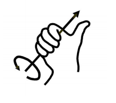

### 4.1.2 Position and Translation Transformation

The position is represented by a three-dimensional vector, and the translation transformation is the transformation of the coordinate system space position, which can be represented by the position vector of the coordinate system origin O, as shown in the figure below. 

Multiple translation transformations are also very simple. You can find the coordinates of a point in space in the coordinate system {B} after translation transformation by adding directly between vectors.

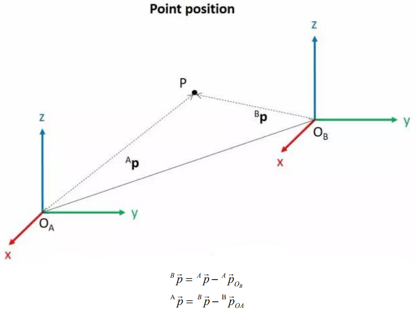

### 4.1.3 Angle Rotation Transformation

Compared with the position, the representation method of the orientation is relatively more complicated. Before discussing the orientation, it is necessary to explain one point: the three-dimensional position and orientation of an object are usually "attached" to the object with a coordinate system that moves and rotates with it, and then by describing the coordinate system and the reference coordinate system relationship to describe this object.

Describing the position and orientation of an object in the coordinate system can be equivalently understood as describing the relationship between the coordinate systems. We talk about orientation notation here, as long as we talk about the relationship between two coordinate systems. To know how and how much a coordinate system is rotated relative to another coordinate system, what should be done? Let's start with the two-dimensional situation:

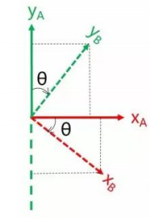

Expressing the unit vectors of the coordinate axes in terms of the reference coordinate system, we can directly write down the following formulas based on the diagram.

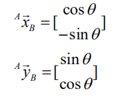

Let's define another 2x2 matrix for example:

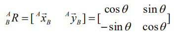

Each column of this matrix represents the unit vectors of coordinate axes in system B, allowing us to draw the x and y axes of system B and determine its unique orientation.

### 4.1.4 Rotation Matrix

The three-dimensional orientation of space is relatively more complicated, because the orientation of the coordinates on the plane can only have one degree of freedom, that is, to rotate around the axis of the vertical plane. The orientation of objects in space will have three degrees of freedom. However, if we start from the first method in the figure above, we can easily write a 3×3 R matrix, which we call the rotation matrix:

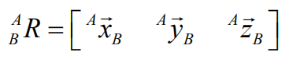

This formula shows that in the rotation matrix from the coordinate system {B} to the coordinate system {A}, each column is the representation of the coordinate axis unit vector of the coordinate system {B} in the coordinate system {A}.

## 4.2 Brief Analysis of Inverse Kinematics

### 4.2.1 Inverse Kinematics Introduction

Inverse kinematics is the process of determining the parameters of the joint movable object to be set to achieve the required posture.

The inverse kinematics of the robotic arm is an important foundation for its trajectory planning and control. Whether the inverse kinematics solution is fast and accurate will directly affect the accuracy of the robotic arm’s trajectory planning and control. so it is important to design a fast and accurate inverse kinematics solution method for a six-degree-of-freedom robotic arm.

### 4.2.2 Brief Analysis of Inverse Kinematics

For the robotic arm, the position and orientation of the gripper are given to obtain the rotation angle of each joint. The three-dimensional motion of the robotic arm is complicated. In order to simplify the model, we remove the rotation joint of the pan-tilt so that the kinematics analysis can be performed on a two-dimensional plane.

Inverse kinematics analysis generally requires a large number of matrix operations, and the process is complex and computationally expensive, so it is difficult to implement. In order to better meet our needs, we use geometric methods to analyze the robotic arm.

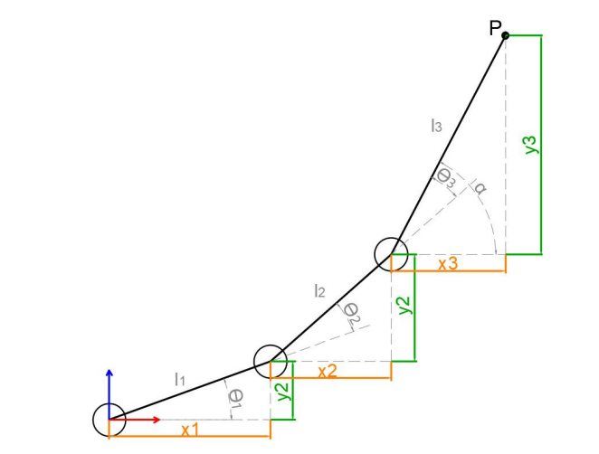

We simplify the model of the robotic arm, remove the pan-tilt at the base, and the actuator part to get the main body of the robotic arm. From the figure above, you can see the coordinates (x, y) of the end point P of the robotic arm, which ultimately consists of three parts (x1+x2+x3, y1+y2+y3).
Among them θ1, θ2, and θ3 in the above figure are the angles of the servo that we need to solve, and α is the angle between the paw and the horizontal plane. From the figure, it is obvious that the top angle of the claw α=θ1+θ2+θ3, based on which we can formulate the following formula:

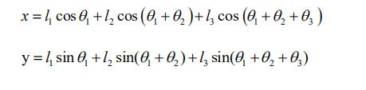

Among them, x and y are given by the user, and l1, l2, and l3 are the inherent properties of the mechanical structure of the robotic arm.
In order to facilitate the calculation, we will deal with the known part and consider the whole:

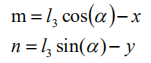

Substituting m and n into the existing equation, and then simplifying can get:

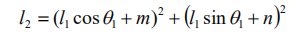

Through calculation:

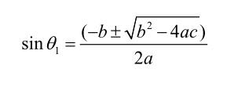

We see that the above formula is the root-finding formula of a quadratic equation in one variable:


Based on this, we can find the angle of θ1, and similarly we can also find θ2. From this we can obtain the angles of the three steering gears, and then control the steering gears according to the angles to realize the control of the coordinate position.

### 4.2.3 Inverse Kinematics Program Position

The inverse kinematics program has been packaged, and the path can be found in "**/home/pi/MasterPi/masterpi_sdk/kinematics_sdk/kinematics/**". For detailed code instruction, please refer to the corresponding program comments.

```bash
cd MasterPi/masterpi_sdk/kinematics_sdk/kinematics
```

## 4.3 Single Control Multiple Servos

### 4.3.1 Program Description

This section demonstrates how to respectively control the servo of the robotic arm through servo control function.
Servo control function is mainly used to directly control the pulse width the servo  to make the servo rotate rotate to the specific position.

### 4.3.2 Start and Close the Game

:::{Note}
the entered command should be case sensitive and "Tab" key can be used to complement the keywords.
:::

(1) Power on the robot and use VNC Viewer to connect to the remote desktop.


(2) Click  in the top left corner of the desktop, or press the shortcut key "Ctrl+Alt+T" to open the LX terminal.

(3) Enter the command . Press "Enter" to switch to  the directory where the program is.

```bash
cd /MasterPi/board_demo
```

(4) Enter the command, and press "Enter" to activate the game. 

```bash
python3 control_by_servo.py
```

(5) If want to exit the program, press "Ctrl+C".

### 4.3.3 Program Outcome

After the program starts, the servos of the robotic arm will rotate from servo 1.


### 4.3.4 Program Analysis

The source code of the program is stored in [/home/pi/MasterPi/board_demo/ control_by_servo.py](https://store.hiwonder.com.cn/docs/masterpi/source_code/robot-arm-inverse-kinematics-basic/control_by_servo.zip)

* **Import Related Library** 

{lineno-start=6}

```python
import time
from common.ros_robot_controller_sdk import Board
```

`time`  is the time-related library; "Board" is the library related to the expansion board control. 

To call the function in function library, please use code "the library name. function name (parameter, parameter)". For example, import time:

{lineno-start=6}

```python
import time
```
The function of code above is to call the`sleep ()` function from the `time` library. The `sleep()` is used for delay. 

There are some built-in libraries in Python, which can be directly imported to call. For example, time, cv2, math, etc. In addition, you can customize a library, such as `Board` expansion board library applied in the program of this lesson.

* **Robotic arm movement** 

{lineno-start=10}

```python
board = Board()
board.pwm_servo_set_position(0.5, [[1, 1300]])
time.sleep(1)
board.pwm_servo_set_position(0.5, [[1, 1500]])
time.sleep(1)
```

Use the `board.pwm_servo_set_position` function to control the servo. The meaning of parameters in parentheses is as follow:

The first parameter `0.02` means the duration of action in the unit of s.

The second parameter `[[1, 1300]]` indicates that the pulse width controlling the rotation of servo 1 is 1300.

## 4.4 Control the Movement of Robotic Arm

### 4.4.1 Working Principle

This lesson will control robotic arm’s movement by setting the position coordinate of the end-effector of robotic arm through the inverse kinematics.

Inverse kinematics is used to calculate the joint angle based on the coordinate of the target position, then convert the angle to the pulse width for controlling the servo so that the end-effector of robotic arm can be controlled to move to the target position.

### 4.4.2  Operation Steps

:::{Note}
the entered command should be case sensitive and "Tab" key can be used to complement the keywords.
:::

(1) Power on the robot and use VNC Viewer to connect to the remote desktop.


(2) Click  in the top left corner of the desktop, or press the shortcut key "Ctrl+Alt+T" to open the LX terminal.

(3) Enter the command . Press "Enter" to switch to  the directory where the program is.

```bash
cd /MasterPi/board_demo
```

(4) Enter the command , and press "Enter" to activate the game. 

```bash
python3 control_by_kinematics.py
```

(5) If want to exit the program, press "Ctrl+C".

### 4.4.3 Program Outcome

After the program starts, the robotic arm will move left and right, forward and backward, then up and down.


### 4.4.4 Code Analysis

The source code of program is stored in : [/home/pi/MasterPi/board_demo/control_by_kinematics.py](https://store.hiwonder.com.cn/docs/masterpi/source_code/robot-arm-inverse-kinematics-basic/control_by_kinematics.zip).

* **Import Related Library** 

{lineno-start=1}

```python
#!/usr/bin/env python3
# encoding:utf-8
import sys
import time
from kinematics.arm_move_ik import *
from common.ros_robot_controller_sdk import Board
```

`time` is the time-related library; `kinematics.arm_move_ik` is the library related to the inverse kinematics. 

To call the function i n function library, please use code "the library name. function name (parameter, parameter)". For example, import time:

{lineno-start=4}

```python
import time
```

The function of code above is to call the `sleep ()` function from the `time` library. The `sleep()` is used for delay. 
There are some built-in libraries in Python, which can be directly imported to call. For example, time, cv2, math, etc. In addition, you can customize a library, such as "kinematics.arm_move_ik" inverse kinematics library applied in the program of this lesson.

* **Nstantiate Function** 

{lineno-start=14}

```python
	# 实例化逆运动学库(Instantiate the inverse kinematics library)
AK = ArmIK()
```

Function instantiation facilitates calling the function. For example, in `AK = ArmIK()`, the ArmIK class is instantiated and becomes an object named AK.

* **Robotic Arm Movement** 

{lineno-start=31}

```python
	    # 设置机械臂初始位置(x:0, y:6, z:18),运行时间:1500毫秒（Set the initial position of the robotic arm to x:0, y:6, z:18 and run for 1500 milliseconds."）
    AK.setPitchRangeMoving((0, 6, 18), 0,-90, 90, 1500) 
    time.sleep(1.5) # 延时1.5秒(Delay for 1.5 seconds.)

    AK.setPitchRangeMoving((5, 6, 18), 0,-90, 90, 1000)  # 设置机械臂X轴右移,运行时间:1000毫秒(Set the robotic arm to move right on the X-axis and run for 1000 milliseconds.)
    time.sleep(1.2) # 延时1.2秒 (Delay for 1.2 seconds.)
    AK.setPitchRangeMoving((5, 13, 11), 0,-90, 90, 1000) #设置机械臂Y轴、Z轴同时移动，运行时间:1000毫秒(Set the robotic arm to move simultaneously on the Y-axis and Y-axis, and run for 1000 milliseconds.)
    time.sleep(1.2) # 延时1.2秒(Delay for 1.2 seconds.)
    AK.setPitchRangeMoving((-5, 13, 11), 0,-90, 90, 1000) # 设置机械臂X轴右移,运行时间:1000毫秒(Set the robotic arm to move right on the X-axis and run for 1000 milliseconds.)
    time.sleep(1.2) # 延时1.2秒(Delay for 1.2 seconds.)
    AK.setPitchRangeMoving((-5, 6, 18), 0,-90, 90, 1000)  #设置机械臂Y轴、Z轴同时移动，运行时间:1000毫秒(Set the robotic arm to move simultaneously on the Y-axis and Y-axis, and run for 1000 milliseconds.)
    time.sleep(1.2) # 延时1.2秒(Delay for 1.2 seconds.)
    AK.setPitchRangeMoving((0, 6, 18), 0,-90, 90, 1000) # 设置机械臂X轴左移,运行时间:1000毫秒(Set the robotic arm to move left on the X-axis and run for 1000 milliseconds.)
    time.sleep(1.2) # 延时1.2秒(Delay for 1.2 seconds.)
```

Take code `AK.setPitchRangeMoving((0, 6, 18), 0,-90, 90, 1500)` as an example. The meaning of parameters in parentheses is as follow:

Parameter `(0,6,18)` represents the coordinate (X,Y,Z) of end-effector in three dimensional space with robotic arm as origin. 

Parameter `0` is the pitch angle of robotic arm moving to the end coordinate.

Parameters `-90` and `90` are the ranges of pitch angle. When robotic arm can not reach to the specified pitch angle, it will find a solution closest to the given pitch angle.

Parameter `1000` is the duration of rotation in mm.

