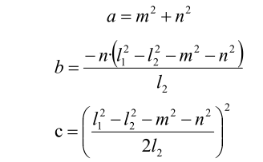

# 机械臂逆运动学基础课程

## 1. 机械臂坐标系的建立

### 1.1 坐标系介绍

描述空间位置、速度和加速度，大部分都是用笛卡尔坐标系，也就是大家熟知由三个互相垂直的坐标轴所组成的坐标系。当我们说绕某一个轴旋转多少角度时，正方向的确定使用右手定则，如下图：


### 1.2 位置、平移变换

位置是使用一个三维向量来表示，平移变换是坐标系空间位置的变换，可以用坐标系原点 O 的位置向量表示，如下图所示。多次平移变换也很简单，向量之间直接相加就可以求空间中一个点的位置在经过平移变换后的坐标系{B} 中的坐标。


### 1.3 角度旋转变换

相比于位置，方位的表示方法相对会麻烦一些。在讨论方位之前，有必要先说明一点：一个物体的三维位置和朝向，通常都会在物体上"附上"一个跟着它动跟着它转的坐标系，然后通过描述这个坐标系与参考坐标系的关系来描述这个物体。

描述一个物体在坐标系中的位置和朝向，可以等效理解为描述坐标系之间的关系。我们这里讲角度/方向表示法，只要讲两个坐标系之间的关系就可以了。 要知道一个坐标系相对于另一个坐标系如何旋转、旋转了多少，应该怎么做呢？我们先从二维的情况看起：


通过将坐标轴单位向量用参考坐标系表示，看图可以直接写出下列公式：


我们再定义一个2x2的矩阵：


显然，这个矩阵的每一列为坐标系B的坐标轴单位向量在坐标系中的表示，有了这个矩阵我们就能画出坐标系B的x轴y轴，确定B的唯一朝向。

### 1.4 旋转矩阵

空间三维朝向相对来讲更加复杂，因为平面上坐标的朝向只能有一个自由度，即绕垂直平面的轴旋转。而空间中物体的朝向会有三个自由度。不过如果我们从上图的第一种方法出发，就可以轻松写出一个3×3的R矩阵，我们称它为旋转矩阵：


这个式子表明从坐标系{B}到坐标系{A}的旋转矩阵中，每一列都是坐标系{B}的坐标轴单位向量在坐标系{A}中的表示。

## 2. 逆运动学简要分析

### 2.1 逆运动学简介

逆运动学是决定要达成所需要的姿势所要设置的关节可活动对象的参数的过程。

机械臂的逆运动学问题是其轨迹规划与控制的重要基础，逆运动学求解是否快速准确将直接影响到机械臂轨迹规划与控制的精度，因此针对六自由度机械臂，设计一种快速准确的逆运动学求解方法是十分重要的。

### 2.2 逆运动学简析

对于机械臂而言，就是给出夹持器的位置和朝向后求出每个关节的旋转角度。机械臂的三维运动是比较复杂的，这里为了简化模型，我们去掉下方云台的旋转关节，这样就可以在二维的平面上进行运动学分析了。

进行逆运动学分析一般要进行大量的矩阵运算，过程复杂计算量大所以实现起来较难。为了更好的适应我们的需要，我们使用几何法对机械臂进行分析。


我们将机械臂的模型简化，去掉底座云台，和执行器部分得到机械臂的主体。从上图可以看到机械臂的端点P的坐标（x,y），最终由三个部分组成（x1+x2+x3，y1+y2+y3）。

其中上图的θ1，θ2 ，θ3就是我们要求解的舵机的角度，α是爪子与水平面的夹角。从图上来看显然爪子的俯视角度α=θ1+θ2+θ3，据此我们可以列出下式：


其中x，y由使用者给出，l1、l2、l3为机械臂的机械结构固有属性。

为了方便计算，我们将已知部分处理一下，作整体考虑：


将m、n代入已有方程，再化简可得：


通过计算可得：


我们看到上式为一元二次方程的求根公式，其中：



据此我们可以求出θ1的角度，同理我们也可以求出θ2。由此我们便可求出三个舵机的角度，然后根据角度控制舵机即可实现坐标位置的控制。

### 2.3 逆运动学程序位置

逆运动学程序已经封装好了，路径查看可在"**/home/pi/MasterPi/masterpi_sdk/kinematics_sdk/kinematics/**"中找到，详细代码说明可参考对应程序注释即可。

```commandline
cd MasterPi/masterpi_sdk/kinematics_sdk/kinematics
```

## 3. 单次控制多个舵机

### 3.1 实验原理

本节课通过舵机控制函数，分别控制机械臂上的舵机。

主要使用舵机控制函数，直接控制舵机脉宽，使舵机转动到指定位置。

该程序的源代码位于: **/home/pi/MasterPi/board_demo/control_by_servo.py**


### 3.2 玩法开启及关闭步骤

:::{Note}
指令的输入需严格区分大小写，另外可按键盘"**Tab**"键进行关键词补齐。
:::

1. 将设备开机，并参照课程资料的"**第1章 学前先看\第4课** **远程工具安装与连接**"内容，通过VNC远程连接工具连接。


2. 点击系统桌面左上角的图标，或按下快捷键"**Ctrl+Alt+T**"打开LX终端。


3. 输入指令，并按下回车，切换至玩法程序所在目录。

```commandline
cd /MasterPi/board_demo
```

4. 输入指令，并按下回车，开启玩法。

```commandline
python3 control_by_servo.py
```

5. 如需关闭此程序，可按下"**Ctrl+C**"。

### 3.3 功能实现

玩法开启后，机械臂上的舵机会从1号舵机开始转动。

### 3.4 代码分析

- #### 3.4.1 导入相关库

```python
#!/usr/bin/python3
# coding=utf8

# 第2章 课程基础/2.机械臂逆运动学基础课程/第3课 单次控制多个舵机 

import time
from common.ros_robot_controller_sdk import Board
```

"**time**"是时间相关的库；"**Board**"是控制扩展板相关的库。

如需调用功能库里的函数，可以使用代码"功能库名.函数名（参数，参数...）"，如：

```python
import time
```
上图所示代码的作用是调用"**time**"库中的sleep()函数，此函数用于延时。

Python中有一些内置的库，用户可以直接导入调用，如time、cv2、math等。此外，用户也可以自定义一个库，如本节课所用程序中的"**Board**"扩展板库。

- #### 3.4.2 机械臂运动

```python
board = Board()
board.pwm_servo_set_position(0.5, [[1, 1300]])
time.sleep(1)
board.pwm_servo_set_position(0.5, [[1, 1500]])
time.sleep(1)
```

使用 board.pwm_servo_set_position函数进行舵机控制，括号内的参数含义如下：

第一个参数："0.02"为动作持续时间，单位是秒。

第二个参数"\[\[1, 1300\]\]"为控制1号舵机转动1300个脉宽。

## 4. 机械臂上下左右移动

### 4.1 实验原理

本节课通过逆运动学设置机械臂末端位置坐标，控制机械臂末端上下左右移动。

主要使用逆运动学，根据设置的目标位置坐标，计算出关节角度；再将关节角度换算成舵机脉宽，再控制舵机就可以实现机械臂末端移动到目标位置。

程序的源代码位于容器内：**/home/pi/MasterPi/board_demo/control_by_kinematics.py**

### 4.2 玩法开启及关闭步骤

:::{Note}
指令的输入需严格区分大小写，另外可按键盘"**Tab**"键进行关键词补齐。
:::

1. 将设备开机，并参照课程资料的"**[学前先看\4. 远程工具安装与连接]()**"内容，通过VNC远程连接工具连接。


2. 点击系统桌面左上角的图标，或按下快捷键"**Ctrl+Alt+T**"打开LX终端。


3. 输入指令，并按下回车，切换至玩法程序所在目录。

```commandline
cd /MasterPi/board_demo
```

4. 输入指令，并按下回车，开启玩法。

```commandline
python3 control_by_kinematics.py
```

5. 如需关闭此程序，可按下"Ctrl+C"。

### 4.3 功能实现

玩法开启后，机械臂会左右移动，再前后移动，最后上下移动。

### 4.4 代码分析

- #### 4.4.1导入相关库

```python
#!/usr/bin/env python3
# encoding:utf-8
import sys
import time
from kinematics.arm_move_ik import *
from common.ros_robot_controller_sdk import Board
```

"**time**"是时间相关的库；"**kinematics.arm_move_ik**"是逆运动学相关的库。

如需调用功能库里的函数，可以使用代码"功能库名.函数名（参数，参数...）"，如：

```python
import time
```

上图所示代码的作用是调用"**time**"库中的sleep()函数，此函数用于延时。

Python中有一些内置的库，用户可以直接导入调用，如time、cv2、math等。此外，用户也可以自定义一个库，如本节课所用程序中的"**kinematics.arm_move_ik**"逆运动学库。

- #### 4.4.2 实例化函数

```python
# 实例化逆运动学库
AK = ArmIK()
```

将函数实例化，方便后面调用函数。AK = ArmIK()中，ArmIK类，被AK的对象实例。

- #### 4.4.3 机械臂运动

```python
    # 设置机械臂初始位置(x:0, y:6, z:18),运行时间:1500毫秒
    AK.setPitchRangeMoving((0, 6, 18), 0,-90, 90, 1500) 
    time.sleep(1.5) # 延时1.5秒
    
    AK.setPitchRangeMoving((5, 6, 18), 0,-90, 90, 1000)  # 设置机械臂X轴右移,运行时间:1000毫秒
    time.sleep(1.2) # 延时1.2秒
    AK.setPitchRangeMoving((5, 13, 11), 0,-90, 90, 1000) #设置机械臂Y轴、Z轴同时移动，运行时间:1000毫秒
    time.sleep(1.2) # 延时1.2秒
    AK.setPitchRangeMoving((-5, 13, 11), 0,-90, 90, 1000) # 设置机械臂X轴右移,运行时间:1000毫秒
    time.sleep(1.2) # 延时1.2秒
    AK.setPitchRangeMoving((-5, 6, 18), 0,-90, 90, 1000)  #设置机械臂Y轴、Z轴同时移动，运行时间:1000毫秒
    time.sleep(1.2) # 延时1.2秒
    AK.setPitchRangeMoving((0, 6, 18), 0,-90, 90, 1000) # 设置机械臂X轴左移,运行时间:1000毫秒
    time.sleep(1.2) # 延时1.2秒
```

以代码"**AK.setPitchRangeMoving((0, 6, 18), 0,-90, 90, 1500)**"为例，括号内的参数含义如下：

第一个参数"**(0,6,18)**"表示以机械臂为原点的三维空间末端坐标（X, Y, Z）；

第二个参数"**0**"是机械臂运动到末端坐标的俯仰角；

第三个参数"**-90**"与第四个参数"**90**"是俯仰角的取值范围，机械臂无法运动到指定俯仰角时，会自动寻找最接近给定俯仰角的解；

第五个参数"**1000**"是运行时间，单位是毫秒。


