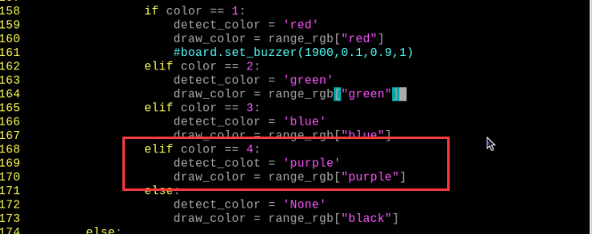
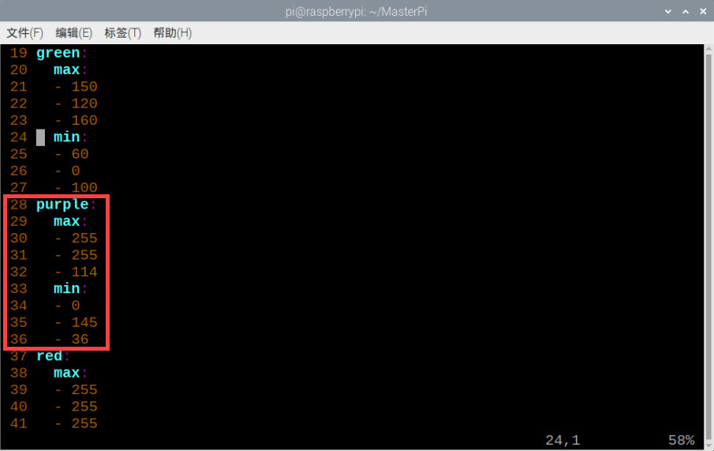

#  5. Al Vision Projects

## 5.1 Single Color Recognition

In this section, the camera detects colors. When a red ball is recognized, the buzzer will emit a beep, and the red ball will be highlighted in the transmitted image with "Color: red" displayed.

### 5.1.1 Program Description

The implementation of color recognition consists of two parts: color detection and execution feedback after recognition.
First, for the color detection part, Gaussian filtering is applied to the image to reduce noise. The Lab color space is then used to convert the color of the object (you can learn more about the Lab color space in the "[OpenCV Vision Basic Course]()" section of the tutorial materials). 
Next, the object's color within the circle is recognized using color thresholding, followed by masking (masking involves using selected images, shapes, or objects to globally or locally obscure the image being processed). 

After performing morphological operations such as opening and closing on the object image, the object with the largest contour is circled. 

Opening: The image undergoes erosion followed by dilation. This operation removes small objects, smooths shape boundaries, and preserves the area. It can eliminate small noise particles and separate connected objects.  

Closing: The image undergoes dilation followed by erosion. This operation fills small holes within objects, connects nearby objects, closes broken contour lines, and smooths boundaries while preserving the area.
After recognition, the servo and buzzer are set up to provide feedback based on the detected color. For example, when red is detected, the buzzer will emit a sound.
For detailed feedback behavior, please refer to section 3. Function Implementation of this document.

<p id="anchor_1_2"></p>

### 5.1.2 Start and Close the Game

:::{Note}
The input command is case-sensitive, and keywords can be auto-completed using the Tab key.
:::

(1)  Power on the robot and use VNC Viewer to connect to the remote desktop.

(2) Click the icon  in the top left corner of the system desktop or press the shortcut **"Ctrl+Alt+T"** to open the LX terminal.

(3) Execute the command to navigate to the directory where the program is located, then press Enter: 

```bash
cd MasterPi/functions/
```

(4) Enter the command and press Enter to start the program:

```bash
python3 color_warning.py
```

(5) To close the program, simply press "Ctrl+C" in the LX terminal. If it does not close, press it multiple times.

<p id="anchor_1_3"></p>

### 5.1.3 Program Outcome

After starting the game, the camera will be used to detect colors. When a red ball is recognized, the buzzer will emit a beep sound, and the ball will be circled in the transmitted image, with "Color: red" printed.


:::{Note}
* During the recognition process, ensure the environment is well-lit to avoid inaccurate recognition due to poor lighting conditions.
* Ensure that no objects with similar or matching colors to the target are present in the background within the camera's visual range, as this may cause misrecognition.
:::

### 5.1.4 Program Analysis

The source code of this program is saved in：[/home/pi/MasterPi/functions/color_warning.py]()

<p id="anchor_1_4_1"></p>

* **Import Function Library** 

{lineno-start=1}

```python
#!/usr/bin/python3
# coding=utf8
import sys
import cv2
import time
import math
import threading
import common.yaml_handle as yaml_handle
```

(1) Import Libraries for OpenCV, Time, Math, and Threading
To use functions from a library, we can call them with the syntax:

{lineno-start=204}

```python
time.sleep(0.01)
```

For example, to call the `sleep` function from the `time` library, we use: 
In Python, several libraries like `time`, `cv2`, and `math` are built-in and can be directly imported and used. You can also create your own libraries, like the "yaml_handle" file-reading library mentioned above.

(2) Instantiate a Library

Some library names can be long and hard to remember. To simplify function calls, we often instantiate libraries. 

After instantiating the library, we can call functions from the `Board` library using the shorter syntax:  

Board.function_name(parameter1, parameter2, ...)

This makes it much easier and more convenient to use.

* **Main Function Analysis** 

In a Python program, `__name__ == '__main__'` indicates the main function of the program, where the program starts by reading an image.

{lineno-start=182}

```python
if __name__ == '__main__':
    from kinematics.arm_move_ik import *
    from common.ros_robot_controller_sdk import Board
    board = Board()
```

**(1) Capturing Camera Image**

{lineno-start=192}

```python
  cap = cv2.VideoCapture('http://127.0.0.1:8080?action=stream')
```

When the program starts, the camera is initialized.

**(2) Image Processing**

The `run()` function handles image processing.

{lineno-start=195}

```python
if ret:
    frame = img.copy()
    Frame = run(frame) 
```

① The function `img.copy()` copies the content of `img` to `frame`.

② Function `run()` for Image Processing

{lineno-start=93}

```python
def run(img):
    global interval_time
    global __isRunning, color_list
    global detect_color, draw_color
    
    if not __isRunning:  # 检测是否开启玩法，没有开启则返回原图像(detect if the game is enabled, if not, return the original image)
        return img
    else:
        img_copy = img.copy()
        img_h, img_w = img.shape[:2]
        
        frame_resize = cv2.resize(img_copy, size, interpolation=cv2.INTER_NEAREST)
        frame_gb = cv2.GaussianBlur(frame_resize, (3, 3), 3)
        
        frame_lab = cv2.cvtColor(frame_gb, cv2.COLOR_BGR2LAB)  # 将图像转换到LAB空间(convert the image to LAB space)
```

③ Resizing the Image. The image size is resized to facilitate processing.

{lineno-start=104}

```python
 frame_resize = cv2.resize(img_copy, size, interpolation=cv2.INTER_NEAREST)
```

The first parameter `img_copy` is the input image.

The second parameter `size` specifies the output image size, which can be customized.

The third parameter `interpolation=cv2.INTER_NEAREST` defines the interpolation method. 

`INTER_NEAREST`: Nearest-neighbor interpolation.  

`INTER_LINEAR`: Bilinear interpolation (default if not specified).  

`INTER_CUBIC`: Bicubic interpolation over a 4x4 pixel neighborhood.  

`INTER_LANCZOS4`: Lanczos interpolation over an 8x8 pixel neighborhood.

④ Apply Gaussian Blur to reduce noise

Gaussian blur is a linear smoothing filter used to eliminate Gaussian noise and is widely used in image denoising.

{lineno-start=105}

```python
frame_gb = cv2.GaussianBlur(frame_resize, (3, 3), 3)
```

The first parameter `frame_resize` is the input image.

The second parameter `(3, 3)` is the size of the Gaussian kernel.

The third parameter `3` is the standard deviation of the Gaussian kernel in the X-direction.

⑤ Convert the image to LAB color space.

{lineno-start=107}

```python
        frame_lab = cv2.cvtColor(frame_gb, cv2.COLOR_BGR2LAB)  # 将图像转换到LAB空间(convert the image to LAB space)
```

The first parameter `frame_gb` is the input image.

The second parameter `cv2.COLOR_BGR2LAB` specifies the conversion from BGR to LAB format. To convert to RGB, use `cv2.COLOR_BGR2RGB`.

⑥ Convert the image to a binary image with only 0s and 1s, simplifying the image and reducing data for easier processing.

The `cv2.inRange()` function is used for binarization:

{lineno-start=112}

```python
                frame_mask = cv2.inRange(frame_lab,
                                             (lab_data[i]['min'][0],
                                              lab_data[i]['min'][1],
                                              lab_data[i]['min'][2]),
                                             (lab_data[i]['max'][0],
                                              lab_data[i]['max'][1],
                                              lab_data[i]['max'][2])) 
```

The first parameter `"frame_lab"` is the input image.
The second parameter `(lab_data[i]['min'][0], lab_data[i]['min'][1], lab_data[i]['min'][2])` specifies the lower color threshold.
The third parameter `(lab_data[i]['max'][0], lab_data[i]['max'][1], lab_data[i]['max'][2])` specifies the upper color threshold.

⑦ To reduce interference and smooth the image, morphological operations are applied. Opening is erosion followed by dilation, and closing is dilation followed by erosion. The `cv2.morphologyEx()` function is used.

{lineno-start=118}

```python
opened = cv2.morphologyEx(frame_mask, cv2.MORPH_OPEN, np.ones((3, 3), np.uint8))  # 开运算(opening operation)
closed = cv2.morphologyEx(opened, cv2.MORPH_CLOSE, np.ones((3, 3), np.uint8))  # 闭运算(closing operation)
```

The first parameter `"frame_mask"` is the input image.

The second parameter `cv2.MORPH_OPEN` specifies the morphological operation (options include `cv2.MORPH_ERODE`, `cv2.MORPH_DILATE`, `cv2.MORPH_OPEN`, `cv2.MORPH_CLOSE`).

The third parameter `np.ones((6, 6))` specifies the convolution kernel.

The fourth parameter `np.uint8` defines the number of iterations to apply.

⑧ Find the Largest Contour

After completing the image processing, the largest contour is found using the `cv2.findContours()` function.

{lineno-start=121}

```python
contours = cv2.findContours(closed, cv2.RETR_EXTERNAL, cv2.CHAIN_APPROX_NONE)[-2]  # 找出轮廓(find contours)
```

The first parameter `"closed"` is the input image.

The second parameter `cv2.RETR_EXTERNAL` specifies the contour retrieval mode.

The third parameter `cv2.CHAIN_APPROX_NONE)[-2]` specifies the contour approximation method.

The largest contour is selected, and a minimum area threshold is set to ensure the target contour is valid only if its area exceeds this value.

{lineno-start=122}

```python
 areaMaxContour, area_max = getAreaMaxContour(contours)  # 找出最大轮廓(find the largest contour)
if areaMaxContour is not None:
    if area_max > max_area:  # 找最大面积(find the maximum area)
       max_area = area_max
       color_area_max = i
       areaMaxContour_max = areaMaxContour
        if max_area > 2500:  # 有找到最大面积(the largest area has been found)
            rect = cv2.minAreaRect(areaMaxContour_max)
            box = np.intp(cv2.boxPoints(rect))
```

⑨ Determine the Color with the Largest Area in the Image by using a conditional statement

{lineno-start=133}

```python
if color_area_max == 'red':  # 红色最大(red is the maximum)
                color = 1
            elif color_area_max == 'green':  # 绿色最大(green is the maximum)
                color = 2
            elif color_area_max == 'blue':  # 蓝色最大(blue is the maximum)
                color = 3
            else:
                color = 0
            color_list.append(color)
            if len(color_list) == 3:  # 多次判断(multiple judgements)
                # 取平均值(get mean)
                color = int(round(np.mean(np.array(color_list))))
                color_list = []
                
                if color == 1:
                    if time.time() > interval_time:
                        interval_time = time.time() + 3
                        for i in range(1):
                            board.set_buzzer(1900, 0.1, 0.9, 1)# 设置蜂鸣器响0.1秒
                            time.sleep(0.1)
                    detect_color = 'red'
                    draw_color = range_rgb["red"]
                elif color == 2:
                    detect_color = 'green'
                    draw_color = range_rgb["green"]
                elif color == 3:  
                    detect_color = 'blue'
                    draw_color = range_rgb["blue"]
                else:
                    detect_color = 'None'
                    draw_color = range_rgb["black"]
        else:
            draw_color = (0, 0, 0)
            detect_color = "None"
```

**(3)  Display the Output Image**

{lineno-start=198}

```python
frame_resize = cv2.resize(Frame, (320, 240))
cv2.imshow('frame', frame_resize)
key = cv2.waitKey(1)
if key == 27:
	break
```

The function `cv2.resize()` resizes the processed image to an appropriate size.

The function `cv2.imshow()` displays the image in a window. `'frame'` is the window name, and `frame_resize` is the image to be displayed. `cv2.waitKey()` must be included afterward, otherwise, the image will not be displayed.
The function `cv2.waitKey()` waits for a key press, and the parameter `1` specifies the delay time.

**1.4.3 Sub-thread Analysis**

**(1) Light the RGB LED**

The RGB LED color is set to match the recognized color.

{lineno-start=60}

```python
#设置扩展板的RGB灯颜色使其跟要追踪的颜色一致(set the color of the RGB light on the expansion board to match the color to be tracked.)
def set_rgb(color):
    if color == "red":
        board.set_rgb([[1, 255, 0, 0], [2, 255, 0, 0]])
    elif color == "green":
        board.set_rgb([[1, 0, 255, 0], [2, 0, 255, 0]])
    elif color == "blue":
        board.set_rgb([[1, 0, 0, 255], [2, 0, 0, 255]])
    elif color == "purple":
        board.set_rgb([[1, 128, 0, 128],[2, 128, 0, 128]])
    else:
        board.set_rgb([[1, 0, 0, 0], [2, 0, 0, 0]])
```

**(2) Drive the Buzzer**

{lineno-start=151}

```python
board.set_buzzer(1900, 0.1, 0.9, 1)
```
### 5.1.5 Function Extensions

<p id="anchor_1_4_1"></p>

* **Changing the Default Recognized Color** 

The color recognition program is pre-configured to recognize three colors: red, green, and blue. By default, the program identifies red, triggering the buzzer to emit a beep and drawing a circle around the red ball in the transmitted image, displaying "Color: red".

To change the recognized color to green, follow these steps:

(1) Enter the following command and press Enter to navigate to the source code directory:

```bash
cd MasterPi/functions/
```

(2) Then, enter the following command and press Enter to open the program file:

```bash
sudo vim color_warning.py
```

(3) Locate the code shown in the image below:


(4) Press the "i" key on the keyboard to enter edit mode.

(5) Move the buzzer code from the above image to directly below code "elif color == 2":


(6) To save your changes, press the "Esc" key, then type ":wq" (note the colon before "wq") and press Enter to save and exit.

(7) Enter the following command and press Enter to start the color recognition functionality: 

```bash
python3 color_warning.py
```

* **Add New Recognizable Colors** 

In addition to the three built-in colors, we can configure the system to recognize other colors. For example, let's add purple as a new recognizable color. The specific modification steps are as follows:

(1) Double-click the icon on the system desktop, then simply select "**Execute**" in the pop-up prompt box.


(2) In the pop-up interface, sequentially select **"Camera Tool"** and then **"Connect"**.


(3) Click "Add New", then name the new color (using "purple" as an example), and click "OK".


(4) Then click the dropdown button of the color selection box and choose "purple".


(5) Point the camera at the purple object, then drag the L, A, and B sliders until the color area to be recognized on the left screen turns white, and the other areas turn black.


(6) Finally, click "Save" to save the adjusted color threshold.


(7) After making the changes, we can check if the modified values have been successfully written. Enter the directory where the program code is stored.

```bash
cd MasterPi
```

(8) Enter the command to open the program file, then press Enter.

```bash
sudo vim lab_config.yaml
```

(9) After opening the color threshold program file, you can check the purple threshold parameters.


(10) Follow steps 1–2 of "[ Change Default Recognized Color](#anchor_1_4_1)" to open the program file and press the "i" key to enter INSERT mode.

(11) Then, locate the code shown in the image below.


(12) Manually input the code `'purple': (255, 255, 114)` and `'purple'`, as shown in the image below:  

(255, 255, 114) is the max threshold value for purple that was viewed in step 9.


(13) Locate the code as the below image:


(14) Manually input the following code as shown in the image below(you can refer to "the RGB Color Finder" for the values):


(15) Then locate the code as the below image:


(16) Manually input the following code as shown in the following image:


(17) Next, find the code shown in the following image:


(18) Manually input the following code as shown in the following image:



(19) Press "Esc" key, then type ":wq" (note the colon before "wq") and press Enter to save and exit.

(20) Refer to "[5.1.2 Start and Close the Game](#anchor_1_2)" to restart the gameplay. Place a purple object in front of the camera. The purple object should be outlined in the returned image, and "purple" should be printed. If you want to revert to the default recognized color, follow the steps in "[Change Default Recognized Color](#anchor_1_4_1)" to set the color to purple.

(21) If you need to add other colors as recognizable colors, refer to the previous steps for operation.

## 5.2 Color Recognition

### 5.2.1 Program Description

This lesson is divided into two parts which are color recognition and execution feedback after recognition.

For color recognition part, the color of the object is converted through LAB space, and then frame the outline of the target after processing the image.

After recognition, set servo, buzzer and RGB to make the robot perform corresponding feedback according to different colors.

<p id="anchor_2_2"></p>

### 5.2.2 Start and Close the Game

:::{Note}
The entered command should be case sensitive. 
:::

(1) Power on the robot and use VNC Viewer to connect to the remote desktop.


(2) Enter command, and then press "Enter" to come to the directory of games programmings.

```bash
cd MasterPi/functions
```

(3) Enter command, then press "Enter" to start the game.

```bash
python3 color_detect.py
```

(4) If you want to exit the game programming, press "Ctrl+C" in LX terminal interface. If the exit fails, please try it few more times.

### 5.2.3 Project Outcome

After the game starts, the robot will recognize colors and then perform corresponding feedback according to different colors as shown in the following table:

| **Object color** | **Buzzer** | **RGB light** | **Execution Action** | **The content printed by frame** |
| ---------------- | ---------- | ------------- | -------------------- | :------------------------------- |
| Red              | beep once  | Red           | "Nod"                | red                              |
| Green            | beep once  | Green         | "Shake head"         | green                            |
| Blue             | beep once  | Blue          | "Shake head"         | blue                             |


:::{Note}

* During the recognition process, please ensure that the recognition is performed in a well-lit environment to avoid inaccurate recognition due to lighting issues.
* During the recognition process, do not place objects with similar or identical colors to the color to be recognized in the background within the visual range of the camera to avoid misidentification.
* If the color recognition is inaccurate, refer to the "[5.2.5 Function Extension --> Add Recognized Color](#anchor_2_5_3)" section of this document to set the color threshold.
:::

### 5.2.4 Program Analysis

The program corresponding to this lesson is stored in **[/home/pi/MasterPi/functions/color_detect.py]()**

:::{Note}
Before modifying the program, it is necessary to back up the original file. Only after that, proceed with the modifications. Directly modifying the source code files is strictly prohibited to avoid any errors that could lead to the robot malfunctioning and becoming irreparable!!!
:::

<span id="anchor_2_4_1" class="anchor"></span>

* **Import Parameter Module** 

| **Import module**                                 | **Function**                                                 |
| ------------------------------------------------- | ------------------------------------------------------------ |
| import sys                                        | Importing Python sys module is used for getting access to the relevant system functionalities and variables. |
| import cv2                                        | Importing OpenCV library is used for  functionalities relayed to the image processing and computer vision. |
| import time                                       | Importing Python time module is used for time-related functionalities,such as delay operations. |
| from common.ros_robot_controller_sdk import Board | Importing board library is used for controlling sensor.      |
| import numpy as np                                | Importing numpy library and renaming it as "np" for performing array and matrix operations |
| import threading                                  | Provide an environment for multi-thread running              |
| from kinematics.transform import *                | Used for functions related to the transformation of the robotic arm's pose. |
| from kinematics.arm_move_ik import *              | Used for functions regarding to inverse kinematics solution and control. |
| import common.yaml_handle                         | Contain some functionalities or tools related to handling YAML format file. |
| import signal                                     | Used for receiving and processing signals                    |

* **Program Logic** 

Information is obtained through the camera, then perform image processing. This includes binarizing the image to reduce interference and make it smoother. Additionally, the image undergoes erosion and dilation processes, then the largest area contour of the target is obtained. Afterward, determine the object color and provide a corresponding feedback.   

* **Program Logic and Corresponding Code Analysis** 

**(1) Image Processing**

**① Import function library**

You need to first import the function library during the initialization.Regarding the content imported, please refer to "[5.2.4 Program Analysis -> Import Parameter Module"](#anchor_2_4_1).

{lineno-start=1}

```python
#!/usr/bin/python3
# coding=utf8
import sys
import cv2
import time
import threading
import common.yaml_handle as yaml_handle
from kinematics.transform import *
```

**② Set the initial status** 

After the initialization is complete, it is necessary to set the initial state. This includes configuring the color for line following, the initial position of the servo, the state of the motors and so on.

{lineno-start=30}

```python
def setTargetColor(target_color):
    global __target_color

    __target_color = target_color
    return (True, ())
```

{lineno-start=52}

```python
# 夹持器夹取时闭合的角度(the closing angle of the gripper while grasping an object)
servo1 = 1500

# 初始位置(initial position)
def initMove():
    board.pwm_servo_set_position(0.3, [[1, servo1]])
    AK.setPitchRangeMoving((0, 6, 18), 0,-90, 90,1500)
```

**(2)  Image Pre-processing**

① Image processing

Resize and apply Gaussian blur to the image.

{lineno-start=213}

```python
frame_resize = cv2.resize(img_copy, size, interpolation=cv2.INTER_NEAREST)
frame_gb = cv2.GaussianBlur(frame_resize, (3, 3), 3)
```

`cv2.resize(img_copy, size, interpolation=cv2.INTER_NEAREST)` is used to resize the image.

The first parameter `img_copy` is the image to be resized.  

The second parameter `size` is the target size. 

The third parameter `interpolation` is the interpolation method used to determine the pixel interpolation algorithm used during `resizing.cv2.GaussianBlur(frame_resize, (3, 3), 3)` is used to apply Gaussian blur to the image.

The first parameter `frame_resize` is the image to be processed with Gaussian blur.

The second parameter `(3,3)` is the size of the Gaussian kernel, wherr both of the width and height of the kernel are 3.

The third parameter `3` is the standard deviation of the Gaussian kernel, which controls the level of blurring. Larger value will result in a stronger blur effect.

② Color Space Conversion

Convert a BGR image to a LAB image.

{lineno-start=216}

```python
frame_lab = cv2.cvtColor(frame_gb, cv2.COLOR_BGR2LAB)  # 将图像转换到LAB空间
```

③ Binarization Processing

The inRange() function from cv2 library is used to perform image binarization processing. 

{lineno-start=224}

```python
frame_mask = cv2.inRange(frame_lab,
                              (lab_data[i]['min'][0],
                               lab_data[i]['min'][1],
                               lab_data[i]['min'][2]),
                               (lab_data[i]['max'][0],
                                lab_data[i]['max'][1],
                                lab_data[i]['max'][2])) #对原图像和掩模进行位运算(perform bitwise operation on the original image and the mask)
```

The first parameter `frame_lab` is the input image.

The second parameter`lab_data[i]['min'][0]` is the lower limit of threshold.

The third parameter `lab_data[i]['max'][0]` is the upper limit of threshold. 

④ Open and Close Operations

{lineno-start=118}

```python
                opened = cv2.morphologyEx(frame_mask, cv2.MORPH_OPEN, np.ones((3, 3), np.uint8))  # 开运算(opening operation)
                closed = cv2.morphologyEx(opened, cv2.MORPH_CLOSE, np.ones((3, 3), np.uint8))  # 闭运算(closing operation)
```

`cv2.morphologyEx(frame_mask, cv2.MORPH_OPEN, np.ones((3, 3), np.uint8))` is an operation to perform opening on a binary image.

The first parameter`frame_mask` is the binary image on which morphological operation will be performed.

The second parameter `cv2.MORPH_OPEN` specifies the type of morphological operation, in this case, it is an opening operation.

The third parameter `np.ones((3, 3), np.uint8)` is the structuring element used in the morphological operation. It defines the shape and size of the operation. In this case , a 3x3 matrix filled with ones is used as the structuring element.

⑤ Obtain the largest area contour

After the above image processing is finished, it is required to obtain the contour the recognized target, which involves the findContours() function in the cv2 library.

{lineno-start=120}

```python
                contours = cv2.findContours(closed, cv2.RETR_EXTERNAL, cv2.CHAIN_APPROX_NONE)[-2]  # 找出轮廓(find contours)
```

Here will use an example of the code `contours = cv2.findContours(dilated, cv2.RETR_EXTERNAL, cv2.CHAIN_APPROX_NONE)[-2]`.

The first parameter`dilated` is the input image.

The second parameter `cv2.RETR_EXTERNAL` is the retrieval mode for contours.

The third parameter `cv2.CHAIN_APPROX_NONE)[-2]` specifies the contour approximation method.

It is necessary to set a minimum value to locate the contour with the largest area among all the obtained contours. Only when the area is greater than this value, the target contour is considered valid to avoid interference.

{lineno-start=121}

```python
                areaMaxContour, area_max = getAreaMaxContour(contours)  # 找出最大轮廓(find the largest contour)
                if areaMaxContour is not None:
                    if area_max > max_area:  # 找最大面积(find the maximum area)
```

⑥ Evaluate the contour with the largest area

{lineno-start=139}

```python
            if color_area_max == 'red':  # 红色最大(red is the maximum)
                color = 1
            elif color_area_max == 'green':  # 绿色最大(green is the maximum)
                color = 2
            elif color_area_max == 'blue':  # 蓝色最大(blue is the maximum)
                color = 3
            else:
                color = 0
```

⑦  Multiple Evaluation 

Make multiple evaluations and take the average value to determine the recognized color.

{lineno-start=148}

```python
            if len(color_list) == 3:  # 多次判断(multiple judgements)
                # 取平均值(get mean)
                color = int(round(np.mean(np.array(color_list))))
                color_list = []
                
                if color == 1:
                    detect_color = 'red'
                    draw_color = range_rgb["red"]
                    #board.set_buzzer(1900,0.1,0.9,1)
                elif color == 2:
                    detect_color = 'green'
                    draw_color = range_rgb["green"]
                elif color == 3:  
                    detect_color = 'blue'
                    draw_color = range_rgb["blue"]
                else:
                    detect_color = 'None'
                    draw_color = range_rgb["black"]
```

**(3)  Color Recognition**

① Turn on RGB light and Buzzer

{lineno-start=143}

```python
if detect_color != 'None' and start_pick_up:  # 检测到色块        
  set_rgb(detect_color) # 设置扩展板上的彩灯与检测到的颜色一样
  board.set_buzzer(1900, 0.1, 0.9, 1)# 设置蜂鸣器响0.1秒
```

set_rgb(detect_color): The set_rgb() function is called to set the RGB on expansion board to the detected color. 

The function `set_buzzer()` is called with the parameters of 1900, 0.1, 0.9, and 1, which sets the buzzer to ring for 0.1 seconds. This is used to control the sound effect and duration of the buzzer.

Therefore, you can control the color lights on the expansion board based on the detected color and provide feedback through the sound emitted by the buzzer.

**② Control Servo**

{lineno-start=148}

```python
  if detect_color == 'red' :  # If the red is detected, it nods the head.
      for i in range(0,3):
           board.pwm_servo_set_position(0.2, [[3, 800]])
           time.sleep(0.2)
           board.pwm_servo_set_position(0.2, [[3, 600]])
           time.sleep(0.2)
           if not __isRunning:
               continue
```

The board.pwm_servo_set_position function is used to control servo. The meaning of the parameters in parentheses is as follow:

The first parameter `0.2` is the duration of the action.

The second parameter `[[3,800]]` represents the servo ID 3, and `800` is the pulse width value, ranging from `500 to 2500`.

**③  Back to the initial position**

{lineno-start=157}

```python
AK.setPitchRangeMoving((0, 6, 18),0,-90, 90,  500)  # 回到初始位置(return to initial position)
time.sleep(0.5)  
detect_color = 'None'
start_pick_up = False
set_rgb(detect_color)
```

The AK.setPitchRangeMoving function is used for inverse kinematics control of the robot's pose. The parameters inside the parentheses have the following meanings:

The first parameter `(0, 6, 18)` represents the initial position coordinates.

The second parameter `0` is the given pitch angle.

The third parameter `-90` is the lower limit of the pitch angle range.

The fourth parameter `90` is the upper limit of the pitch angle range.

The fifth parameter `500` is the duration of the motion in milliseconds.

### 5.2.5 Function Extension

<p id="anchor_2_4_1"></p>

* **Adjust Color Threshold** 

During the game process, if the color recognition effect is not good, you need to adjust the color threshold. This section takes adjusting the red color as an example, and other color setting methods can refer to this method. The operation steps are as follows:

(1) Double-clickon system desktop and then click "Execute" in the pops-up window.


(2) After entering the interface, select "Camera Tool".


(3) In the pop-up interface, click "Connect" to connect the camera.


(4) After the connection is completed, select "red" in the color option bar in the lower right corner of the interface.


(5) If the transmitted image does not appear in the pop-up interface, it means that the camera is not connected successfully. Please check whether the camera connection cable is connected properly.

(6) The live camera feed is on the right side of the interface, and the color to be collected is on the left side. Aim the camera at the red ball, and then drag the six sliders below to make the area of the red ball in the left picture all white and other areas black. Then click the "Save" button to save the data.


<span id="anchor_2_4_2" class="anchor"></span>

* **Modify Default Recognition Color** 

Red, green and blue are three built-in colors in the color recognition program and red is the default color. After the robot recognizes red object, it will execute nod action.

In the following steps, we're going to modify the recognized color as green. 

(1) Enter command and press "Enter "to the directory of game programmings.

```bash
cd MasterPi/functions
```

(2) Enter command , and then press "Enter" to open program file.

```bash
sudo vim color_detect.py
```

(3) Find the code shown in the following red box. 


(4) Press "i" to enter the editing mode.

(5) Modify "red" in "detect_color == 'red'" to "green" as the figure shown below:


(6) Then, save the modified content. Press "Esc", then enter ":wq" to save file and exit editor.

```bash
:wq
```

(7) Enter command again, and then press "Enter" to start color recognition.

```bash
python3 color_detect.py
```

<p id="anchor_2_5_3"></p>

* **Add Recognized Color** 

In addition to the built-in recognized colors, you can set other recognized colors in the programming. Take purple as example: 

(1) Double-clickon system desktop and then click "Execute" in the pops-up window


(2) In the pop-up interface, select "Camera Tool" and "Connect" in turn.


(3) Click "Add". Then name the added color (Take "purple" as an example) and click "OK".


(4) Then select "purple" in the color potion bar.


(5) Point the camera at the purple object. Drag the corresponding sliders of L, A, and B until the color area to be recognized becomes white and other areas become black.


(6) Click "Save" to save the adjusted color threshold. 


(7) After the modification is complete, check whether the modified data is written in successfully. Enter command and then press "Enter" to come to the directory where the program code is located.

```bash
cd MasterPi
```

(8) Enter command, and then press "Enter" to open program file.

```bash
sudo vim lab_config.yaml
```

(9) After opening the color threshold program file, you can view the purple threshold parameters. 


For game's performance, it's recommended to modify the value to the initial value by LAB_Tool after the modification is completed.

(10) According to the steps in "[Modify recognized color]()", Modify "red" in "detect_color == 'red'" to "purple" as the figure shown below: 


(11) Find the code shown in the following red box.


(12) Enter "purple" as the figure shown below:


(13) Save the modified content. Press "Esc", and then enter ":wq", and press "Enter" to save and exit.

```bash
:wq
```

(14) Start the game again according to "[5.2.2 Start and Close the Games](#anchor_2_2)" and then place the purple object in front of the camera. You can find that the robot will perform "nod" action.

(15) If you want to add other colors as recognizable color, please operate as the above steps.

## 5.3 Color Sorting

### 5.3.1 Program Description

For the color recognition part, the color of the object is converted through LAB space, and then frame the outline of the target after processing the image.

After recognizing, robot arm will lift up and transport the different colored block to the corresponding position through the following two steps. 

The first step: after gripping block, control the impulse of ID6 servo to transport the colored block to close to the position of placement coordination.

 The second step: through inverse kinematics, directly control robotic arm to move to corresponding coordinate position.

### 5.3.2 Start and Close the Game

:::{Note}
The entered command should be case sensitive. 
:::

(1) Power on the robot and use VNC Viewer to connect to the remote desktop.


(2) Enter command, and then press "Enter" to come to the directory of games programmings.

```bash
cd MasterPi/functions
```

(3) Enter command, then press "Enter" to start the game.

```bash
python3 color_sorting.py
```

(4) If you want to exit the game programming, press "Ctrl+C" in the LX terminal interface. If fail to exit, please try it few more times.

### 5.3.3 Project Outcome

Place the red, green and blue blocks in a smooth and flat surface. The robot arm will beep once when the block is recognized. Then take the recognized colored block with your hand and place it in front of the gripper. Robot arm will grip the recognized block and carry them to the left corresponding position in turn.


### 5.3.4 Program Analysis

The program corresponding to this lesson is stored in [/home/pi/MasterPi/functions/color_sorting.py]()

:::{Note}
Before modifying the program, it is necessary to back up the original file. Only after that, proceed with the modifications. Directly modifying the source code files is strictly prohibited to avoid any errors that could lead to the robot malfunctioning and becoming irreparable!!!
:::

<span id="anchor_3_4_1" class="anchor"></span>

* **Import Parameter Module** 

| **Import module**                                 | **Function**                                                 |
| ------------------------------------------------- | ------------------------------------------------------------ |
| import sys                                        | Importing Python sys module is used for getting access to the relevant system functionalities and variables. |
| import cv2                                        | Importing OpenCV library is used for  functionalities relayed to the image processing and computer vision. |
| import time                                       | Importing Python time module is used for time-related functionalities,such as delay operations. |
| import math                                       | Importing Python math function is used for mathematics operations and functions. |
| from common.ros_robot_controller_sdk import Board | Importing board library is used for controlling sensor.      |
| import numpy as np                                | Importing numpy library and renaming it as "np" for performing array and matrix operations |
| import threading                                  | Provide an environment for multi-thread running              |
| from kinematics.transform import *                | Used for functions related to the transformation of the robotic arm's pose. |
| from kinematics.arm_move_ik import *              | Used for functions regarding to inverse kinematics solution and control. |
| import common.yaml_handle                         | Contain some functionalities or tools related to handling YAML format file. |
| import signal                                     | Used for receiving and processing signals                    |

* **Program Logic and Corresponding Code Analysis** 

**(1) Image Processing**

① Import function library

You need to first import the function library during the initialization.Regarding the content imported, please refer to "[5.3.4 Program Analysis->Import Parameter Module](#anchor_3_4_1)".

{lineno-start=1}

```python
#!/usr/bin/python3
# coding=utf8
import sys
import cv2
import time
sys.path.append('/home/pi/MasterPi/')
import Camera
import threading
import common.sonar as Sonar
import common.yaml_handle as yaml_handle
from kinematics.transform import *
from CameraCalibration.CalibrationConfig import *
```

②  Set the initial status 

After the initialization is complete, it is necessary to set the initial state. This includes configuring the color for line following, the initial position of the servo, the state of the motors and so on.

{lineno-start=37}

```python
# 设置检测颜色(set the target color)
def setTargetColor(target_color):
    global __target_color

    print("COLOR", target_color)
    __target_color = target_color
    return (True, ())
```

{lineno-start=64}

```python
# 初始位置(initial position)
def initMove():
    board.pwm_servo_set_position(0.3, [[1, servo1]])
    AK.setPitchRangeMoving((0, 8, 10), -90,-90, 0,1500)
```

**(2) Image processing**

**① Image Pre-processing**

Resize and apply Gaussian blur to the image.

{lineno-start=254}

```python
frame_resize = cv2.resize(img_copy, size, interpolation=cv2.INTER_NEAREST)
frame_gb = cv2.GaussianBlur(frame_resize, (3, 3), 3)  
```

`cv2.resize(img_copy, size, interpolation=cv2.INTER_NEAREST)` is used to resize the image.
The first parameter `img_copy` is the image to be resized.  

The second parameter "size" is the target size. 

The third parameter `interpolation` is the interpolation method used to determine the pixel interpolation algorithm used during resizing.`cv2.GaussianBlur(frame_resize, (3, 3), 3)` is used to apply Gaussian blur to the image.

The first parameter `frame_resize` is the image to be processed with Gaussian blur.

The second parameter `(3,3)` is the size of the Gaussian kernel, wherr both of the width and height of the kernel are 3.

The third parameter `3` is the standard deviation of the Gaussian kernel, which controls the level of blurring. Larger value will result in a stronger blur effect.

② Color Space Conversion

Convert a BGR image to a LAB image.

{lineno-start=256}

```python
frame_lab = cv2.cvtColor(frame_gb, cv2.COLOR_BGR2LAB)  # 将图像转换到LAB空间(convert the image to LAB space)
```

③ Binarization Processing

The inRange() function from cv2 library is used to perform image binarization processing. 

{lineno-start=262}

```python
    if not start_pick_up:
        for i in lab_data:
            if i in __target_color:
                frame_mask = cv2.inRange(frame_lab,
                                             (lab_data[i]['min'][0],
                                              lab_data[i]['min'][1],
                                              lab_data[i]['min'][2]),
                                             (lab_data[i]['max'][0],
                                              lab_data[i]['max'][1],
                                              lab_data[i]['max'][2]))  
```

The first parameter `frame_lab` is the input image.

The second parameter `lab_data[i]['min'][0]` is the lower limit of threshold.

The third parameter `lab_data[i]['max'][0]` is the upper limit of threshold. 

④  Open and Close Operations

{lineno-start=272}

```python
opened = cv2.morphologyEx(frame_mask, cv2.MORPH_OPEN, np.ones((3, 3),np.uint8))  #开运算(opening operation)
closed = cv2.morphologyEx(opened, cv2.MORPH_CLOSE, np.ones((3, 3),np.uint8)) #闭运算(closing operation)
```

`cv2.morphologyEx(frame_mask, cv2.MORPH_OPEN, np.ones((3, 3), np.uint8))` is an operation to perform opening on a binary image.

The first parameter `frame_mask` is the binary image on which morphological operation will be performed.

The second parameter `cv2.MORPH_OPEN` specifies the type of morphological operation, in this case, it is an opening operation.

The third parameter `np.ones((3, 3), np.uint8)` is the structuring element used in the morphological operation. It defines the shape and size of the operation. In this case , a 3x3 matrix filled with ones is used as the structuring element.

⑤ Obtain the largest area contour

After the above image processing is finished, it is required to obtain the contour the recognized target, which involves the findContours() function in the cv2 library.

{lineno-start=275}

```python
contours = cv2.findContours(closed, cv2.RETR_EXTERNAL, cv2.CHAIN_APPROX_NONE)[-2]  #找出轮廓(find contours)
```

Here will use an example of the code `contours = cv2.findContours(dilated, cv2.RETR_EXTERNAL, cv2.CHAIN_APPROX_NONE)[-2]`.

The first parameter `dilated` is the input image.

The second parameter `cv2.RETR_EXTERNAL` is the retrieval mode for contours.

The third parameter `cv2.CHAIN_APPROX_NONE)[-2]` specifies the contour approximation method.

It is necessary to set a minimum value to locate the contour with the largest area among all the obtained contours. Only when the area is greater than this value, the target contour is considered valid to avoid interference.

{lineno-start=277}

```python
 if areaMaxContour is not None:
     if area_max > max_area:#找最大面积(find the largest area)
         max_area = area_max
         color_area_max = i
         areaMaxContour_max = areaMaxContour
```

⑥  Evaluate the contour with the largest area

{lineno-start=287}

```python
if not start_pick_up:
    if color_area_max == 'red':  #红色最大(red is the maximum)
        color = 1
    elif color_area_max == 'green':  #绿色最大(green is the maximum)
        color = 2
    elif color_area_max == 'blue':  #蓝色最大(blue is the maximum)
         color = 3
     else:
         color = 0
     color_list.append(color)
```

**⑦ Multiple Evaluation** 

Make multiple evaluations and take the average value to determine the recognized color.

{lineno-start=298}

```py
if len(color_list) == 3:  #多次判断(multiple judgements)
 # 取平均值(get mean)
    color = int(round(np.mean(np.array(color_list))))
    color_list = []
    if color:
        start_pick_up = True
        if color == 1:
            detect_color = 'red'
            draw_color = range_rgb["red"]
            elif color == 2:
                 detect_color = 'green'
                 draw_color = range_rgb["green"]
            elif color == 3:
                 detect_color = 'blue'
                 draw_color = range_rgb["blue"]
       else:
            start_pick_up = False
            detect_color = 'None'
            draw_color = range_rgb["black"]
 else:
       if not start_pick_up:
           draw_color = (0, 0, 0)
           detect_color = "None"
```

(3) Color Recognition

① Grip block, turn on RGB light and Buzzer

{lineno-start=161}

```python
            if detect_color != 'None' and start_pick_up:  #如果检测到方块,开始夹取(If a block is detected, it starts to grasp.)
                
                set_rgb(detect_color) # 设置扩展板上的彩灯与检测到的颜色一样(set the color of the RGB light on the expansion board to match the detected color)
                board.set_buzzer(1900, 0.1, 0.9, 1)# 设置蜂鸣器响0.1秒 (set the buzzer to sound for 0.1s)
                
                AK.setPitchRangeMoving((0, 6, 18), 0,-90, 90, 1500) # 机械臂抬起来(lift the robotic arm)
                time.sleep(1.5)
                if not __isRunning:  # 检测是否停止玩法(detect if the game is stopped)
                    continue
                board.pwm_servo_set_position(0.5, [[1, 2000]])# 张开爪子(open the gripper)
                time.sleep(1.5)
                if not __isRunning:
                    continue
                board.pwm_servo_set_position(0.5, [[1, 1500]])# 闭合爪子(close the gripper)
                time.sleep(1.5)
```

The `AK.setPitchRangeMoving` function is used for the robotic arm control. The parameters inside the parentheses have the following meanings:

The first parameter `(0, 6, 18)` represents the initial position coordinates.

The second parameter `0` is the given pitch angle.

The third parameter `-90` is the lower limit of the pitch angle range.

The fourth parameter `90` is the upper limit of the pitch angle range.

The fifth parameter `500` is the duration of the motion in milliseconds.

`set_rgb(detect_color)`: The set_rgb() function is called to set the RGB on expansion board to the detected color. 
`board.set_buzzer(1900, 0.1, 0.9, 1)`: The function "set_buzzer()" is called with the parameters of 1900, 0.1, 0.9, and 1, which sets the buzzer to ring for 0.1 seconds. This is used to control the sound effect and duration of the buzzer.

Therefore, you can control the color lights on the expansion board based on the detected color and provide feedback through the sound emitted by the buzzer.

The board.pwm_servo_set_position function is used to control servo. The meaning of the parameters in parentheses is as follow:

The first parameter `0.2` is the duration of the action.

The second parameter `[[3,800]]` represents the servo ID 3, and "800" is the pulse width value, ranging from "500 to 2500".

**(4) Place block**

Robotic arm will rotate to a corresponding angle based on the detected color.

{lineno-start=178}

```python
if detect_color == 'red':       # 根据检测到的颜色，机械臂转动到对应角度(According to the detected color, the robotic arm rotates to the corresponding angle.)
   board.pwm_servo_set_position(0.5, [[6, 1900]])
   time.sleep(0.5)
elif detect_color == 'green':
    board.pwm_servo_set_position(0.8, [[6, 2100]])
    time.sleep(0.8)
elif detect_color == 'blue':
     board.pwm_servo_set_position(1.5, [[6, 2500]])
     time.sleep(1.5)
```

Robotic arm will move to above the coordinates of the corresponding color.

{lineno-start=207}

```python
if not __isRunning:
     continue
result = AK.setPitchRangeMoving((coordinate[detect_color][0], coordinate[detect_color][1], 8), -90, -90, 0,800) # 运行到对应颜色的坐标上方
                if result == False:
                    unreachable = True
```

Place block to the corresponding coordinates of the detected color.

{lineno-start=195}

```python
if not __isRunning:
     continue
AK.setPitchRangeMoving((coordinate[detect_color]), -90, -90, 0, 500)  # 放置到检测到颜色对应的坐标(place to the corresponding coordinate of the detected color)
```
### 5.3.5 Function Extension

* **Change placement position** 

The default effect of the color sorting program: grip the recognized red, green and blue blocks and place them to the corresponding position on the left side.
The robot coordinate system is as follow:


The corresponding relationship between the position of the color block and the coordinate parameters are shown in the following table:

| The change of the coordinate parameter | The change of block position                        |
| -------------------------------------- | --------------------------------------------------- |
| x increase                             | The color block moves to the right along the x-axis |
| x decrease                             | The color block moves to the left along the x-axis  |
| y increase                             | The color block moves forward along the y-axis      |
| y decrease                             | The color block moves backward along the y-axis     |
| z increase                             | The color block moves upward along the z-axis       |
| z decrease                             | The color block moves downward along the z-axis     |

:::{Note}
when the parameter y is a negative value, it is invalid; the value of parameter z cannot be less than -3. 
:::

We will modify the placement position of red block to the front of robot as example. The modification method is same to other colored blocks. The steps is as follow: 

(1) Enter command, and then press "Enter" to come to the category of game programmings.

```bash
cd MasterPi/functions
```

(2) Enter command, and then press "Enter" to open program file.

```bash
sudo vim color_sorting.py
```

(3) Find the code shown in the following red box:


(4) Press "i" to enter the editing mode.


(5) In 'red': (-8, 16, 2), "-8" is the x-axis parameter, "16" is the Y-axis parameter and "2" is the parameter of z-axis. We will modify "-8" to "0" , keep the parameters of y-axis and z-axis unchanged and place the color block to the front. The modification method is as follow:


(6) Find the code in red box, and then add "#" in front of it. 


(7) Save the modified content. Press "Esc" and then enter ":wq" to save and exit.

```bash
:wq
```

(8) Enter command again and then press "Enter" to start the game.

```bash
python3 color_sorting.py
```
## 5.4 Target Position Recognition

### 5.4.1 Program Description

The implementation of target tracking can be divided into two parts: color recognition and position marking.

First, for the color recognition part, Gaussian filtering is applied to the image for noise reduction. The Lab color space is then used to convert the color of the objects (for more details on the Lab color space, please refer to the "[OpenCV Vision Basic Course]()").

Next, color thresholding is used to identify the color of objects within the circle. The image is then masked (masking involves using a selected image, shape, or object to globally or locally occlude the processed image).

After performing morphological operations (open and close operations) on the object's image, the largest contour is outlined with a circle.

Opening operation: The image is eroded first and then dilated. This operation is used to remove small objects, smooth shape boundaries, and preserve the overall area. It helps remove small noise particles and separate objects that are connected.

Closing operation: The image is dilated first and then eroded. This operation is used to fill small holes within the objects, connect adjacent objects, and reconnect broken contour lines while smoothing the boundaries without changing the area.
Position marking requires specific detection algorithms. The basic principle is to search for areas in the image that match predefined features or patterns, then return the position and bounding box of these areas.

### 5.4.2 Start and Close the Game

:::{Note}
The input of commands must strictly distinguish between uppercase and lowercase letters, as well as spaces. Additionally, you can use the "Tab" key on the keyboard to auto-complete keywords.
:::

(1) Power on the robot and use VNC Viewer to connect to the remote desktop.


(2) Click the icon in the top left corner of the system desktop or press the shortcut "Ctrl+Alt+T" to open the LX terminal.

(3) Enter the command and press Enter to start the program:

```bash
cd MasterPi/functions/
```

(4) To close the program, simply press "Ctrl+C" in the LX terminal. If it does not close, press it multiple times.

```bash
python3 color_recognition.py
```

(5) To close the program, simply press "Ctrl+C" in the LX terminal. If it does not close, press it multiple times.

### 5.4.3 Program Outcome

The program defaults to recognizing red, green, and blue balls. After recognition, it will highlight the objects in the transmitted image and display their XY coordinates.


:::{Note}

* During the recognition process, ensure the environment is well-lit to avoid inaccurate recognition due to lighting issues.
*  Ensure there are no objects with similar or identical colors to the target colors within the camera's field of view to prevent misrecognition.
*  If color recognition is inaccurate, refer to the section "[5.4.4 Function Extension->Adjusting Color Threshold](#anchor_4_4_1)" in this document to adjust the color threshold settings.
  :::


### 5.4.4 Program Analysis

The source code of this program is saved in: [/home/pi/MasterPi/functions/color\_recognition.py]()

<p id="anchor_4_4_1"></p>

* **Import Function Library** 

{lineno-start=1}

```python
#!/usr/bin/python3
# coding=utf8
import sys
import cv2
import time
import math
import common.misc as Misc
import threading
import common.yaml_handle as yaml_handle
```

(1) Import Libraries for OpenCV, Time, Math, and Threading
To use functions from a library, we can call them with the syntax:

```
library_name.function_name(parameter1, parameter2, ...)   
```

For example:

{lineno-start=196}

```python
time.sleep(0.01)
```

For example, to call the `sleep` function from the `time` library, we use: 
In Python, several libraries like `time`, `cv2`, and `math` are built-in and can be directly imported and used. You can also create your own libraries, like the "yaml_handle" file-reading library mentioned above.

(2) Instantiate a Library

Some library names can be long and hard to remember. To simplify function calls, we often instantiate libraries. For example: 

{lineno-start=7}

```python
import common.misc as Misc
```

After instantiating the library, we can call functions from the `Board` library using the shorter syntax:  

```
Board.function_name(parameter1, parameter2, ...)
```

This makes it much easier and more convenient to use.

* **Main Function Analysis** 

In a Python program, `__name__ == '__main__'` indicates the main function of the program, where the program starts by reading an image.

{lineno-start=174}

```python
if __name__ == '__main__':
    from kinematics.arm_move_ik import *
    from common.ros_robot_controller_sdk import Board
    board = Board()
    # 实例化逆运动学库(instantiate the inverse kinematics library)
    AK = ArmIK()
    AK.board = board
    
    init()
    start()
    cap = cv2.VideoCapture('http://127.0.0.1:8080?action=stream')
    while True:
        ret,img = cap.read()
        if ret:
            frame = img.copy()
            Frame = run(frame)  
            frame_resize = cv2.resize(Frame, (320, 240))
            cv2.imshow('frame', frame_resize)
            key = cv2.waitKey(1)
            if key == 27:
                break
        else:
            time.sleep(0.01)
    my_camera.camera_close()
    cv2.destroyAllWindows()

```

**(1) Capturing Camera Image**

{lineno-start=184}

```python
cap = cv2.VideoCapture('http://127.0.0.1:8080?action=stream')
```

When the program starts, the camera is initialized.

**(2) Image Processing**

① Function run() for Image Processing

{lineno-start=90}

```python
def run(img):
    global interval_time
    global __isRunning, color_list
    global detect_color, draw_color
    
    if not __isRunning:  # 检测是否开启玩法，没有开启则返回原图像(detect if the game is enabled, if not, return the original image)
        return img
    else:
        img_copy = img.copy()
        img_h, img_w = img.shape[:2]
        
        frame_resize = cv2.resize(img_copy, size, interpolation=cv2.INTER_NEAREST)
        frame_gb = cv2.GaussianBlur(frame_resize, (3, 3), 3)
        
        frame_lab = cv2.cvtColor(frame_gb, cv2.COLOR_BGR2LAB)  # 将图像转换到LAB空间(convert the image to LAB space)
```

② Resizing the Image. The image size is resized to facilitate processing.

{lineno-start=101}

```python
frame_resize = cv2.resize(img_copy, size, interpolation=cv2.INTER_NEAREST)
```

The first parameter `"img"` is the input image.

The second parameter `(320, 240)` specifies the output image size, which can be customized.
The third parameter `interpolation=cv2.INTER_NEAREST` defines the interpolation method.  

`INTER_NEAREST`: Nearest-neighbor interpolation.  

`INTER_LINEAR`: Bilinear interpolation (default if not specified). 

`INTER_CUBIC`: Bicubic interpolation over a 4x4 pixel neighborhood.  

`INTER_LANCZOS4`: Lanczos interpolation over an 8x8 pixel neighborhood.

③  Apply Gaussian Blur to reduce noise

Gaussian blur is a linear smoothing filter used to eliminate Gaussian noise and is widely used in image denoising.

{lineno-start=102}

```python
frame_gb = cv2.GaussianBlur(frame_resize, (3, 3), 3)
```

The first parameter `frame_resize` is the input image.

The second parameter `(3, 3)` is the size of the Gaussian kernel.

The third parameter `3` is the standard deviation of the Gaussian kernel in the X-direction.

④  Convert the image to LAB color space.

{lineno-start=104}

```python
frame_lab = cv2.cvtColor(frame_gb, cv2.COLOR_BGR2LAB)  # 将图像转换到LAB空间(convert the image to LAB space)
```

The first parameter `frame_gb` is the input image.

The second parameter `cv2.COLOR_BGR2LAB` specifies the conversion from BGR to LAB format. To convert to RGB, use `cv2.COLOR_BGR2RGB`.

⑤ Convert the image to a binary image with only 0s and 1s, simplifying the image and reducing data for easier processing.

The `cv2.inRange()` function is used for binarization:

{lineno-start=111}

```python
frame_mask = cv2.inRange(frame_lab,
                              (lab_data[i]['min'][0],
                                lab_data[i]['min'][1],
                                lab_data[i]['min'][2]),
                                (lab_data[i]['max'][0],
                                 lab_data[i]['max'][1],
                                 lab_data[i]['max'][2])) 
```

The first parameter `frame_lab` is the input image.

The second parameter `(lab_data[i]['min'][0], lab_data[i]['min'][1], lab_data[i]['min'][2])` is the lower threshold for the color.

The third parameter `(lab_data[i]['max'][0], lab_data[i]['max'][1], lab_data[i]['max'][2])` is the upper threshold for the color.

⑥ Perform erosion and dilation to smooth the image and reduce interference.

Erosion reduces the size of foreground objects and eliminates small objects, while dilation increases the size of foreground objects and fills small holes.

{lineno-start=118}

```python
opened = cv2.morphologyEx(frame_mask, cv2.MORPH_OPEN, np.ones((3, 3), np.uint8))  # 开运算(opening operation)
closed = cv2.morphologyEx(opened, cv2.MORPH_CLOSE, np.ones((3, 3), np.uint8))  # 闭运算(closing operation)
```

⑦ Find the contour with the largest area

After the image processing steps, use the `cv2.findContours()` function to find contours:

{lineno-start=120}

```python
contours = cv2.findContours(closed, cv2.RETR_EXTERNAL, cv2.CHAIN_APPROX_NONE)[-2]  # 找出轮廓(find contours)
```

The first parameter `dilated` is the input image.

The second parameter `cv2.RETR_EXTERNAL` specifies the contour retrieval mode.

The third parameter `cv2.CHAIN_APPROX_NONE)[-2]` specifies the contour approximation method.

The program searches for the largest contour and sets a threshold area to ensure the detected contour is valid.

{lineno-start=122}

```python
                if areaMaxContour is not None:
                    if area_max > max_area:  # 找最大面积(find the maximum area)
                        max_area = area_max
                        color_area_max = i
                        areaMaxContour_max = areaMaxContour
        if max_area > 2500:  # 有找到最大面积(the largest area has been found)
```

⑧ Extract the position information

Use `cv2.putText()` to draw text on the image:

{lineno-start=136}

```python
cv2.putText(img, 'X:'+str(center_x)+' Y:'+str(center_y), (center_x-65, center_y+100 ), cv2.FONT_HERSHEY_SIMPLEX, 0.65,draw_color, 2) # 在画面显示中心坐标
```

The first parameter `img` is the input image.

The second parameter `"Color: " + detect_color` is the text to display (e.g., the detected color).

The third parameter `(10, img.shape[0] - 10)` and `(centerX, centerY - 20)` specify the starting coordinates for the text (bottom-left position).

The fourth parameter `cv2.FONT_HERSHEY_SIMPLEX` specifies the font type.

The fifth parameter `0.65` is the scaling factor for the font size.

The sixth parameter `draw_color` is the color of the text.

The seventh parameter `2` specifies the thickness of the text line.

**(3) Displaying the Return Image**

{lineno-start=187}

```python
        if ret:
            frame = img.copy()
            Frame = run(frame)  
            frame_resize = cv2.resize(Frame, (320, 240))
            cv2.imshow('frame', frame_resize)
            key = cv2.waitKey(1)
            if key == 27:
                break
```

The `cv2.imshow()` function is used to display the image in a window. The first parameter is the window name (e.g., 'Frame'), and the second parameter is the image to display.  

The function `cv2.waitKey()` is used to wait for a key press; the parameter `1` specifies the delay time.
### 5.4.5 Function Extension

<p id="anchor_4_4_1"></p>

* **Adjusting Color Threshold** 

During the game experience, if the color recognition of objects is not accurate, you may need to adjust the color threshold. This section uses adjusting the red color as an example; the process for adjusting other colors is similar. Follow the steps below:

(1) Double-click the system desktop icon and click "Execute" in the pop-up window.


(2) Once the interface opens, click "Connect."


(3) After a successful connection, select "red" from the color options in the bottom-right corner of the interface.


(4) If the transmitted image does not appear in the pop-up window, it indicates the camera is not connected properly. Check the camera connection cable to ensure it is securely connected.
The image on the right side of the interface shows the real-time transmitted video, and the left side shows the color to be captured.

Point the camera at the red color block, and then adjust the six sliders at the bottom to ensure that the red color block on the left side of the screen turns completely white, while other areas remain black.

Finally, click the "Save" button to save the data.


* **Adding New Recognizable Colors** 

In addition to the three built-in colors, you can add other recognizable colors. For example, let's add purple as a new recognizable color. Follow these steps:

(1) Double-click the system desktop icon, then select "Execute" in the pop-up prompt box.


(2) In the pop-up interface, select "Connect."


(3) Click "Add" and give the new color a name (e.g., "purple"), then click "OK."


(4) Next, click the dropdown button in the color selection box and choose "purple."


(5) Point the camera at the purple object, and adjust the L, A, and B sliders until the purple area in the left-side image turns white, while the rest of the image turns black.


(6) Finally, click "Save" to save the adjusted color threshold.


(7) After completing the modifications, you can check if the new values have been successfully written by following these steps:
Input the command and press Enter to go to the program directory.

```bash
cd MasterPi
```

(8) Then input the following command and press Enter to open the program file:

```bash
sudo vim lab_config.yaml
```

(9) In the opened color threshold program file, you can check the purple color threshold parameters.



(10) Find the code shown below.


(11) Manually add `'purple': (255, 255, 114)`, where `(255, 255, 114)` is the max value of the purple threshold you viewed in Step 9. The updated code should look like this:

```python
'purple': (255, 255, 114),
```

```python
target_color = ('red','green','blue','purple')
```

(12) Press "Esc" key, then type ":wq" (note the colon before "wq") and press Enter to save and exit.

```bash
:wq
```

(14) If you want to add other colors as recognizable color, please operate as the above steps.


## 5.5 Target Tracking

### 5.5.1 Program Description

Firstly, convert the color of object through Lab color space and then frame target outline with a circle after processing the image. When the object is recognized, it can be tracked. Tracking mode includes robotic arm tracking and car following.

Robotic arm tracking mode is that robotic arm tracks target while car keeps stationary. Car following mode is that car follows the movement of the target but robotic arm keeps stationary.

<p id="anchor_5_2"></p>

### 5.5.2 Start and Close the Game

:::{Note}
The entered command should be case sensitive. And the keywords can be complemented by Tab key.
:::

(1) Power on the robot and use VNC Viewer to connect to the remote desktop.


(2) Enter command, and then press "Enter" to come to the category of game programmings.

```bash
cd MasterPi/functions
```

* **Robotic Arm Tracking** 

(1) After entering the games directory, input command and then press "Enter" to enter robotic arm tracking mode.

```bash
python3 color_tracking.py --Wheel 0
```

:::{Note}
MasterPi defaults to robotic arm tracking mode. You can also directly enter command to enter this mode.
:::

(2) If you want to exit the programming, press "Ctrl+C" in LX terminal interface. If fail to exit, please try it few more times.

* **Car Following** 

(1) After entering games directory, enter command and then press "Enter" to enter car following mode.

```bash
python3 color_tracking.py --Wheel 1
```

(2) If you want to exit the programming, press "Ctrl+C" in LX terminal interface. If fail to exit, please try it few more times.

### 5.5.3 Project Outcome

The default tracking color is red.

| **Mode**           | **Outcome**                                                  |
| ------------------ | ------------------------------------------------------------ |
| Robot arm tracking | The robotic arm will follow the movement of the block while the car keeps still. |
| Car following      | The car will follow the movement of the block while the robotic arm keeps still. |


:::{Note}

* During the recognition process, please ensure that the recognition is performed in a well-lit environment to avoid inaccurate recognition due to lighting issues.

* During the recognition process, do not place objects with similar or identical colors to the color to be recognized in the background within the visual range of the camera to avoid misidentification.

:::

### 5.5.4 Program Analysis

The program corresponding to this lesson is stored in ：[/home/pi/MasterPi/functions/color_tracking.py]()

:::{Note}
Before modifying the program, it is necessary to back up the original file. Only after that, proceed with the modifications. Directly modifying the source code files is strictly prohibited to avoid any errors that could lead to the robot malfunctioning and becoming irreparable!!!
:::

<span id="anchor_5_5_1" class="anchor"></span>

* **Import Parameter Module** 

| **Import module**                                  | **Function**                                                 |
| -------------------------------------------------- | ------------------------------------------------------------ |
| import sys                                         | Importing Python sys module is used for getting access to the relevant system functionalities and variables. |
| import cv2                                         | Importing OpenCV library is used for  functionalities relayed to the image processing and computer vision. |
| import time                                        | Importing Python time module is used for time-related functionalities,such as delay operations. |
| import math                                        | Importing Python math function is used for mathematics operations and functions. |
| ifrom common.ros_robot_controller_sdk import Board | Importing board library is used for controlling sensor.      |
| import numpy as np                                 | Importing numpy library and renaming it as "np" for performing array and matrix operations |
| Import common.misc as Misc                         | Importing Misc module is used for processing the rectangular data identified. |
| import threading                                   | Provide an environment for multi-thread running              |
| import Camera                                      | Importing Camera library for the use of camera.              |
| Import common.pid as PID                           | Import the PID class from the armpi-pro module. This is used to implement PID control algorithm. |
| from kinematics.transform import *                 | Used for functions related to the transformation of the robotic arm's pose. |
| from kinematics.arm_move_ik import *               | Used for functions regarding to inverse kinematics solution and control. |
| import yaml_handle                                 | Contain some functionalities or tools related to handling YAML format file. |

* **Program Logic** 

Information is obtained through the camera, then perform image processing. This includes binarizing the image to reduce interference and make it smoother.

Then obtain the contour with the largest area and the minimum enclosing circle of the target so as to get the region for tracking the colored object. Next, Next, apply the PID algorithm to make the robotic arm turn towards the colored object or make the car drive towards the direction of the colored object.

* **Program Logic and Corresponding Code Analysis** 

**(1) Initialization**

**①  Import function library**

You need to first import the function library during the initialization.Regarding the content imported, please refer to "[5.5.4 Program Analysis -> Import Parameter Module](#anchor_5_5_1)".

{lineno-start=1}

```python
#!/usr/bin/python3
# coding=utf8
import sys
sys.path.append('/home/pi/MasterPi/')
import cv2
import time
import signal
import Camera
import argparse
import threading
import common.pid as PID
import common.misc as Misc
import common.mecanum as mecanum
import common.yaml_handle as yaml_handle
from kinematics.transform import *
```

**② Set the initial status**

After the initialization is complete, it is necessary to set the initial state. This includes configuring the color for line following, the initial position of the servo, the state of the motors and so on.

{lineno-start=37}

```python
# 设置检测颜色(set the target color)
def setTargetColor(target_color):
    global __target_color

    print("COLOR", target_color)
    __target_color = target_color
    return (True, ())
```

{lineno-start=81}

```python
# 初始位置(initial position)
def initMove():
    board.pwm_servo_set_position(0.8, [[1, servo1]])
    AK.setPitchRangeMoving((0, 6, 18), 0,-90, 90,1500)

# 关闭电机(stop the motor)
def MotorStop():
    car.set_velocity(0,90,0)  # 关闭所有电机(close all motors)
```

**(2)  Image Processing**

①  Image Pre-processing

Resize and apply Gaussian blur to the image.

{lineno-start=200}

```python
frame_resize = cv2.resize(img_copy, size, interpolation=cv2.INTER_NEAREST)
frame_gb = cv2.GaussianBlur(frame_resize, (3, 3), 3)  
```

`cv2.resize(img_copy, size, interpolation=cv2.INTER_NEAREST)` is used to resize the image.

The first parameter `img_copy` is the image to be resized.  

The second parameter `size` is the target size. 

The third parameter `interpolation` is the interpolation method used to determine the pixel interpolation algorithm used during resizing.

`cv2.GaussianBlur(frame_resize, (3, 3), 3)` is used to apply Gaussian blur to the image.

The first parameter `frame_resize` is the image to be processed with Gaussian blur.

The second parameter `(3,3)` is the size of the Gaussian kernel, wherr both of the width and height of the kernel are 3.

The third parameter `3` is the standard deviation of the Gaussian kernel, which controls the level of blurring. Larger value will result in a stronger blur effect.

② Color Space Conversion

Convert a BGR image to a LAB image.

{lineno-start=202}

```python
frame_lab = cv2.cvtColor(frame_gb, cv2.COLOR_BGR2LAB)  # 将图像转换到LAB空间
```

③ Binarization Processing

The inRange() function from cv2 library is used to perform image binarization processing. 

{lineno-start=211}

```python
frame_mask = cv2.inRange(frame_lab,
                         (lab_data[detect_color]['min'][0],
                          lab_data[detect_color]['min'][1],
                          lab_data[detect_color]['min'][2]),
                          (lab_data[detect_color]['max'][0],
                           lab_data[detect_color]['max'][1],
                           lab_data[detect_color]['max'][2]))  #对原图像和掩模进行位运算 
```

The first parameter `frame_lab` is the input image.

The second parameter `tuple(color_range['min'])` is the lower limit of threshold.

The third parameter `tuple(color_range['max'])` is the upper limit of threshold. 

④ Open and Close Operations

{lineno-start=}

```python
opened = cv2.morphologyEx(frame_mask, cv2.MORPH_OPEN, np.ones((3, 3), np.uint8))  # 开运算
closed = cv2.morphologyEx(opened, cv2.MORPH_CLOSE, np.ones((3, 3), np.uint8))  # 闭运算
```

`cv2.morphologyEx(frame_mask, cv2.MORPH_OPEN, np.ones((3, 3), np.uint8))` is an operation to perform opening on a binary image.

The first parameter `frame_mask` is the binary image on which morphological operation will be performed.

The second parameter `cv2.MORPH_OPEN` specifies the type of morphological operation, in this case, it is an opening operation.

The third parameter `np.ones((3, 3), np.uint8)` is the structuring element used in the morphological operation. It defines the shape and size of the operation. In this case , a 3x3 matrix filled with ones is used as the structuring element.

⑤ Obtain position information

After the image processing is finished, if you want to start robotic arm tracking, it will be implemented by calling the Board.setPWMServosPulse() function.

{lineno-start=}

```python
contours = cv2.findContours(closed, cv2.RETR_EXTERNAL, cv2.CHAIN_APPROX_NONE)[-2]  # 找出轮廓
```

Use the board.pwm_servo_set_position function for servo control. The meanings of the parameters in parentheses are as follows:

The first parameter`0.02` is the duration of the action in seconds.

The second parameter `[[3, int(y_dis)],[6, int(x_dis)]]` controls the movement of servo 3 in y direction and servo 6 in x direction.

If controlling the robot's car for tracking, the car.translation() function is called.

{lineno-start=221}

```python
                areaMaxContour, area_max = getAreaMaxContour(contours)  # 找出最大轮廓(find the largest contour)
        if area_max > 1000:  # 有找到最大面积(the largest area has been found)
            (center_x, center_y), radius = cv2.minEnclosingCircle(areaMaxContour)  # 获取最小外接圆(obtain the minimum circumscribed circle)
            center_x = int(Misc.map(center_x, 0, size[0], 0, img_w))
            center_y = int(Misc.map(center_y, 0, size[1], 0, img_h))
            radius = int(Misc.map(radius, 0, size[0], 0, img_w))
            if radius > 100:
                return img
```

**(3) Target Tracking**

After the image processing is finished, if you want to start robotic arm tracking, it will be implemented by calling the `Board.setPWMServosPulse()` function.

{lineno-start=258}

```py
                else:
                    if Motor_:
                        MotorStop()
                        Motor_ = False
                        
                    x_pid.SetPoint = img_w / 2.0  # 设定(set)
                    x_pid.update(center_x)  # 当前(current)
                    dx = x_pid.output
                    x_dis += int(dx)  # 输出(output)
                    x_dis = 500 if x_dis < 500 else x_dis
                    x_dis = 2500 if x_dis > 2500 else x_dis
                    
                    y_pid.SetPoint = img_h / 2.0  # 设定(set)
                    y_pid.update(center_y)  # 当前(current)
                    dy = y_pid.output
                    y_dis += int(dy)  # 输出(output)
                    y_dis = 500 if y_dis < 500 else y_dis
                    y_dis = 2500 if y_dis > 2500 else y_dis
                                     
                    board.pwm_servo_set_position(0.02, [[3, int(y_dis)],[6, int(x_dis)]])
```

Use the board.pwm_servo_set_position function for servo control. The meanings of the parameters in parentheses are as follows:

The first parameter `0.02` is the duration of the action in seconds.

The second parameter `[[3, int(y_dis)],[6, int(x_dis)]]` controls the movement of servo 3 in y direction and servo 6 in x direction.

If controlling the robot's car for tracking, the car.translation() function is called.

{lineno-start=236}

```py
                if enableWheel == True:   #  检测是否开启车身跟随;   enableWheel = True,为开启车身跟随(Detect if the wheel following is started; 'enableWheel = True' enables the wheel following.)
                    Motor_ = True
                    
                    if abs(center_x - img_w/2.0) < 15: # 移动幅度比较小，则不需要动(If the movement range is relatively small, there is no need to move.)
                        car_x_pid.SetPoint = center_x
                    else:
                        car_x_pid.SetPoint = img_w/2.0 # 设定(set)
                    car_x_pid.update(center_x) # 当前(current)
                    x_speed = -int(car_x_pid.output)  # 获取PID输出值(get the output value of PID)
                    x_speed = -20 if x_speed < -20 else x_speed
                    x_speed = 20 if x_speed > 20 else x_speed
                    
                    if abs(center_y - img_h/2.0) < 10: # 移动幅度比较小，则不需要动(If the movement range is relatively small, there is no need to move.)
                        car_y_pid.SetPoint = center_y
                    else:
                        car_y_pid.SetPoint = img_h/2.0  
                    car_y_pid.update(center_y)
                    y_speed = int(car_y_pid.output)# 获取PID输出值(get the output value of PID)
                    y_speed = -20 if y_speed < -20 else y_speed
                    y_speed = 20 if y_speed > 20 else y_speed
                    car.translation(x_speed, y_speed)
```

The car.translation() function is used for chassis motion control. Taking the code `car.translation(x_speed, y_speed)` as an example, the meanings of parameters in parentheses are as follows:

The first parameter `x_speed` is the synthesized speed, representing the deviation calculated by the previous PID with the target in the X and Y directions, and mapped to control the robot's speed in the X-axis.

The second parameter`y_speed` is the synthesized speed, representing the deviation calculated by the previous PID with the target in the X and Y directions, and mapped to control the robot's speed in the Y-axis.

### 5.5.5 Function Extension

* **Color Threshold Adjustment** 

In the process of game experience, if the color recognition effect of the object is not good enough, you need to adjust the color threshold. This section will modify red as an example. The adjustment method is same to other colors. The operation steps is as follow:

(1)  Double-clickon system desktop, and then click "Execute" in the pop-up window.


(2) After entering the interface, click "Camera Tool".


(3) Then click "Connect" button. After connecting successfully, select "red" in color option bar.


(4) If no real-time image transmitted by camera appears in the pop-up window, it means the camera fails to connect and need to check whether camera cable is connected normally.

The right side of the interface below is the real-time image transmitted by the camera. The left side is the color to be collected. Point the camera at the red block, and then drag the following six sliders until the the red area becomes white and other areas become black. 

(5) Then click "Save" to save the data.


<span id="anchor_5_5_2" class="anchor"></span>

* **Modify Tracking Color** 

The default tracking color is red. Take modifying the default color to blue as an example:

(1) If want to modify the tracking color, enter command and then press "Enter" to the directory where the game programs are located.

```bash
cd MasterPi/functions/
```

(2) Enter command, and then press "Enter" to open program file.

```bash
sudo vim color_tracking.py
```

(3)  Find the code shown in the following red box:


(4) Press "i" on keyboard. Then enter "editing mode" when the word "INSERT" appears.


(5) Find the corresponding code and modify "red" in "_target_color = ('red')" to "blue" as shown in the figure below:


:::{Note}
The color to be modified must be in color option bar. If want to modify to other colors, you can refer to "[Add Recognized Color]($anchro_5_5_3)" to add a new recognition color.
:::

(6) After the modification is completed, press "Esc". Then enter ":wq" and press "Enter" to save and exit. 

```bash
:wq
```

<span id="anchro_5_5_3" class="anchor"></span>

* **Add Recognized Color** 

There are three built-in colors red, green and blue in this game program. In addition to the built-in recognized colors, you can set other recognized colors in this game. Take purple as example: 

(1) Double-clickon system desktop and then click "Execute" in the pops-up window.


(2) In the pop-up interface, select "Camera Tool" and "Connect" in turn.


(3) Click "Add". Then name the added color (Take "purple" as an example) and click "OK".


(4) Then select "purple" in the color potion bar.


(5) Point the camera at the purple object. Drag the corresponding sliders of L, A, and B until the color area to be recognized becomes white and other areas become black.


(6) Click "Save" to save the adjusted color threshold. 


(7) After the modification is complete, check whether the modified data is written in successfully. Enter command and then press "Enter" to come to the directory of the game programmings.

```bash
cd MasterPi
```

(8) Enter command, and then press "Enter" to open the program file.

```bash
sudo vim lab_config.yaml
```

(9) After opening the color threshold program file, you can view the purple threshold parameter. 


To avoid affecting the game, it is recommended to use the LAB_Tool tool to reset the values to their initial values after the modifications are completed.

(10) According to the steps of "[ Modify Tracking Color](#anchor_5_5_2)", open the program file ,and enter the editing mode, and then modify "red" in "_target_color = ('red')" to "purple" as the figure shown below: 


(11) After the modification is complete, press "Esc". Then enter ":wq" and press "Enter" to save and exit.

```bash
:wq
```

(12) Refer to "[5.5.2 Start and Close the Game](#anchor_5_2)" to start the game. Then MasterPi will track the purple object.

## 5.6 Line Following

### 5.6.1 Program Description

In the process of recognition is to convert line color through the Lab color space, and then frame the outline of the target after processing the image.

<p id="anchor_6_2"></p>

### 5.6.2 Start and Close the Game

:::{Note}
The entered command should be case sensitive. And the keywords can be complemented by Tab key.
:::

(1) Power on the robot and use VNC Viewer to connect to the remote desktop.


(2) Enter command, and then press "Enter" to come to the directory of games programmings.

```bash
cd MasterPi/functions
```

(3) Enter command, then press "Enter" to start the game.

```bash
python3 visual_patrol.py
```

(4) If you want to exit the game programming, press "Ctrl+C" in LX terminal interface. If the exit fails, please try it few more times.

### 5.6.3 Project Outcome

The program defaults to recognize red line.

After the game starts, MasterPi will follow the red line. 


### 5.6.4 Program Analysis

The program corresponding to this lesson is stored in: [/home/pi/MasterPi/functions/visual_patrol.py]()

:::{Note}
efore modifying the program, it is necessary to back up the original file. Only after that, proceed with the modifications. Directly modifying the source code files is strictly prohibited to avoid any errors that could lead to the robot malfunctioning and becoming irreparable!!!
:::

<span id="ancro_6_5_1" class="anchor"></span>

* **Import Parameter Module** 

| **Import module**                                 | **Function**                                                                                                 |
| ------------------------------------------------- |--------------------------------------------------------------------------------------------------------------|
| import sys                                        | Importing Python sys module is used for getting access to the relevant system functionalities and variables. |
| import cv2                                        | Importing OpenCV library is used for  functionalities relayed to the image processing and computer vision.   |
| import time                                       | Importing Python time module is used for time-related functionalities,such as delay operations.              |
| import math                                       | Importing Python math function is used for mathematics operations and functions.                             |
| from common.ros_robot_controller_sdk import Board | Importing board library is used for controlling sensor.                                                      |
| import numpy as np                                | Importing numpy library and renaming it as "np" for performing array and matrix operations                   |
| Import common.misc as Misc                        | Importing Misc module is used for processing the rectangular data identified.                                |
| import threading                                  | Provide an environment for multi-thread running                                                              |
| import Camera                                     | Importing Camera library for the use of camera.                                                              |
| Import common.pid as PID                          | Import the PID class from the armpi-pro module. This is used to implement PID control algorithm.             |
| from kinematics.transform import *                | Used for functions related to the transformation of the robotic arm's pose.                                  |
| from kinematics.arm_move_ik import *              | Used for functions regarding to inverse kinematics solution and control.                                     |
| import common.yaml_handle                         | Contain some functionalities or tools related to handling YAML format file.                                  |

* **Program Logic** 

Information is obtained through the camera, then perform image processing. This includes binarizing the image to reduce interference and make it smoother. Then obtain the contour with the largest area and the minimum enclosing circle of the target, and calculate the central coordinates of the target. Lastly, PID algorithm is used to control the chassis according to the centre coordinates.

* **Program Logic and Corresponding Code Analysis** 

**(1) Initialization**

**① Import function library**

You need to first import the function library during the initialization.Regarding the content imported, please refer to "[6.5.1 Import Parameter Module](#ancro_6_5_1)".

{lineno-start=1}

```python
#!/usr/bin/python3
# coding=utf8
import sys
sys.path.append('/home/pi/MasterPi/')
import cv2
import time
import math
import signal
import Camera
import threading
import numpy as np
import common.pid as PID
import common.misc as Misc
import common.yaml_handle as yaml_handle
import common.mecanum as mecanum
from kinematics.transform import *
```

② Set the initial status 

After the initialization is complete, it is necessary to set the initial state. This includes configuring the color for line following, the initial position of the servo, the state of the motors and so on.

{lineno-start=37}

```python
# 设置检测颜色(set target color)
def setTargetColor(target_color):
    global __target_color

    print("COLOR", target_color)
    __target_color = target_color
    return (True, ())
```

{lineno-start=}

  ```python
  # 初始位置(initial position)
  def initMove():
      board.pwm_servo_set_position(0.8, [[1, 1500]])
      AK.setPitchRangeMoving((0, 7, 11), -60, -90, 0, 1500)
      chassis.set_velocity(0,90,0)  # 关闭所有电机(close all motors)
  ```

(2) Image Processing

① Binarization Processing

The `inRange()` function from cv2 library is used to perform image binarization processing. 

{lineno-start=186}

```python
frame_mask = cv2.inRange(frame_lab,
                         (lab_data[i]['min'][0],
                         lab_data[i]['min'][1],
                         lab_data[i]['min'][2]),
                         (lab_data[i]['max'][0],
                          lab_data[i]['max'][1],
                          lab_data[i]['max'][2]))  #对原图像和掩模进行位运算(perform bitwise operation on the original image and the mask)
```

The first parameter `frame_lab` is the input image.

The second parameter `tuple(color_range['min'])` is the lower limit of threshold.

The third parameter `tuple(color_range['max'])` is the upper limit of threshold. 

②  Dilation and Erosion Processing

It is necessary to apply open and close operations to image to reduce interference and make image smoother.

{lineno-start=193}

```python
eroded = cv2.erode(frame_mask, cv2.getStructuringElement(cv2.MORPH_RECT, (3, 3)))  #腐蚀
dilated = cv2.dilate(eroded, cv2.getStructuringElement(cv2.MORPH_RECT, (3, 3))) #膨胀
```

The erode() function is used to perform erosion on image. Take the example of the code `eroded = cv2.erode(frame_mask, cv2.getStructuringElement (cv2.MORPH_RECT, (3, 3)))`. The meanings of the parameters in parentheses are as follow:

The second parameter `cv2.getStructuringElement(cv2.MORPH_RECT, (3, 3))` is the structuring element or kernel. The first parameter in parentheses is the shape of the kernel. The second parameter is the size of the kernel. 

The dilate() function is used to perform dilation on image. The meaning of the parameters in parentheses are the same as that if the erode() function.

③ Obtain position information

To obtain the minimum bounding rectangle of the target contour using the `minAreaRect()`function from the cv2 library, and then get the coordinates of its four vertices using the `boxPoints()` function. Afterwards, you can calculate the coordinates of the center point by using the vertex coordinates of the rectangle.

{lineno-start=198}

```python
        if cnt_large is not None:#如果轮廓不为空(if the contour is not empty)
            rect = cv2.minAreaRect(cnt_large)#最小外接矩形(the minimum bounding rectangle)
            box = np.intp(cv2.boxPoints(rect))#最小外接矩形的四个顶点(four vertex the minimum bounding rectangle)
            for i in range(4):
                box[i, 1] = box[i, 1] + (n - 1)*roi_h + roi[0][0]
                box[i, 1] = int(Misc.map(box[i, 1], 0, size[1], 0, img_h))
            for i in range(4):                
                box[i, 0] = int(Misc.map(box[i, 0], 0, size[0], 0, img_w))

            cv2.drawContours(img, [box], -1, (0,0,255,255), 2)#画出四个点组成的矩形(draw a rectangle composed of four points)
        
            #获取矩形的对角点(obtain the diagonal point of the rectangle)
            pt1_x, pt1_y = box[0, 0], box[0, 1]
            pt3_x, pt3_y = box[2, 0], box[2, 1]            
            center_x, center_y = (pt1_x + pt3_x) / 2, (pt1_y + pt3_y) / 2#中心点(ceter point)
            cv2.circle(img, (int(center_x), int(center_y)), 5, (0,0,255), -1)#画出中心点(draw the center point)
            center_.append([center_x, center_y])  
```

**(3) Line Following Control**

After the image processing are complete, the `Board.setMotor()` function is called to control the movement of the motor on robot.

{lineno-start=113}

```python
def move():
    global line_centerx

    i = 0
    while True:
        if __isRunning:
            if line_centerx > 0:
                # 计算线的中心点和画面中心点的值(calculate values of the center points of the line and the image)
                num = line_centerx - img_centerx
                # 偏差较小，不进行处理(the deviation is small, and no processing is necessary)
                if abs(num)< 25:
                    pitch_pid.SetPoint = num
                else:
                    pitch_pid.SetPoint = 0
                pitch_pid.update(num) 
                angle = pitch_pid.output # 获取PID输出值(obtain the output value of the PID)
                print('angle:',angle)
                    
                chassis.set_velocity(50, 90, angle)
                time.sleep(1)
                
            else :
                chassis.set_velocity(0,90,0)  # 关闭所有电机(close all motors)
                time.sleep(0.01)
        else:
            time.sleep(0.01)
```

The motor is mainly controlled through the set_velocity function. There are three parameters in this function, taking the code `chassis.set_velocity(50, 90, angle)` as an example:

The first parameter `50` represents the speed of the motor in the unit of millimeters per second, with a range of "-100~100". When the value is negative, the motor rotates counterclockwise.

The second parameter `90` represents the direction in which the car moves in the unit of degrees, with a range of "0~360". 90 degrees represents the front of the car, 270 degrees represents the back, 0 degrees represents the right, and 180 degrees represents the left. Other direction angles follow this way.

The third parameter `angle` represents the yaw rate of the car, with a range of "-2.0~2.0". 0 represents no angular velocity, positive values represent clockwise rotation, and negative values represent counterclockwise rotation. The larger the absolute value, the faster the rotation speed.

## 5.7 Face Recognition

### 5.7.1 Program Description

When no face is detected, the robotic arm rotates left and right to scan the area. Once a face is detected, the claw moves up and down as a greeting.  

Face recognition is one of the most widely used applications in artificial intelligence, particularly in image recognition. Among these applications, face recognition is the most popular, often used in scenarios like smart locks and facial unlocking on mobile phones.  

In this activity, we first train the face recognition model. The system then detects faces by scaling the image. After detection, the coordinates of the recognized face are converted back to the original scale, and the largest face is identified. The recognized face is then outlined with a frame.  

Next, the pan-tilt servos are set to rotate left and right to locate the face. Finally, the robot executes the feedback action based on the recognition results.

### 5.7.2 Start and Close the Game

:::{Note}
The input of commands must strictly distinguish between uppercase and lowercase letters.
:::

(1) Power on the robot and use VNC Viewer to connect to the remote desktop.

(2) Click the icon  in the top left corner of the system desktop or press the shortcut "**Ctrl+Alt+T**" to open the LX terminal.

(3) In the terminal, enter the command to navigate to the directory where the program is locat ed, then press Enter:

```bash
cd MasterPi/functions/
```

(4) Enter the command and press Enter to start the program:

```bash
python3 face_recognition.py
```

(5) To close the program, simply press "Ctrl+C" in the LX terminal. If it does not close, press it multiple times.

### 5.7.3 Program Outcome

:::{Note}
For optimal performance, please avoid using this activity under strong lighting conditions, such as direct sunlight or close proximity to incandescent lights, as intense light can affect face recognition accuracy. It is recommended to conduct this activity indoors, with the face positioned within a range of 50 cm to 1 meter from the camera.
:::

Once the activity begins, the camera's pan-tilt will rotate left and right. If no face is detected, the robotic arm will scan by rotating left and right. Upon detecting a face, the claw will move up and down to greet the user.

### 5.7.4 Program Analysis

The source code of the program is saved in: ：[/home/pi/MasterPi/functions/face_recgonition.py]()

* **Importing Parameter Modules** 

| **Module Import**                 | **Purpose**                                                  |
| --------------------------------- | ------------------------------------------------------------ |
| import sys                        | Imports the Python sys module, which provides access to system-specific parameters and functions. |
| import cv2                        | Imports the OpenCV library, which is used for image processing and computer vision tasks. |
| import time                       | Imports the Python time module, which provides functions for handling time-related tasks, such as delays. |
| import HiwonderSDK.Misc as Misc   | Imports the Misc module from the Hiwonder SDK for handling recognized rectangular data. |
| import threading                  | Provides support for running tasks in multiple threads concurrently |
| import yaml_handle                | Contains functions or tools for handling YAML format files   |
| from ArmIK.Transform import *     | Imports functions for robotic arm posture transformations    |
| from ArmIK.ArmMoveIK import *     | Provides functions for inverse kinematics solving and control for robotic arm movement |
| import HiwonderSDK.Board as Board | Imports the Board module from the Hiwonder SDK, which is used to control sensors and execute related actions |

* **Function Logic** 

The camera captures image data, which is then processed by converting the image into a different color space to facilitate face detection.

The Mediapipe face detection model is used to identify faces in the image. Once detected, the system triggers the appropriate action group to provide feedback based on the detected faces.

This flow ensures that the system accurately detects and responds to faces.

* **Program Logic and Code Analysis** 

**(1)  Importing Libraries**

At this initialization step, necessary libraries are imported to facilitate future function calls within the program.

{lineno-start=1}

```python
#!/usr/bin/python3
# coding=utf8
import sys
import cv2
import time
import sys
import numpy as np
import threading
import mediapipe as mp
from common import yaml_handle
from common.ros_robot_controller_sdk import Board
```

**(2) Setting Initial State**

{lineno-start=39}

```python
# 初始位置(initial position)
def initMove():
    board.pwm_servo_set_position(0.3, [[1, servo1]])
    AK.setPitchRangeMoving((0, 6, 18), 0,-90, 90,1500)
    
d_pulse = 20
start_greet = False
action_finish = True
```

**(3)  Color Space Conversion**

The BGR image is converted to an RGB image.

{lineno-start=123}

```python
imgRGB = cv2.cvtColor(img_copy, cv2.COLOR_BGR2RGB) # 将BGR图像转为RGB图像(convert BGR image to RGB image)
```

**(4) Using Mediapipe Face Model for Recognition**

The system performs face detection and draws a rectangle around the detected face. Then, the position of the face is compared to the center of the image. If the face is centered, `start_greet` is set to `True` to trigger the action group.

{lineno-start=124}

```python
results = faceDetection.process(imgRGB) # 将每一帧图像传给人脸识别模块(transmit the image of each frame to facial recognition module)

if results.detections:  # 如果检测不到人脸那就返回None(If no face is detected, return None)

for index, detection in enumerate(results.detections):  # 返回人脸索引index(第几张脸)，和关键点的坐标信息(Return the face index (which face) and the coordinate information of the keypoints)
     scores = list(detection.score)
     if scores and scores[0] > 0.7:
         bboxC = detection.location_data.relative_bounding_box  # 设置一个边界框，接收所有的框的xywh及关键点信息(Set a bounding box to receive xywh and keypoint information for all received boxes)
                
         # 将边界框的坐标点,宽,高从比例坐标转换成像素坐标(Convert the coordinates' width and height of the bounding box from proportional coordinates to pixel coordinates)
         bbox = (
               int(bboxC.xmin * img_w),
               int(bboxC.ymin * img_h),
               int(bboxC.width * img_w),
               int(bboxC.height * img_h)
                )
                
                cv2.rectangle(img, bbox, (0, 255, 0), 2)  # 在每一帧图像上绘制矩形框(draw a rectangle on each frame of the image)
                
                # 获取识别框的信息, xy为左上角坐标点(Get information about the recognition box, where xy is the coordinates of the upper left corner)
                x, y, w, h = bbox
                center_x = int(x + (w / 2))
                center_y = int(y + (h / 2))
                area = int(w * h)
                if action_finish:
                    start_greet = True
```

(5) Face Recognition

If a face is detected, the `Board.setPWMServoPulse` function is used to control the servo motor by setting the PWM (Pulse Width Modulation) to perform the waving action.  

The first parameter `0.05` is the pulse interval or duration.  

The second parameter `3`refers to the pin number connected to the servo.  

The third parameter `500` represents the pulse width, which typically corresponds to the servo's position.

{lineno-start=81}

```python
    while True:
        if __isRunning:
            if start_greet:
                start_greet = False
                action_finish = False
                board.pwm_servo_set_position(0.05, [[3, 500]])
                time.sleep(0.4)
                board.pwm_servo_set_position(0.05, [[3, 900]])  
                time.sleep(0.4)
                board.pwm_servo_set_position(0.05, [[3, 500]])
                time.sleep(0.4)
                board.pwm_servo_set_position(0.05, [[3, 700]])  
                action_finish = True
                time.sleep(0.5)
```

If no face is detected, the system controls the pan-tilt servo to rotate left or right to search for a face.

{lineno-start=95}

```python
else:
    if x_pulse >= 1900 or x_pulse <= 1100:
         d_pulse = -d_pulse
            
     x_pulse += d_pulse
                
     board.pwm_servo_set_position(0.05, [[6, x_pulse]])    
     time.sleep(0.05)
else:
    time.sleep(0.01)
```

## 5.8 Obstacle Avoidance

### 5.8.1 Program Description

Ultrasonic sensor can range the distance of front object and control the movement of car. If the distance of the front object exceeds the detected distance, the car will move forward; if the distance is less than the detected distance, the car will stop moving and turn to avoid the obstacle.

<p id="anchor_8_2"></p>

### 5.8.2 Start and Close the Game

:::{Note}
entered command should be case sensitive. And the keywords can be complemented by Tab key.
:::

(1) Power on the robot and use VNC Viewer to connect to the remote desktop.


(2) Enter command, and then press "Enter" to come to the category of games programs.

```bash
cd MasterPi/functions
```

(3) Enter command, then press "Enter" to start game.

```bash
python3 avoidance.py
```

(4) If you want to exit the game program, press "Ctrl+C" in LX terminal interface. If the exit fails, please try it few more times.

### 5.8.3 Project Outcome

After starting game, the distance of ranged object will be displayed on the transmitted screen. When the distance between car and detected object is less than 30cm, the car will stop moving; when the distance is more than 30cm, the car will move forward.


### 5.8.4 Program Analysis

The program corresponding to this lesson is stored in [/home/pi/MasterPi/functions/avoidance.py]().

:::{Note}

Before modifying the program, it is necessary to back up the original file. Only after that, proceed with the modifications. Directly modifying the source code files is strictly prohibited to avoid any errors that could lead to the robot malfunctioning and becoming irreparable!!!

:::

<span id="anchor_8_5_1" class="anchor"></span>

* **Import Parameter Module** 

| **Import module**                                 | **Function**                                                                                                |
| ------------------------------------------------- |-------------------------------------------------------------------------------------------------------------|
| import sys                                        | Importing Python sys module is used for getting access to the relevant system functionalities and variables. |
| import cv2                                        | Importing OpenCV library is used for  functionalities relayed to the image processing and computer vision.  |
| import time                                       | Importing Python time module is used for time-related functionalities,such as delay operations.             |
| import math                                       | Importing Python math function is used for mathematics operations and functions.                            |
| from common.ros_robot_controller_sdk import Board | Importing board library is used for controlling sensor.                                                     |
| import numpy as np                                | Importing numpy library and renaming it as "np" for performing array and matrix operations                  |
| Import common.misc as Misc                        | Importing Misc module is used for processing the rectangular data identified.                 |
| import threading                                  | Provide an environment for multi-thread running                                                             |
| import Camera                                     | Importing Camera library for the use of camera.                                                             |
| import common.pid as PID                          | Import the PID class from the armpi-pro module. This is used to implement PID control algorithm.            |
| from kinematics.transform import *                | Used for functions related to the transformation of the robotic arm's pose.                                 |
| from kinematics.arm_move_ik import *              | Used for functions regarding to inverse kinematics solution and control.                                    |
| import common.yaml_handle                         | Contain some functionalities or tools related to handling YAML format file.                                 |
| import signal                                     | Used for receiving and processing signals                                                                   |

* **Program Logic** 

The distance between MasterPi and obstacle is obtained through ultrasonic module, then perform an action based on the calculated distance between the robot and the module. When the distance is less than a certain set value, the car will execute obstacle avoidance; when it is greater than another set value, the robot will continue moving forward.

* **Program Logic and Corresponding Code Analysis** 

**(1) Initialization**

**① Import function library**

You need to first import the function library during the initialization.Regarding the content imported, please refer to "[5.8.4 Program Analysis -> Import Parameter Module](#anchor_8_5_1)".

{lineno-start=1}

```python
#!/usr/bin/python3
#coding=utf8
import sys
sys.path.append('/home/pi/MasterPi')
import cv2
import time
import signal
import Camera
import numpy as np
import pandas as pd
import common.sonar as Sonar
import common.mecanum as mecanum
from kinematics.transform import *
from kinematics.arm_move_ik import *
from common.ros_robot_controller_sdk import Board
```

**② Set the initial status** 

After the initialization is complete, it is necessary to set the initial state. This includes configuring the initial position for the servo following, the threshold of the obstacle avoidance, etc.

{lineno-start=37}

```python
# 夹持器夹取时闭合的角度(the closing angle of the gripper while grasping an object)
servo1 = 1500

# 初始位置(initial position)
def initMove():
    car.set_velocity(0,0,0)
    board.pwm_servo_set_position(0.3, [[1, servo1]])
    AK.setPitchRangeMoving((0, 6, 18), 0,-90, 90,1500)
```

{lineno-start=101}

```python
# 设置避障速度(set the speed of obstacle avoidance)
def setSpeed(args):
    global speed
    speed = int(args[0])
    return (True, ())
 
# 设置避障阈值(set the threshold of obstacle avoidance)
def setThreshold(args):
    global Threshold
    Threshold = args[0]
    return (True, (Threshold,))

# 获取当前避障阈值(obtain current threshold of obstacle avoidance)
def getThreshold(args):
    global Threshold
    return (True, (Threshold,))
```

**(2) Calculate Distance**

**① Calculate the mean and standard deviation**

The data.copy() and data_.std() functions from the pandas library are used. With these two functions, we can calculate the mean and standard deviation of the imported values which correspond to the distance between the robot and obstacles.

{lineno-start=136}

```python
    dist = HWSONAR.getDistance() / 10.0

    distance_data.append(dist)
    data = pd.DataFrame(distance_data)
    data_ = data.copy()
    u = data_.mean()  # 计算均值(calculate the mean)
    std = data_.std()  # 计算标准差(calculate the standard deviation）

    data_c = data[np.abs(data - u) <= std]
    distance = data_c.mean()[0]

    if len(distance_data) == 5:
        distance_data.remove(distance_data[0])
```

② Determine the relationship between distance and threshold

During the judgement relationship, the most commonly used statement is if statement. 

In the relationship determination, the commonly used statement is the "if" statement. Here, it is used to check whether the current distance meets the threshold set during the initialization process. Based on the result, different actions can be executed subsequently.

In this context, the value "30.0" inside the "Threshold" parameter corresponds to the threshold of 30 cm.

{lineno-start=58}

```python
Threshold = 30.0
```

{lineno-start=150}

```python
    if __isRunning:   
        if speed != old_speed:   # 同样的速度值只设置一次 (set the same speed value only once)
            old_speed = speed
            car.set_velocity(speed,90,0)
            
        if distance <= Threshold:   # 检测是否达到距离阈值(detect whether the distance threshold has been reached)
            if turn:
                turn = False
                forward = True
                stopMotor = True
                car.set_velocity(0,90,-0.5)
                time.sleep(0.5)
            
        else:
            if forward:
                turn = True
                forward = False
                stopMotor = True
                car.set_velocity(speed,90,0)
```

**(3) Control Execution and Obstacle Avoidance** 

After completing the distance detection and determination, the next step is to execute actions based on the judgment result. This program is calling the functions from the library file `HiwonderSDK.mecanum` to perform the actions.

{lineno-start=156}

```python
        if turn:
            turn = False
            forward = True
            stopMotor = True
            car.set_velocity(0,90,-0.5)
            time.sleep(0.5)
        else:
            if forward:
                turn = True
                forward = False
                stopMotor = True
                car.set_velocity(speed,90,0)
```

There are two actions, turning and executing, corresponding to different distances. Let's demonstrate on the speed of execution. There are three parameters in this function, taking the code `car.set_velocity(speed,90,0)` as an example:

The first parameter `speed` represents the speed of the motor, in units of millimeters per second, with a range of `-100~100`. When the value is negative, the motor rotates counterclockwise.

The second parameter `90` represents the direction in which the car moves, in units of degrees, with a range of "0~360". 90 degrees represents the front of the car, 270 degrees represents the back, 0 degrees represents the right, and 180 degrees represents the left. Other direction angles follow this way.

The third parameter `0` represents the yaw rate of the car, with a range of "-2.0~2.0". 0 represents no angular velocity, positive values represent clockwise rotation, and negative values represent counterclockwise rotation. The larger the absolute value, the faster the rotation speed.

### 5.8.5 Function Extension

* **Modify Distance Threshold** 

The distance threshold defaults to 30cm. If want to modify the distance threshold, you can refer to the following steps to modify. This section will modify the distance between MasterPi and detected object to less than or equal to 20cm, and then turn left.

(1) Enter command to the directory where the game programs are located.

```bash
cd MasterPi/functions
```

(2) Enter command, and then press "Enter" to open program file.

```bash
sudo vim avoidance.py
```

(3) Find the code shown in the following red box:


(4) Press "i" key to enter the editing mode. 

(5) Modify "30.0" in "Threshold = 30.0" to "40.0" as the figure shown below:


(6) After the modification is complete, press "Esc". Then enter ":wq" and press "Enter" to save and exit.

```bash
:wq
```

(7) Refer to the operation steps in "[5.8.2 Operation Steps](#anchor_8_2)" to start game. MasterPi will turn left when the distance between MasterPi and object is less than or equal to 40cm.

* **Modify Speed** 

If want to modify the car speed, you can modify it according to the following steps. This section will modify speed to 20 as an example.

(1) Enter command to the directory of game programs.

```bash
cd MasterPi/functions
```

(2) Enter command, and then press "Enter" to open program file.

```bash
sudo vim avoidance.py
```

(3) Find the code shown in the following red box.


(4) Press "i" on keyboard. Then enter the editing mode when the word "INSERT" appears.

(5) Modify "40" in "speed = "40" to "20" as the figure shown below:


(6) After the modification is complete, press "Esc". Then enter ":wq" and press "Enter" to save and exit. 

```bash
:wq
```

(7) According to "[5.8.2 Operation Steps](#anchor_8_2)" to start the game again, MasterPi will move at the speed of 20.
