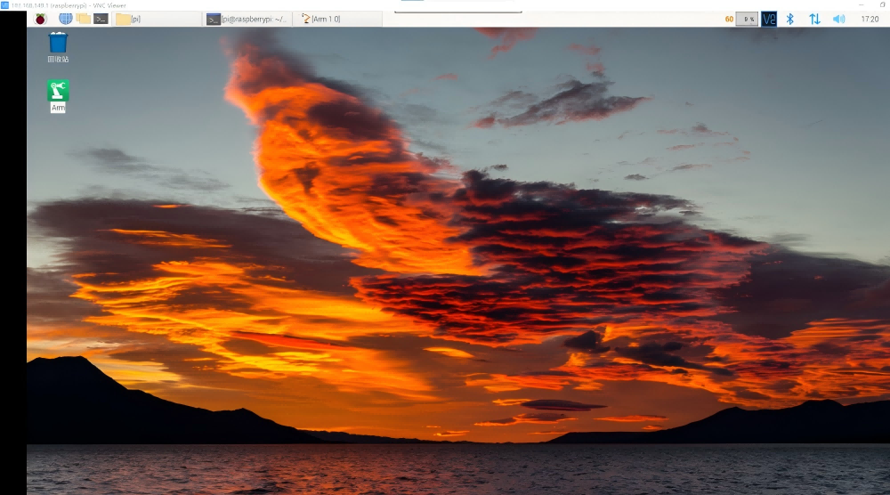
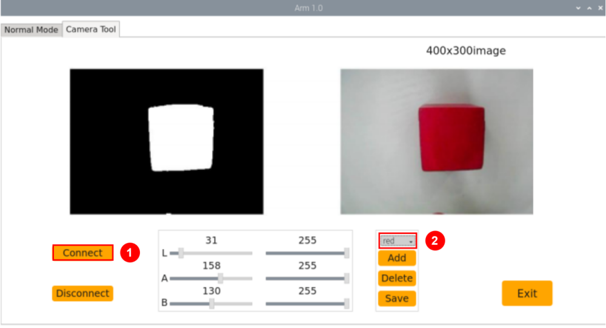
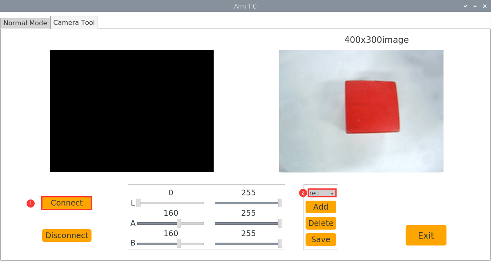
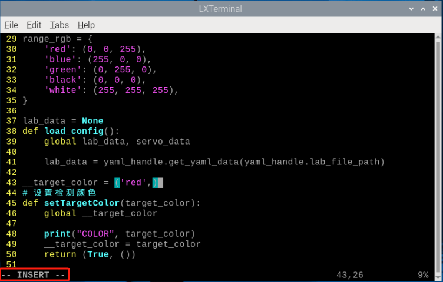

# AI视觉项目课程

## 1. 单个颜色识别

本节通过摄像头来识别颜色,识别到红色小球时，蜂鸣器发出滴滴报警声，并在回传画面中圈出，打印 "Color：red"。

### 1.1 实现原理

颜色识别的实现分为颜色识别和识别后的执行反馈两部分。

首先颜色识别部分，先进行高斯滤波（对图像中进行减噪），通过Lab颜色空间来对物品的颜色进行转换(关于Lab颜色空间的这个部分可以前往教程资料中 "[OpenCV视觉基础课程]()"进行详细学习)。

接着通过颜色阈值对圆圈中的物体颜色进行识别，再对图像部分进行掩膜（掩膜是用选定的图像、图形或物体，对处理的图像进行全局或者局部遮挡）。

然后经过对物品图片开闭运算处理后，最后将轮廓最大的物体用圆圈圈出。

开运算：先对图像腐蚀后膨胀。作用：用来消除小的物体，平滑形状边界，并且不改变其面积。可以去除小颗粒噪声，断开物体之间的粘连。

闭运算：先对图像膨胀后腐蚀。作用：用来填充物体内的小空洞，连接邻近的物体，连接断开的轮廓线，平滑其边界的同时不改变面积。

在识别后对蜂鸣器进行设置，使小车根据不同颜色来做出对应的反馈。比如识别红色，蜂鸣器响一声。

关于详细对应的反馈效果，可参考本文档[1.3 功能实现](#anchor_1_3)。

### 1.2 玩法开启及关闭步骤

:::{Note}
指令输入需严格区分大小写及空格，关键字可以使用"Tab"键进行补齐。
:::

1. 将设备开机，并参照课程资料的"**[学前先看\ 4. 远程工具安装与连接]()**"内容，通过VNC远程连接工具连接。



2. 点击系统桌面左上角的图标，或按下快捷键"**Ctrl+Alt+T**"打开LX终端。


3. 输入指令，按下回车，则可定位到存放玩法程序的目录。

```commandline
cd MasterPi/functions/
```

4. 输入指令，然后按下回车键，玩法启动。

```commandline
python3 color_warning.py
```

5. 如需关闭此玩法，只需要在LX终端界面中按下"Ctrl+c"。若关闭失败，可多次按下。

<p id="anchor_1_3"></p>

### 1.3 实现效果

玩法开启后，通过摄像头来识别颜色,识别到红色小球时，蜂鸣器发出滴滴报警声，并在回传画面中圈出，打印 "color:red"

:::{Note}
1. 识别过程中，请尽量保证在光线充足环境下进行识别，避免因光线问题导致识别不准确。
2. 识别过程中，摄像头视觉范围之内的背景中，不要出现与要识别颜色相近或相同的物体，避免误识别。
3. 若颜色识别不准确可参照本文档"4.功能延伸--\>4.1调节颜色阈值"，对颜色阈值进行设置。
:::

### 1.4 功能延伸

- #### 1.4.1 更换默认识别颜色

颜色识别程序内置了三种颜色：红色、绿色以及蓝色，其中默认识别到红色，蜂鸣器发出滴滴响声，并在回传画面中圈出，打印 "color：red"。

**这里我们将识别颜色更换为绿色为例，具体修改步骤如下所示：**

1. 输入指令切换到源码路径下的指令，按下回车。

```commandline
cd MasterPi/functions/
```

2. 然后再输入指令打开程序文件的指令，按下回车。

```commandline
sudo vim color_warning.py
```

3. 找到下图所示代码：


4. 按下键盘上的"**i**"键，进入到编辑模式。

5. 将上图中蜂鸣器代码移到"elif color == 2"下面：


6. 接下来，保存我们修改的内容。按下"**Esc**"键，然后依次输入"**:wq**"（注意wq前为冒号：），回车即可保存并退出。

7. 输入开启颜色识别玩法的指令，按下回车。

```commandline
python3 color_warning.py
```

- #### 1.4.2 增加新的识别颜色

除了内置三种识别的颜色，我们还可以设置其它可识别的颜色，**比如我们以紫色作为新增的识别颜色为例**，**具体的修改步骤如下：**

1. 双击系统桌面上位机图标，然后弹出的提示框内直接选择"**执行**"即可。


2. 在弹出的界面中依次选择"**摄像头工具**"、"**连接**"。


3. 点击"**新增**"，然后为新增颜色命名（这里以"**purple**"为例），再点击"**OK**"。


4. 然后点击颜色选框的下拉按钮，选择"**purple**"。


5. 将摄像头对准紫色物体，拖动L、A、B应的滑杆，直到左侧画面里要识别的颜色区域变为白色，其他区域变成黑色。


6. 最后，再点击"**保存**"，保存一下调节好的颜色阈值。


7. 修改完成后，我们可以检查一下修改的值是否成功被写入进去，输入进入到程序代码的目录。

```commandline
cd MasterPi
```

8. 输入打开程序文件的指令，按下回车。

```commandline
sudo vim lab_config.yaml
```

9. 打开颜色阈值程序文件后，即可查看紫色阈值参数。


10. 再按照"**4.1 更换默认识别颜色**"1—2步骤，打开程序文件并按下"i"键进入编辑模式。

11. 接着找到如下图所示代码。


12. 手动输入添加"**'purple': (255, 255, 114)**"和"**'purple'**"，如下图所示：

(255, 255, 114)为第9步查看的紫色阈值参数的max。


13. 接着找到如下图所示代码。


14. 手动输入添加框中内容，（颜色的RGB值可以前往-\><u>RGB颜色查询器</u>查询）如下图所示：


15. 接着找到如下图所示代码。


16. 手动输入添加框中内容，如下图所示：


17. 接着找到如下图所示代码。


18. 手动输入添加框中内容，如下图所示：


19. 保存我们修改的内容。按下"**Esc**"键，然后依次输入"**:wq**"（注意wq前为冒号：），回车即可保存并退出。

20. 参照"**<u>1.2.实验步骤</u>**"再次启动该玩法，将紫色物品放置到摄像头前，课在回传画面中看到紫色框出，并打印"purple"。如果需要改为默认识别颜色，参照"**1.4.1 更换默认识别颜色**"将颜色改为紫色即可。

21. 如果需要添加其他颜色作为可识别颜色，可参考前面步骤进行操作。

### 1.5 程序分析

该程序的源代码位于：**/home/pi/MasterPi/functions/color_warning.py**

根据实现的效果，梳理程序的过程逻辑，如下图所示：


- #### 1.5.1导入功能库

```python
#!/usr/bin/python3
# coding=utf8
import sys
import cv2
import time
import math
import threading
import common.yaml_handle as yaml_handle
```

1. 导入opencv、时间、数学、线程相关的库。我们如果想要调用功能库里的函数，就可以使用"功能库名+函数名（参数，参数...）"如：

```python
time.sleep(0.01)
```

就是调用"**time**"库中的"**sleep**"函数，sleep()的作用是延时。

在python中有一些已经内置的库，我们直接导入调用就可以，比如"**time**"、"**cv2**"、"**math**"等。我们也可以自己写一个库，比如上面的"**yaml_handle**"文件读取库。

2. 实例化函数库。

为了方便调用函数，我们经常会对函数库进行实例化
进行实例化后，在使用misc库中的函数，就可以像这样"Misc**.函数名(参数,参数...)**"直接调用了，非常方便。

- #### 1.5.2 主函数分析

python程序中"**\_\_name\_\_ == '\_\_main\_\_:'**"就是程序的主函数。首先调用函数init()进行初始化配置。本程序中初始化包括读取颜色阈值文件。一般还有端口、外设、定时中断等配置，这些都要在初始化内容中完成。

```python
if __name__ == '__main__':
    from kinematics.arm_move_ik import *
    from common.ros_robot_controller_sdk import Board
    board = Board()
```

1. **读取摄像头图像**

```python
  cap = cv2.VideoCapture('http://127.0.0.1:8080?action=stream')
```

当玩法启动时，获取视频流并存储在"cap"中。

2. **进入图像处理**

读取到图像时，调用run()函数进行图像处理。

```python
if ret:
    frame = img.copy()
    Frame = run(frame) 
```

- 函数img.copy()的作用是将"**img**"的内容复制给"**frame**"。

- 函数run()进行图像处理。

```python
def run(img):
    global interval_time
    global __isRunning, color_list
    global detect_color, draw_color
    
    if not __isRunning:  # 检测是否开启玩法，没有开启则返回原图像
        return img
    else:
        img_copy = img.copy()
        img_h, img_w = img.shape[:2]
        
        frame_resize = cv2.resize(img_copy, size, interpolation=cv2.INTER_NEAREST)
        frame_gb = cv2.GaussianBlur(frame_resize, (3, 3), 3)
        
        frame_lab = cv2.cvtColor(frame_gb, cv2.COLOR_BGR2LAB)  # 将图像转换到LAB空间
```

- 对图片大小进行缩放，方便处理。

```python
 frame_resize = cv2.resize(img_copy, size, interpolation=cv2.INTER_NEAREST)
```

第一个参数"**img_copy**"是输入图像。

第二个参数"**size**"是输出图像的大小。大小可以自己设定。

第三个参数"**interpolation=cv2.INTER_NEAREST**"是插值方式。INTER_NEAREST：最邻近插值。INTER_LINEAR：双线性插值，如果最后一个参数你不指定，将默认使用这种方法。INTER_CUBIC：4x4像素邻域内的双立方插值。INTER_LANCZOS4：8x8像素邻域内的Lanczos插值。

- 高斯滤波

图像中总是会混入噪声，影响图像的质量，让特征不明显。根据不同的噪声种类选择对应的滤波方法，常见的有：高斯滤波、中值滤波、均值滤波等。

高斯滤波是一种线性平滑滤波，适用于消除高斯噪声，广泛应用于图像处理的减噪过程。
  
```python
frame_gb = cv2.GaussianBlur(frame_resize, (3, 3), 3)
```

第一个参数"**frame_resize**"是输入图像。

第二个参数"**(3, 3)**"是高斯内核大小。

第三个参数"**3**"是X方向上的高斯核标准偏差。

- 将图像转换到LAB空间，其中函数cv2.cvtColor()是颜色空间转换函数。

```python
frame_lab = cv2.cvtColor(frame_gb, cv2.COLOR_BGR2LAB)  # 将图像转换到LAB空间
```

第一个参数"**frame_gb**"是输入图像。

第二个参数"**cv2.COLOR_BGR2LAB**"是转换格式。"**cv2.COLOR_BGR2LAB**"是将BGR格式转换到LAB格式。如果要转换到RGB就可以使用"**cv2.COLOR_BGR2RGB**"。

- 将图像转换成二值图像，只有0和1，图像变得简单并且数据量减小，更容易处理。

采用cv2库中的inRange()函数对图像进行二值化处理。

```python
frame_mask = cv2.inRange(frame_lab,(lab_data[i]['min'][0], lab_data[i]['min'][1], lab_data[i]['min'][2]), (lab_data[i]['max'][0], lab_data[i]['max'][1], lab_data[i]['max'][2]))
```

第一个参数"**frame_lab**"是输入图像；

第二个参数"**(lab_data\[i\]\['min'\]\[0\],lab_data\[i\]\['min'\]\[1\],lab_data\[i\]\['min'\]\[2\])**"是颜色阈值下限；

第三个参数"**(lab_data\[i\]\['max'\]\[0\],lab_data\[i\]\['max'\]\[1\],lab_data\[i\]\['max'\]\[2\])**"是颜色阈值上限；

- 为了降低干扰，令图像更平滑，需要对图像进行开运算和闭运算，开运算是先腐蚀再膨胀，闭运算是先膨胀再腐蚀。函数cv2.morphologyEx()是形态学函数。

```py
opened = cv2.morphologyEx(frame_mask, cv2.MORPH_OPEN, np.ones((3, 3), np.uint8))  # 开运算
closed = cv2.morphologyEx(opened, cv2.MORPH_CLOSE, np.ones((3, 3), np.uint8))  # 闭运算
```

第一个参数"**frame_mask**"是输入图像。

第二个参数"**cv2.MORPH_OPEN**"是形态操作的类型。cv2.MORPH_ERODE（腐蚀）,cv2.MORPH_DILATE（膨胀）,cv2.MORPH_OPEN（开运算)，cv2.MORPH_CLOSE（闭运算）

第三个参数"**np.ones((3, 3)**"是卷积核。

第四个参数"**np.uint8**"是应用次数。

- 获取最大面积轮廓

完成上述的图像处理后，需要获取识别目标的轮廓，此处涉及cv2库中的findContours()函数。
  
```python
contours = cv2.findContours(closed, cv2.RETR_EXTERNAL, cv2.CHAIN_APPROX_NONE)[-2]  # 找出轮廓
```

第一个参数"**closed**"是输入图像；

第二个参数"**cv2.RETR_EXTERNAL**"是轮廓的检索模式；

第三个参数"**cv2.CHAIN_APPROX_NONE)\[-2\]**"是轮廓的近似方法。

在获得的轮廓中寻找面积最大的轮廓，而为了避免干扰，需要设定一个最小值，仅当面积大于该值时，目标轮廓才有效。

```python
 areaMaxContour, area_max = getAreaMaxContour(contours)  # 找出最大轮廓
if areaMaxContour is not None:
    if area_max > max_area:  # 找最大面积
       max_area = area_max
       color_area_max = i
       areaMaxContour_max = areaMaxContour
        if max_area > 2500:  # 有找到最大面积
            rect = cv2.minAreaRect(areaMaxContour_max)
            box = np.intp(cv2.boxPoints(rect))
```

- 通过判断语句得到图像中面积最大的颜色。

```python
if color_area_max == 'red':  # 红色最大
                color = 1
            elif color_area_max == 'green':  # 绿色最大
                color = 2
            elif color_area_max == 'blue':  # 蓝色最大
                color = 3
            else:
                color = 0
            color_list.append(color)
            if len(color_list) == 3:  # 多次判断
                # 取平均值
                color = int(round(np.mean(np.array(color_list))))
                color_list = []
                
                if color == 1:
                    if time.time() > interval_time:
                        interval_time = time.time() + 3
                        for i in range(1):
                            board.set_buzzer(1900, 0.1, 0.9, 1)# 设置蜂鸣器响0.1秒
                            time.sleep(0.1)
                    detect_color = 'red'
                    draw_color = range_rgb["red"]
                elif color == 2:
                    detect_color = 'green'
                    draw_color = range_rgb["green"]
                elif color == 3:  
                    detect_color = 'blue'
                    draw_color = range_rgb["blue"]
                else:
                    detect_color = 'None'
                    draw_color = range_rgb["black"]
        else:
            draw_color = (0, 0, 0)
            detect_color = "None"
```

3. **显示回传画面**

```python
frame_resize = cv2.resize(Frame, (320, 240))
cv2.imshow('frame', frame_resize)
key = cv2.waitKey(1)
if key == 27:
	break
```

函数cv2.resize()的作用是把处理好的图像缩放到合适的大小。

函数cv2.imshow()的作用是在窗口显示图像，"**'frame'**"是窗口名称、"**frame_resize**"是显示内容。后面一定要有cv2.waitKey()，否则无法显示。

函数cv2.waitKey()的作用是等待按键输入，参数"**1**"是延迟时间。

- #### 1.5.3 子线程分析

1. **点亮RGB灯**

根据识别的颜色，RGB灯颜色与识别的颜色一致。

```python
#设置扩展板的RGB灯颜色使其跟要追踪的颜色一致
def set_rgb(color):
    if color == "red":
        board.set_rgb([[1, 255, 0, 0], [2, 255, 0, 0]])
    elif color == "green":
        board.set_rgb([[1, 0, 255, 0], [2, 0, 255, 0]])
    elif color == "blue":
        board.set_rgb([[1, 0, 0, 255], [2, 0, 0, 255]])
    else:
        board.set_rgb([[1, 0, 0, 0], [2, 0, 0, 0]])
```

2. **驱动蜂鸣器**

```python
board.set_buzzer(1900, 0.1, 0.9, 1)
```

## 2. 颜色识别

### 2.1 玩法简要说明

本节课可分为颜色识别和识别后的执行反馈两部分。

首先颜色识别部分，通过Lab颜色空间来对物品的颜色进行转换，然后经过对物品图片的处理后，将目标的轮廓用圆圈框起来。

在识别后通过对舵机和RGB进行设置，使机器人根据对应的颜色做出对应的反馈。

<p id="anchor_2_2"></p>

### 2.2 玩法开启及关闭步骤

:::{Note}
指令输入需严格区分大小写及空格，关键字可以使用"Tab"键进行补齐。
:::

1. 将设备开机，并参照课程资料的"**[学前先看\4.远程工具安装与连接]()**"内容，通过VNC远程连接工具连接。


2. 输入玩法程序目录所在的指令，并按下回车。

```commandline
cd MasterPi/functions
```

3. 输入玩法执行指令，并按下回车,玩法启动。

```commandline
python3 color_detect.py
```

4. 如需关闭此玩法，只需要在LX终端界面中按下"Ctrl+C"。若关闭失败，可多次按下。

### 2.3 功能实现

玩法开启后，机器人对颜色进行识别，根据不同颜色做出不同反馈，如下表所示：

| **物体颜色** | **蜂鸣器** | **RGB灯** | **执行动作** | **frame工具打印内容** |
| :----------: | :--------: | :-------: | :----------: | :-------------------: |
|     红色     |   响一声   |   红色    |    "点头"    |          red          |
|     绿色     |   响一声   |   绿色    |    "摇头"    |         green         |
|     蓝色     |   响一声   |   蓝色    |    "摇头"    |         blue          |

:::{Note}
1. 识别过程中，请尽量保证在光线充足环境下进行识别，避免因光线问题导致识别不准确。
2. 识别过程中，摄像头视觉范围之内的背景中，不要出现与要识别颜色相近或相同的物体，避免误识别。
3. 若颜色识别不准确可参照本文档"4.功能延伸--\>4.1调节颜色阈值"，对颜色阈值进行设置。
:::

### 2.4 功能延伸

- #### 2.4.1 调节颜色阈值

在玩法体验的过程中，如识别物体颜色效果不佳，则需调节颜色阈值。**本节以调节红色为例，其他颜色设置方法皆可参考此方法，操作步骤如下**：

1. 双击系统桌面图标，在弹出的界面中点击"**Execute**"。


2. 进入界面后，选择"**摄像头工具**"。


3. 进入界面后，点击"**Connect**"连接摄像头。


4. 连接成功后，在界面右下角的颜色选项栏中选择"**red**"。



5. 若在弹出的界面中未出现回传画面，说明摄像头未连接成功，需检查一下摄像头连接线是否连接好。

下图界面右侧是实时回传画面，左侧是需要被采集的颜色。将摄像头对准红色小球，然后拖动下方的六个滑杆，使得左侧画面中红色小球的区域全部变为白色，其它区域为黑色。接着点击"**Save**"按钮保存数据。


<span id="anchor_2_4_2" class="anchor"></span>

- #### 2.4.2 更换默认识别颜色

颜色识别程序内置了三种颜色：红色、绿色以及蓝色，其中默认识别到红色，机器人便执行点头动作。

**这里我们将识别颜色更换为绿色为例，具体修改步骤如下所示：**

1. 输入指令，按下回车，切换至源码程序路径下。

```commandline
cd MasterPi/functions
```

2. 然后再输入指令，按下回车，即可打开程序文件。

```commandline
sudo vim color_detect.py
```

3. 在打开的程序中找到下图框出的代码。


4. 按下键盘上的"i"键，进入到编辑模式。

5. 将"detect_color == 'red'"中的"red"换成"green"，如下图所示：


6. 接下来，保存我们修改的内容。按下"Esc"键，然后依次输入指令（注意wq前为冒号：），回车即可保存并退出。

```commandline
:wq
```

7. 再次输入指令，按下回车，即可开启识别绿色点头的玩法。

```commandline
python3 color_detect.py
```

- #### 2.4.3 增加新的识别颜色

除了内置三种识别的颜色，我们还可以设置其它可识别的颜色，**比如我们以紫色作为新增的识别颜色为例，具体的修改步骤如下**：

1. 双击系统桌面上位机图标，然后弹出的提示框内直接选择"**Execute**"即可。


2. 在弹出的界面中依次选择"**摄像头工具**"、"**连接**"。


3. 点击"**新增**"，然后为新增颜色命名（这里以"**purple**"为例），再点击"**OK**"。


4. 然后点击颜色选框的下拉按钮，选择"**purple**"。


5. 将摄像头对准紫色物体，拖动L、A、B应的滑杆，直到左侧画面里要识别的颜色区域变为白色，其他区域变成黑色。


6. 最后，再点击"**保存**"，保存一下调节好的颜色阈值。


7. 修改完成后，我们可以检查一下修改的值是否成功被写入进去，输入指令，按下回车，进入到程序代码所在目录。

```commandline
cd MasterPi
```

8. 再输入指令，按下回车，打开程序文件。

```commandline
sudo vim lab_config.yaml
```

9. 打开颜色阈值程序文件后，即可查看紫色阈值参数。


**为了避免对玩法造成影响，在后面修改完毕后，建议通过LAB_Tool工具将数值修改回初始值。**

10. 再按照"[更换默认识别颜色](#anchor_2_4_2)"步骤，将"**detect_color == 'red'**"中的"**red**"换成"**purple**",如下图所示：


11. 接着找到如下图所示代码。


12. 手动输入"**purple**"，如下图所示：


13. 保存我们修改的内容。按下"**Esc**"键，然后依次输入指令（注意wq前为冒号：），回车即可保存并退出。

```commandline
:wq
```

14. 参照"[玩法开启及关闭步骤](#anchor_2_2)"再次启动该玩法，将紫色物品放置到摄像头前，可看到机器人将执行"**点头**"动作。

15. 如果需要添加其他颜色作为可识别颜色，可参考前面步骤进行操作。

### 2.5 程序简要分析

该程序的源代码位于：/home/pi/MasterPi/functions/color_detect.py

:::{Note}
在程序修改前务必将原有出厂程序进行备份，再进行修改，禁止直接在源代码文件中进行修改，避免以错误的方式修改参数之后导致机器人异常且无法修复！！！
:::

<span id="anchor_2_5_1" class="anchor"></span>

- #### 2.5.1导入参数模块

| **导入模块**                                      | **作用**                                                 |
| :------------------------------------------------ | -------------------------------------------------------- |
| import sys                                        | 导入了Python的sys模块，用于访问系统相关的功能和变量      |
| import cv2                                        | 导入了OpenCV库，用于图像处理和计算机视觉相关的功能       |
| import time                                       | 导入了Python的time模块，用于时间相关的功能，例如延时操作 |
| import threading                                  | 提供多线程运行的环境                                     |
| import common.yaml_handle                         | 包含一些与处理YAML格式文件相关的功能或工具               |
| from kinematics.transform import \*               | 用于机械臂姿态变换相关的功能                             |
| from kinematics.arm_move_ik import \*             | 可用于机械臂逆运动学求解及控制的功能                     |
| from common.ros_robot_controller_sdk import Board | 导入了board库，可以控制传感器，用于执行控制的操作        |

- #### 2.5.2 功能逻辑

根据实现效果，梳理该玩法的实现逻辑如下图所示：


通过摄像头获取图像信息，再进行图像处理，即对图像进行二值化处理，为了降低干扰，令图像更平滑，对图像进行腐蚀和膨胀处理，然后获取目标最大面积轮廓，判断色块颜色，并且做出相应的反馈。

- #### 2.5.3 程序逻辑及对应的代码分析

从程序文件梳理得到程序逻辑流程图如下图所示。


从上图得到，程序的逻辑流程主要为图像处理与颜色识别，以下的文档内容将依照上述程序逻辑流程图进行编写。

1. **初始化**

- 导入功能库

在初始化的这一步，首先就需要将功能库导入进来，方便后续程序的调用，关于导入进来的内容。可以前往[导入参数模块](#anchor_2_5_1)进行查看。

```python
#!/usr/bin/python3
# coding=utf8
import sys
import cv2
import time
import threading
import common.yaml_handle as yaml_handle
from kinematics.transform import *
```

- 设定初始状态

初始完成之后，就需要设置好初始状态。这里就包括了设置要识别的颜色、舵机的初始位置、电机的状态等。

```python
def setTargetColor(target_color):
    global __target_color

    __target_color = target_color
    return (True, ())
```

```python
# 夹持器夹取时闭合的角度
servo1 = 1500

# 初始位置
def initMove():
    board.pwm_servo_set_position(0.3, [[1, servo1]])
    AK.setPitchRangeMoving((0, 6, 18), 0,-90, 90,1500)
```

2. **图像处理**

- 图像预处理

对图像进行尺寸调整与高斯模糊处理

```python
frame_resize = cv2.resize(img_copy, size, interpolation=cv2.INTER_NEAREST)
frame_gb = cv2.GaussianBlur(frame_resize, (3, 3), 3)
```

cv2.resize(img_copy, size, interpolation=cv2.INTER_NEAREST) 是对图像进行尺寸调整的操作。

第一个参数"**img_copy**"是要调整尺寸的图像；

第二个参数"**size**"是目标尺寸；

第三个参数"**interpolation**"是插值方法，用于确定调整尺寸时使用的像素插值算法。

cv2.GaussianBlur(frame_resize, (3, 3), 3) 是对图像应用高斯模糊

第一个参数"**frame_resize**"是要进行模糊处理的图像；

第二个参数"**(3, 3)**"高斯核的大小，表示核的宽度和高度都为 3；

第三个参数"**3**"是高斯核的标准差，用于控制模糊程度。较大的值会产生更强的模糊效果。

- 颜色空间转换

将BGR图像转换为LAB图像

```python
frame_lab = cv2.cvtColor(frame_gb, cv2.COLOR_BGR2LAB)  # 将图像转换到LAB空间
```

- 二值化处理

采用cv2库中的inRange()函数对图像进行二值化处理。

```python
frame_mask = cv2.inRange(frame_lab,
                              (lab_data[i]['min'][0],
                               lab_data[i]['min'][1],
                               lab_data[i]['min'][2]),
                               (lab_data[i]['max'][0],
                                lab_data[i]['max'][1],
                                lab_data[i]['max'][2])) #对原图像和掩模进行位运算
```

第一个参数"**frame_lab**"是输入图像；

第二个参数"**lab_data\[i\]\['min'\]\[0\]**"是阈值下限；

第三个参数"**lab_data\[i\]\['max'\]\[0\]**"是阈值上限；

- 开运算与闭运算

```python
opened = cv2.morphologyEx(frame_mask, cv2.MORPH_OPEN, np.ones((3, 3), np.uint8))  # 开运算
closed = cv2.morphologyEx(opened, cv2.MORPH_CLOSE, np.ones((3, 3), np.uint8))  # 闭运算
```

cv2.morphologyEx(frame_mask, cv2.MORPH_OPEN, np.ones((3, 3), np.uint8)) 是对二值图像进行开运算的操作。

第一个参数"**frame_mask**"是要进行形态学运算的二值图像；

第二个参数"**cv2.MORPH_OPEN**"是指定进行开运算操作；

第三个参数"**np.ones((3, 3), np.uint8)**"是形态学运算的结构元素，用于定义运算的形状和大小。在这里，使用了一个大小为 3x3 的全为 1 的矩阵作为结构元素。闭运算函数同理。

- 获取最大面积轮廓

完成上述的图像处理后，需要获取识别目标的轮廓，此处涉及cv2库中的findContours()函数。

```python
contours = cv2.findContours(closed, cv2.RETR_EXTERNAL, cv2.CHAIN_APPROX_NONE)[-2]  # 找出轮廓
```

以代码"contours = cv2.findContours(dilated, cv2.RETR_EXTERNAL, cv2.CHAIN_APPROX_NONE)\[-2\]"为例：

第一个参数"**dilated**"是输入图像；

第二个参数"**cv2.RETR_EXTERNAL**"是轮廓的检索模式；

第三个参数"**cv2.CHAIN_APPROX_NONE)\[-2\]**"是轮廓的近似方法。

在获得的轮廓中寻找面积最大的轮廓，而为了避免干扰，需要设定一个最小值，仅当面积大于该值时，目标轮廓才有效。

```python
areaMaxContour, area_max = getAreaMaxContour(contours)  # 找出最大轮廓
if areaMaxContour is not None:
	if area_max > max_area:  # 找最大面积
```

- 判断颜色最大的色块

```python
if not start_pick_up:
   if color_area_max == 'red':  # 红色最大
        color = 1
   elif color_area_max == 'green':  # 绿色最大
        color = 2
   elif color_area_max == 'blue':  # 蓝色最大
        color = 3
   else:
       color = 0
```

- 多次判断

多次判断取平均值，确定识别到的颜色

```python
if len(color_list) == 3:  # 多次判断
    # 取平均值
    color = int(round(np.mean(np.array(color_list))))
    color_list = []
    start_pick_up = True
    if color == 1:
       detect_color = 'red'
       draw_color = range_rgb["red"]
    elif color == 2:
       detect_color = 'green'
       draw_color = range_rgb["green"]
    elif color == 3:
        detect_color = 'blue'
        draw_color = range_rgb["blue"]
    else:
        detect_color = 'None'
        draw_color = range_rgb["black"]
```

3. **颜色识别**

- 打开RGB灯与蜂鸣器

```python
if detect_color != 'None' and start_pick_up:  # 检测到色块        
  set_rgb(detect_color) # 设置扩展板上的彩灯与检测到的颜色一样
  board.set_buzzer(1900, 0.1, 0.9, 1)# 设置蜂鸣器响0.1秒
```

set_rgb(detect_color)：调用了一个函数 set_rgb()，将扩展板上的彩灯设置为与检测到的颜色相同。根据输入的颜色参数设置扩展板上的 RGB 灯光。

board.set_buzzer(1900, 0.1, 0.9, 1)：调用了一个函数 set_buzzer()，将蜂鸣器设置为响铃持续 0.1 秒。用于控制蜂鸣器的音响效果和持续时间。

可以根据检测到的颜色来控制扩展板上的彩灯，并通过蜂鸣器发出的声音反馈。

- **控制舵机**

```python
  if detect_color == 'red' :  # 检测到红色,点头
      for i in range(0,3):
           board.pwm_servo_set_position(0.2, [[3, 800]])
           time.sleep(0.2)
           board.pwm_servo_set_position(0.2, [[3, 600]])
           time.sleep(0.2)
           if not __isRunning:
               continue
```

使用 board.pwm_servo_set_position函数进行舵机控制，括号内的参数含义如下：

第一个参数："0.2"为动作持续时间，单位是秒。

第二个参数"\[\[3,800\]\]"为舵机ID3和"800"为脉冲宽度，取值范围为"500~2500"。

- **回到初始位置**

```python
AK.setPitchRangeMoving((0, 6, 18),0,-90, 90,  500)  # 回到初始位置
time.sleep(0.5)  
detect_color = 'None'
start_pick_up = False
set_rgb(detect_color)
```

使用AK.setPitchRangeMoving函数进行逆运动学控制机械臂位姿。括号内的参数含义如下：

第一个参数"(0, 6, 18)"是初始位置坐标；

第二个参数："0"是给定俯仰角。

第三个参数："-90"是俯仰角范围。

第四个参数："90"是俯仰角范围。

第五个参数："500"为动作持续时间。

## 3. 颜色分拣

### 3.1 玩法简要说明

通过初步处理的图像，需要再经过一些操作，信息才能被有效利用，比如进行物体的轮廓提取、坐标位置确定等。完成后需要对物体和所在背景的颜色进行区分，即可实现对目标物体颜色的识别。

在完成识别后，将对方块是否为静止放置状态进行判断。如检测到方块已停止移动一段时间后，则机械臂便开始进入分拣夹取的流程。

### 3.2 玩法开启及关闭步骤

:::{Note}
指令的输入需严格区分大小写及空格。
:::

1. 将设备开机，并参照课程资料的"**[学前先看\4.远程工具安装与连接]()**"内容，通过VNC远程连接工具连接。


2. 输入玩法程序目录所在的指令，并按下回车。

```commandline
cd MasterPi/functions
```

3. 输入玩法执行指令，并按下回车,玩法启动。

```commandline
python3 color_sorting.py
```

4. 如需关闭此玩法，只需要在LX终端界面中按下"Ctrl+C"。若关闭失败，可多次按下。

### 3.3 功能实现

将红绿蓝方块分别放置到平整光滑的环境下，当机械臂识别到后会发出"滴"的一声，再手持被识别色块放置到机械臂爪子前方，机械臂会夹住色块，并依次搬运到左侧对应位置。

### 3.4 功能延伸

- #### 3.4.1 更换默认放置位置

颜色分拣程序默认的效果是：将识别到的红、绿、蓝三种颜色色块夹取，放置到其左侧对应位置。

机器人坐标系如下所示：


:::{Note}
上图中O点为原点，Q'(x,y,z)为色块放置点。
:::

色块放置的位置与坐标参数的对应变化关系见下表：

| **坐标参数变化** | **色块位置变化**                |
| :--------------- | :------------------------------ |
| x增大            | 色块位置往X轴方向移动（向右）   |
| x减小            | 色块位置往X轴反方向移动（向左） |
| y增大            | 色块位置往Y轴方向移动（向前）   |
| y减小            | 色块位置往Y轴反方向移动（向后） |
| z增大            | 色块位置往Z轴方向移动（向上）   |
| z减小            | 色块位置往Z轴反方向移动（向下） |

:::{Note}
参数y为负值时，无效；参数z数值不能小于-3。
:::

**我们这里将红色色块的放置位置修改为机器人前方为例进行示范，其它色块的位置修改方法同理。具体修改步骤如下所示：**

1. 输入指令，按下回车，切换至源码程序路径下。

```commandline
cd MasterPi/functions
```

2. 然后再输入指令，按下回车，即可打开程序文件。

```commandline
sudo vim color_sorting.py
```

3. 在打开的程序中找到下图框出的代码。


4. 按下键盘上的"**i**"键，进入到编辑模式。


5. 在"**'red': (-8,16,2)**"中，"**-8**"是X轴参数，"**16**"是Y轴参数，"**2**"是Z轴参数。我们将"**-8**"改为"**0**"，保持Y轴和Z轴参数不变，让色块放置到前方。修改如下图所示：


6. 然后，再找到199行，并将其注释。


7. 接下来，保存我们修改的内容。按下"**Esc**"键，然后依次输入指令（注意wq前为冒号：），回车即可保存并退出。

```commandline
:wq
```

8. 再次输入指令，按下回车，即可开启识别绿色点头的玩法。

```commandline
python3 color_sorting.py
```

### 3.5 程序简要分析

:::{Note}
在程序修改前务必将原有出厂程序进行备份，再进行修改，禁止直接在源代码文件中进行修改，避免以错误的方式修改参数之后导致机器人异常且无法修复！！！
:::

<span id="anchor_3_5_1" class="anchor"></span>

- #### 3.5.1 导入参数模块

| **导入模块**                                      | **作用**                                                 |
| ------------------------------------------------- | -------------------------------------------------------- |
| import sys                                        | 导入了Python的sys模块，用于访问系统相关的功能和变量      |
| import cv2                                        | 导入了OpenCV库，用于图像处理和计算机视觉相关的功能       |
| import time                                       | 导入了Python的time模块，用于时间相关的功能，例如延时操作 |
| import threading                                  | 提供多线程运行的环境                                     |
| import common.yaml_handle                         | 包含一些与处理YAML格式文件相关的功能或工具               |
| from kinematics.transform import \*               | 用于机械臂姿态变换相关的功能                             |
| from kinematics.arm_move_ik import \*             | 可用于机械臂逆运动学求解及控制的功能                     |
| from common.ros_robot_controller_sdk import Board | 导入了board库，可以控制传感器，用于执行控制的操作        |

- #### 3.5.2 功能逻辑

根据实现效果，梳理该玩法的实现逻辑如下图所示：


通过摄像头获取图像信息，再进行图像处理，即对图像进行二值化处理，为了降低干扰，令图像更平滑，对图像进行腐蚀和膨胀处理，然后获取目标最大面积轮廓，判断色块颜色之后打开蜂鸣器和RGB灯，并将面前的色块夹取并放置到相应位置上。

- #### 3.5.3 程序逻辑及对应的代码分析

从程序文件梳理得到程序逻辑流程图如下图所示。


从上图得到，程序的逻辑流程主要为图像处理与颜色分拣，以下的文档内容将依照上述程序逻辑流程图进行编写。

1. **初始化**

- 导入功能库

在初始化的这一步，首先就需要将功能库导入进来，方便后续程序的调用，关于导入进来的内容。可以前往[导入参数模块](#anchor_3_5_1)进行查看。

```python
#!/usr/bin/python3
# coding=utf8
import sys
import cv2
import time
sys.path.append('/home/pi/MasterPi/')
import Camera
import threading
import common.sonar as Sonar
import common.yaml_handle as yaml_handle
from kinematics.transform import *
from CameraCalibration.CalibrationConfig import *
```

- 设定初始状态

  初始完成之后，就需要设置好初始状态。这里就包括了设置要分拣的颜色、舵机的初始位置、电机的状态等。

```python
# 设置检测颜色
def setTargetColor(target_color):
    global __target_color

    print("COLOR", target_color)
    __target_color = target_color
    return (True, ())
```

```python
# 初始位置
def initMove():
    board.pwm_servo_set_position(0.3, [[1, servo1]])
    AK.setPitchRangeMoving((0, 8, 10), -90,-90, 0,1500)
```

2. **图像处理**

- 图像预处理

对图像进行尺寸调整与高斯模糊处理

```python
frame_resize = cv2.resize(img_copy, size, interpolation=cv2.INTER_NEAREST)
frame_gb = cv2.GaussianBlur(frame_resize, (3, 3), 3)  
```

cv2.resize(img_copy, size, interpolation=cv2.INTER_NEAREST) 是对图像进行尺寸调整的操作。

第一个参数"**img_copy**"是要调整尺寸的图像；

第二个参数"**size**"是目标尺寸；

第三个参数"**interpolation**"是插值方法，用于确定调整尺寸时使用的像素插值算法。

cv2.GaussianBlur(frame_resize, (3, 3), 3) 是对图像应用高斯模糊

第一个参数"**frame_resize**"是要进行模糊处理的图像；

第二个参数"**(3, 3)**"高斯核的大小，表示核的宽度和高度都为 3；

第三个参数"**3**"是高斯核的标准差，用于控制模糊程度。较大的值会产生更强的模糊效果。

- 颜色空间转换

将BGR图像转换为LAB图像

```python
frame_lab = cv2.cvtColor(frame_gb, cv2.COLOR_BGR2LAB)  # 将图像转换到LAB空间
```

- 二值化处理

采用cv2库中的inRange()函数对图像进行二值化处理。

```python
    if not start_pick_up:
        for i in lab_data:
            if i in __target_color:
                frame_mask = cv2.inRange(frame_lab,
                                             (lab_data[i]['min'][0],
                                              lab_data[i]['min'][1],
                                              lab_data[i]['min'][2]),
                                             (lab_data[i]['max'][0],
                                              lab_data[i]['max'][1],
                                              lab_data[i]['max'][2]))  
```

第一个参数"**frame_lab**"是输入图像；

第二个参数"**lab_data\[i\]\['min'\]\[0\]**"是阈值下限；

第三个参数"**lab_data\[i\]\['max'\]\[0\]**"是阈值上限；

- 开运算与闭运算

```python
opened = cv2.morphologyEx(frame_mask, cv2.MORPH_OPEN, np.ones((3, 3),np.uint8))  #开运算
closed = cv2.morphologyEx(opened, cv2.MORPH_CLOSE, np.ones((3, 3),np.uint8)) #闭运算
```

cv2.morphologyEx(frame_mask, cv2.MORPH_OPEN, np.ones((3, 3), np.uint8)) 是对二值图像进行开运算的操作。

第一个参数"**frame_mask**"是要进行形态学运算的二值图像；

第二个参数"**cv2.MORPH_OPEN**"是指定进行开运算操作；

第三个参数"**np.ones((3, 3), np.uint8)**"是形态学运算的结构元素，用于定义运算的形状和大小。在这里，使用了一个大小为 3x3 的全为 1 的矩阵作为结构元素。

闭运算函数同理。

- 获取最大面积轮廓

完成上述的图像处理后，需要获取识别目标的轮廓，此处涉及cv2库中的findContours()函数。

```python
contours = cv2.findContours(closed, cv2.RETR_EXTERNAL, cv2.CHAIN_APPROX_NONE)[-2]  #找出轮廓
```

以代码"contours = cv2.findContours(dilated, cv2.RETR_EXTERNAL, cv2.CHAIN_APPROX_NONE)\[-2\]"为例：

第一个参数"**dilated**"是输入图像；

第二个参数"**cv2.RETR_EXTERNAL**"是轮廓的检索模式；

第三个参数"**cv2.CHAIN_APPROX_NONE)\[-2\]**"是轮廓的近似方法。

在获得的轮廓中寻找面积最大的轮廓，而为了避免干扰，需要设定一个最小值，仅当面积大于该值时，目标轮廓才有效。

```python
 if areaMaxContour is not None:
     if area_max > max_area:#找最大面积
         max_area = area_max
         color_area_max = i
         areaMaxContour_max = areaMaxContour
```

- 判断颜色最大的色块

```python
if not start_pick_up:
    if color_area_max == 'red':  #红色最大
        color = 1
    elif color_area_max == 'green':  #绿色最大
        color = 2
    elif color_area_max == 'blue':  #蓝色最大
         color = 3
     else:
         color = 0
     color_list.append(color)
```

- 多次判断

多次判断取平均值，确定识别到的颜色

```py
if len(color_list) == 3:  #多次判断
 # 取平均值
    color = int(round(np.mean(np.array(color_list))))
    color_list = []
    if color:
        start_pick_up = True
        if color == 1:
            detect_color = 'red'
            draw_color = range_rgb["red"]
            elif color == 2:
                 detect_color = 'green'
                 draw_color = range_rgb["green"]
            elif color == 3:
                 detect_color = 'blue'
                 draw_color = range_rgb["blue"]
       else:
            start_pick_up = False
            detect_color = 'None'
            draw_color = range_rgb["black"]
 else:
       if not start_pick_up:
           draw_color = (0, 0, 0)
           detect_color = "None"
```

3. **颜色分拣**

- 夹取色块并打开蜂鸣器和RGB灯

```python
if detect_color != 'None' and start_pick_up:  #如果检测到方块,开始夹取
                
    set_rgb(detect_color) # 设置扩展板上的彩灯与检测到的颜色一样
    board.set_buzzer(1900, 0.1, 0.9, 1)# 设置蜂鸣器响0.1秒
                
     AK.setPitchRangeMoving((0, 6, 18), 0,-90, 90, 1500) # 机械臂抬起来
     time.sleep(1.5)
     if not __isRunning:  # 检测是否停止玩法
         continue
     board.pwm_servo_set_position(0.5, [[1, 2000]])# 张开爪子
     time.sleep(1.5)
     if not __isRunning:
         continue
     board.pwm_servo_set_position(0.5, [[1, 1500]])# 闭合爪子
     time.sleep(1.5)
```

使用AK.setPitchRangeMoving函数控制机械臂。括号内的参数含义如下：

第一个参数"**(0, 6, 18)**"是初始位置坐标；

第二个参数："**0**"是给定俯仰角。

第三个参数："**-90**"是俯仰角范围。

第四个参数："**90**"是俯仰角范围。

第五个参数："1**500**"为动作持续时间。

set_rgb(detect_color)：调用了一个函数 set_rgb()，将扩展板上的彩灯设置为与检测到的颜色相同，根据输入的颜色参数设置扩展板上的 RGB 灯光。

board.set_buzzer(1900, 0.1, 0.9, 1)：调用了一个函数 set_buzzer()，将蜂鸣器设置为响铃持续 0.1 秒。用于控制蜂鸣器的音响效果和持续时间。

可以根据检测到的颜色来控制扩展板上的彩灯，并通过蜂鸣器发出的声音反馈。

使用 board.pwm_servo_set_position函数进行舵机控制，括号内的参数含义如下：

第一个参数："0.2"为动作持续时间，单位是秒。

第二个参数"\[\[3,800\]\]"为舵机ID3和"800"为脉冲宽度，取值范围为"500~2500"。

- **放置色块**

根据检测到的颜色，机械臂转动到对应角度。

```python
if detect_color == 'red':       # 根据检测到的颜色，机械臂转动到对应角度
   board.pwm_servo_set_position(0.5, [[6, 1900]])
   time.sleep(0.5)
elif detect_color == 'green':
    board.pwm_servo_set_position(0.8, [[6, 2100]])
    time.sleep(0.8)
elif detect_color == 'blue':
     board.pwm_servo_set_position(1.5, [[6, 2500]])
     time.sleep(1.5)
```

机械臂运行到对应颜色坐标上方。

```python
if not __isRunning:
     continue
result = AK.setPitchRangeMoving((coordinate[detect_color][0], coordinate[detect_color][1], 8), -90, -90, 0,800) # 运行到对应颜色的坐标上方
                if result == False:
                    unreachable = True
```

放置到检测到颜色对应的坐标。

```python
if not __isRunning:
     continue
AK.setPitchRangeMoving((coordinate[detect_color]), -90, -90, 0, 500)  # 放置到检测到颜色对应的坐标
```

## 4. 颜色位置识别

本节课可以通过摄像头进行颜色识别红绿蓝三色小球，并在回传画面中圈出，显示其XY坐标位置。

### 4.1 实现原理

目标追踪的实现可分为颜色识别和位置标记两部分。

首先颜色识别部分，先进行高斯滤波（对图像中进行减噪），通过Lab颜色空间来对物品的颜色进行转换(关于Lab颜色空间的这个部分可以前往"**[OpenCV视觉基础课程]()**"课程进行详细学习)。

接着通过颜色阈值对圆圈中的物体颜色进行识别，再对图像部分进行掩膜（掩膜是用选定的图像、图形或物体，对处理的图像进行全局或者局部遮挡）。

然后经过对物品图片开闭运算处理后，最后将轮廓最大的物体用圆圈圈出。

开运算：先对图像腐蚀后膨胀。作用：用来消除小的物体，平滑形状边界，并且不改变其面积。可以去除小颗粒噪声，断开物体之间的粘连。

闭运算：先对图像膨胀后腐蚀。作用：用来填充物体内的小空洞，连接邻近的物体，连接断开的轮廓线，平滑其边界的同时不改变面积。

位置标记需要使用特定的检测算法。其基本原理是在图像中寻找符合预定义特征或模式的区域，然后返回这些区域的位置和边界框。

### 4.2 玩法开启及关闭步骤

:::{Note}
指令的输入需严格区分大小写和空格，另外可按键盘"Tab"键进行关键词补齐。
:::
1. 将设备开机，并参照课程资料的"[学前先看\4.远程工具安装与连接]()"内容，通过VNC远程连接工具连接。


2. 点击系统桌面左上角的图标，或按下快捷键"Ctrl+Alt+T"打开LX终端。


3. 在打开的界面中，输入进入玩法程序所在目录的指令，按下回车键。

```commandline
cd MasterPi/functions/
```

4. 输入指令，然后按下回车，启动玩法。

```commandline
python3 color_recognition.py
```

5. 如需关闭此玩法，只需要在LX终端界面中按下"**Ctrl+c**"。若关闭失败，可多次按下。

### 4.3 实现效果

**程序默认的识别颜色为红绿蓝三色小球，识别完成后在回传画面中圈出，并显示其XY坐标位置**。

:::{Note}
1. 识别过程中，请尽量保证在光线充足环境下进行识别，避免因光线问题导致识别不准确。
2. 识别过程中，摄像头视觉范围之内的背景中，不要出现与要识别颜色相近或相同的物体，避免误识别。
3. 若颜色识别不准确可参照本文档"4.4 功能延伸--\>4.4.1颜色调节阈值"，对颜色阈值进行设置。
:::

### 4.4 功能延伸

- #### 4.4.1调节颜色阈值

在玩法体验的过程中，如识别物体颜色效果不佳，则需调节颜色阈值。**本节以调节红色为例，其他颜色设置方法皆可参考，操作步骤如下：**

1. 双击系统桌面图标，在弹出的界面中点击"**执行**"。


2. 进入界面后，点击"**摄像头工具**"。


3. 再点击"**连接**"按钮，连接成功后，在界面右下角的颜色选项栏中选择"**red**"。


4. 若在弹出的界面中未出现回传画面，说明摄像头未连接成功，需检查一下摄像头连接线是否连接好。

下图界面右侧是实时回传画面，左侧是需要被采集的颜色。将摄像头对准红色色块，然后拖动下方的六个滑杆，使得左侧画面中红色色块的区域全部变为白色，其它区域为黑色。接着点击"**保存**"按钮保存数据。


- #### 4.4.2 增加新的识别颜色

除了内置三种识别的颜色，我们还可以设置其它可识别的颜色，**比如我们以紫色作为新增的识别颜色为例**，**具体的修改步骤如下：**

1. 双击系统桌面上位机图标，然后弹出的提示框内直接选择"**执行**"即可。


2. 在弹出的界面中依次选择"**摄像头工具**"、"**连接**"。


3. 点击"**新增**"，然后为新增颜色命名（这里以"**purple**"为例），再点击"**OK**"。


4. 然后点击颜色选框的下拉按钮，选择"**purple**"。


5. 将摄像头对准紫色物体，拖动L、A、B应的滑杆，直到左侧画面里要识别的颜色区域变为白色，其他区域变成黑色。


6. 最后，再点击"**保存**"，保存一下调节好的颜色阈值。


7. 修改完成后，我们可以检查一下修改的值是否成功被写入进去，输入指令，并按下回车，进入到程序代码所在目录。

```commandline
cd MasterPi
```

8. 再输入指令，并按下回车，打开程序文件。

```commandline
sudo vim lab_config.yaml
```

9. 打开颜色阈值程序文件后，即可查看紫色阈值参数。


10. 再按照"**修改追踪颜色**"1—2步骤，打开程序文件并按下"i"键进入编辑模式。

11. 接着找到如下图所示代码。


12. 手动输入添加"**'purple': (255, 255, 114)**"，将"**'red'**"修改为"**'purple'**"，如下图所示：

**'purple': (255, 255, 114),**

**target_color = ('red','green','blue','purple')**

(255, 255, 114)为第9步查看的紫色阈值参数的max。

13. 保存我们修改的内容。按下"**Esc**"键，然后依次输入指令（注意wq前为冒号：），回车即可保存并退出。

```commandline
:wq
```

14. 如果需要添加其他颜色作为可识别颜色，可参考前面步骤进行操作。

### 4.5 程序说明

该程序的源代码位于：**/home/pi/MasterPi/functions/color\_recognition.py**

根据实现的效果，梳理程序的过程逻辑，如下图所示：


- #### 4.5.1 导入功能库

```python
#!/usr/bin/python3
# coding=utf8
import sys
import cv2
import time
import math
import common.misc as Misc
import threading
import common.yaml_handle as yaml_handle
```

1. 导入opencv、时间、数学、线程、逆运动学相关的库。我们如果想要调用功能库里的函数，就可以使用"**功能库名+函数名（参数，参数...）**"如：

```python
time.sleep(0.01)
```

就是调用"**time**"库中的"**sleep**"函数。sleep()的作用是延时。

在python中有一些已经内置的库，我们直接导入调用就可以，比如"**time**"、"**cv2**"、"**math**"等。我们也可以自己写一个库，比如上面的"**yaml_handle**"文件读取库等。

2. 实例化函数库

为了方便调用函数，我们经常会对函数库进行实例化，如：

```python
import common.misc as Misc
```

进行实例化后，在使用misc库中的函数，就可以像这样"**Misc.函数名(参数,参数...)**"直接调用了，非常方便。

- #### 4.5.2 主函数分析

python程序中"**\_\_name\_\_ == '\_\_main\_\_:'**"就是程序的主函数。首先要打开摄像头，并读取视频流通过read方法可以读取到每一帧的图片，查找并标记小球颜色并显示结果。通过循环读取显示就可以实现视频的播放，在视频读取展示结束后关闭摄像头。

```python
if __name__ == '__main__':
    from kinematics.arm_move_ik import *
    from common.ros_robot_controller_sdk import Board
    board = Board()
    # 实例化逆运动学库(instantiate the inverse kinematics library)
    AK = ArmIK()
    AK.board = board
    
    init()
    start()
    cap = cv2.VideoCapture('http://127.0.0.1:8080?action=stream')
    while True:
        ret,img = cap.read()
        if ret:
            frame = img.copy()
            Frame = run(frame)  
            frame_resize = cv2.resize(Frame, (320, 240))
            cv2.imshow('frame', frame_resize)
            key = cv2.waitKey(1)
            if key == 27:
                break
        else:
            time.sleep(0.01)
    my_camera.camera_close()
    cv2.destroyAllWindows()

```

1. **读取摄像头图像**

```python
cap = cv2.VideoCapture('http://127.0.0.1:8080?action=stream')
```

当玩法启动时，首先读取摄像头。

2. **进入图像处理**

- 函数run()进行图像处理。

```python
def run(img):
    global interval_time
    global __isRunning, color_list
    global detect_color, draw_color
    
    if not __isRunning:  # 检测是否开启玩法，没有开启则返回原图像(detect if the game is enabled, if not, return the original image)
        return img
    else:
        img_copy = img.copy()
        img_h, img_w = img.shape[:2]
        
        frame_resize = cv2.resize(img_copy, size, interpolation=cv2.INTER_NEAREST)
        frame_gb = cv2.GaussianBlur(frame_resize, (3, 3), 3)
        
        frame_lab = cv2.cvtColor(frame_gb, cv2.COLOR_BGR2LAB)  # 将图像转换到LAB空间(convert the image to LAB space)
```

- 对图片大小进行缩放，方便处理。

```python
frame_resize = cv2.resize(img_copy, size, interpolation=cv2.INTER_NEAREST)
```

第一个参数"**img_copy**"是输入图像。

第二个参数"**size**"是输出图像的大小。大小可以自己设定。

第三个参数"**interpolation=cv2.INTER_NEAREST**"是插值方式。INTER_NEAREST：最邻近插值。INTER_LINEAR：双线性插值，如果最后一个参数你不指定，将默认使用这种方法。INTER_CUBIC：4x4像素邻域内的双立方插值。INTER_LANCZOS4：8x8像素邻域内的Lanczos插值。

- 高斯滤波

图像中总是会混入噪声，影响图像的质量，让特征不明显。根据不同的噪声种类选择对应的滤波方法，常见的有：高斯滤波、中值滤波、均值滤波等。

高斯滤波是一种线性平滑滤波，适用于消除高斯噪声，广泛应用于图像处理的减噪过程。

```python
frame_gb = cv2.GaussianBlur(frame_resize, (3, 3), 3)
```

第一个参数"**frame_resize**"是输入图像。

第二个参数"**(3, 3)**"是高斯内核大小。

第三个参数"**3**"是X方向上的高斯核标准偏差。

- 将图像转换到LAB空间，其中函数cv2.cvtColor()是颜色空间转换函数。

```python
frame_lab = cv2.cvtColor(frame_gb, cv2.COLOR_BGR2LAB)  # 将图像转换到LAB空间(convert the image to LAB space)
```

第一个参数"**frame_gb**"是输入图像。

第二个参数"**cv2.COLOR_BGR2LAB**"是转换格式。"**cv2.COLOR_BGR2LAB**"是将BGR格式转换到LAB格式。如果要转换到RGB就可以使用"**cv2.COLOR_BGR2RGB**"。

- 将图像转换成二值图像，只有0和1，图像变得简单并且数据量减小，更容易处理。

采用cv2库中的inRange()函数对图像进行二值化处理。

```python
frame_mask = cv2.inRange(frame_lab,
                              (lab_data[i]['min'][0],
                                lab_data[i]['min'][1],
                                lab_data[i]['min'][2]),
                                (lab_data[i]['max'][0],
                                 lab_data[i]['max'][1],
                                 lab_data[i]['max'][2])) 
```

第一个参数"**frame_lab**"是输入图像；

第二个参数"**(lab_data\[i\]\['min'\]\[0\],lab_data\[i\]\['min'\]\[1\],lab_data\[i\]\['min'\]\[2\])**"是颜色阈值下限；

第三个参数"**(lab_data\[i\]\['max'\]\[0\],lab_data\[i\]\['max'\]\[1\],lab_data\[i\]\['max'\]\[2\])**"是颜色阈值上限；

- 为了降低干扰，令图像更平滑，需要对图像进行开运算和闭运算操作，腐蚀和膨胀是一种形态学操作，腐蚀通常用于减小图像中前景对象的尺寸或消除小的对象；膨胀通常用于增大图像中前景对象的尺寸或填补对象内部的小洞。

```python
opened = cv2.morphologyEx(frame_mask, cv2.MORPH_OPEN, np.ones((3, 3), np.uint8))  # 开运算(opening operation)
closed = cv2.morphologyEx(opened, cv2.MORPH_CLOSE, np.ones((3, 3), np.uint8))  # 闭运算(closing operation)
```

- 获取最大面积轮廓

完成上述的图像处理后，需要获取识别目标的轮廓，此处涉及cv2库中的findContours()函数。

```python
contours = cv2.findContours(closed, cv2.RETR_EXTERNAL, cv2.CHAIN_APPROX_NONE)[-2]  # 找出轮廓(find contours)
```

第一个参数"dilated"是输入图像；

第二个参数"**cv2.RETR_EXTERNAL**"是轮廓的检索模式；

第三个参数"**cv2.CHAIN_APPROX_NONE)\[-2\]**"是轮廓的近似方法。

在获得的轮廓中寻找面积最大的轮廓，而为了避免干扰，需要设定一个值，仅当面积大于该值时，目标轮廓才有效。

```python
                if areaMaxContour is not None:
                    if area_max > max_area:  # 找最大面积(find the maximum area)
                        max_area = area_max
                        color_area_max = i
                        areaMaxContour_max = areaMaxContour
        if max_area > 2500:  # 有找到最大面积(the largest area has been found)
```

- 获取位置信息

采用cv2库中的cv2.putText() 函数在图像上绘制文本

```python
cv2.putText(img, 'X:'+str(center_x)+' Y:'+str(center_y), (center_x-65, center_y+100 ), cv2.FONT_HERSHEY_SIMPLEX, 0.65,draw_color, 2) # 在画面显示中心坐标
```

第一个参数"img"是输入图像；

第二个参数 "'X:'+str(center_x)+' Y:'+str(center_y)"是要绘制的文本内容，通常以字符串形式传入；

第三个参数"(center_x-65, center_y+100 )"是文本在图像中的中心坐标点；

第四个参数"cv2.FONT_HERSHEY_SIMPLEX"表示使用简单的字体；

第五个参数"0.65" 字体大小的缩放因子，指定文本字体的大小缩小到默认大小的0.65倍；

第六个参数"draw_color"是文本的颜色；

第六个参数"2"是文本字体的线条粗细。

2. **显示回传画面**

```python
        if ret:
            frame = img.copy()
            Frame = run(frame)  
            frame_resize = cv2.resize(Frame, (320, 240))
            cv2.imshow('frame', frame_resize)
            key = cv2.waitKey(1)
            if key == 27:
                break
```

函数cv2.imshow()的作用是在窗口显示图像，"**'frame'**"是窗口名称、"**frame_resize**"是显示内容。后面一定要有cv2.waitKey()，否则无法显示。

函数cv2.waitKey()的作用是等待按键输入，参数"**1**"是延迟时间。

## 5. 目标追踪

:::{Note}
玩法开始前请确保已参照"**[学前先看\ 5.偏差调试]()"课程对机械臂舵机的偏差进行了调节。
:::

本节通过摄像头来识别颜色，让机械臂或车体可以跟随目标的移动而移动。

### 5.1 玩法简要说明

首先通过 Lab 颜色空间对物品的颜色进行转换，然后经过对物品图片的处理后，将目标 的轮廓用圆圈框起来。当识别到物体后，即可对目标物体进行追踪，追踪模式包含机器臂追 踪和车体跟随追踪两种模式。

其中机器臂模式是机械臂跟随目标移动而转动，车体不动；车体跟随模式是车体跟随目 标移动而移动，机器臂保持不动。

<p id="anchor_5_2"></p>

### 5.2 玩法开启及关闭步骤

:::{Note}
指令输入需严格区分大小写及空格，关键字可以使用"Tab"键进行补齐。
:::

1. 将设备开机，并参照课程资料的"**[学前先看\4.远程工具安装与连接]()**"内容，通过VNC远程连接工具连接。


2. 输入玩法程序目录所在的指令，并按下回车。

```commandline
cd MasterPi/functions
```

- #### 5.2.1 机械臂追踪

1. 进入玩法目录后，输入玩法执行指令，并按下回车,即可进入机械臂追踪模式。

```commandline
python3 color_tracking.py --Wheel 0
```

:::{Note}
MasterPi 默认为是机械臂追踪模式 ，我们也可以直接输入"**python3 color_tracking.py**" 进入该模式。
:::

2. 如需关闭此玩法，只需要在LX终端界面中按下"Ctrl+C"。若关闭失败，可多次按下。

- #### 5.2.2 车体跟随

1. 进入玩法目录后，输入玩法执行指令，并按下回车,即可进入车体跟随追踪模式。

```commandline
python3 color_tracking.py --Wheel 1
```

2. 如需关闭此玩法，只需要在LX终端界面中按下"**Ctrl+C**"。若关闭失败，可多次按下。

### 5.3 功能实现

玩法开启后，机器人默认追踪颜色为红色：

|  模式名称  |               实现效果               |
| :--------: | :----------------------------------: |
| 机械臂追踪 | 机械臂随着色块的移动而移动，车体不动 |
|  车体跟随  |  车体随着色块移动而移动，机械臂不动  |


:::{Note}
1. 识别过程中，请尽量保证在光线充足环境下进行识别，避免因光线问题导致识别不准确。
2. 识别过程中，摄像头视觉范围之内的背景中，不要出现与要识别颜色相近或相同的物体，避免误识别。
:::

### 5.4 功能延伸

- #### 5.4.1调节颜色阈值

在玩法体验的过程中，如识别物体颜色效果不佳，则需调节颜色阈值。**本节以调节红色为例，其他颜色设置方法皆可参考此方法，操作步骤如下**：

1. 双击系统桌面图标，在弹出的界面中点击"**Execute**"。


2. 进入界面后，选择"摄像头工具"。


3. 进入界面后，点击"**Connect**"连接摄像头。



4. 连接成功后，在界面右下角的颜色选项栏中选择"**red**"。


5. 若在弹出的界面中未出现回传画面，说明摄像头未连接成功，需检查一下摄像头连接线是否连接好。

下图界面右侧是实时回传画面，左侧是需要被采集的颜色。将摄像头对准红色小球，然后拖动下方的六个滑杆，使得左侧画面中红色小球的区域全部变为白色，其它区域为黑色。接着点击"**Save**"按钮保存数据。


<span id="anchor_5_4_2" class="anchor"></span>

- #### 5.4.2 更换默认识别颜色

颜色识别程序内置了三种颜色：红色、绿色以及蓝色，其中默认识别到红色，机器人便执行点头动作。

**这里我们将识别颜色更换为绿色为例，具体修改步骤如下所示：**

1. 输入指令，按下回车，切换至源码程序路径下。

```commandline
cd MasterPi/functions/
```

2. 然后再输入指令，按下回车，即可打开程序文件。

```commandline
sudo vim color_tracking.py
```

3. 在打开的程序中找到下图框出的代码。


4. 按下键盘上的"**i**"键，进入到编辑模式。



5. 将"**\_\_target_color = ('red',)**"中的"**red**"换成"**blue**"，如下图所示：


:::{Note}
这里修改的颜色必须是下图颜色选项栏里出现的颜色，如想修改成其他颜色，可参照下文"**增加新的识别颜色**"步骤添加新的识别颜色。
:::

6. 接下来，保存我们修改的内容。按下"Esc"键，然后依次输入指令（注意wq前为冒号：），回车即可保存并退出。

```commandline
:wq
```

<span id="anchro_5_4_3" class="anchor"></span>

- #### 5.4.3 增加新的识别颜色

除了内置三种识别的颜色，我们还可以设置其它可识别的颜色，**比如我们以紫色作为新增的识别颜色为例，具体的修改步骤如下**：

1. 双击系统桌面上位机图标，然后弹出的提示框内直接选择"**Execute**"即可。


2. 在弹出的界面中依次选择"**摄像头工具**"、"**连接**"。


3. 点击"**新增**"，然后为新增颜色命名（这里以"**purple**"为例），再点击"**OK**"。


4. 然后点击颜色选框的下拉按钮，选择"**purple**"。


5. 将摄像头对准紫色物体，拖动L、A、B应的滑杆，直到左侧画面里要识别的颜色区域变为白色，其他区域变成黑色。


6. 后，再点击"**保存**"，保存一下调节好的颜色阈值。


7. 修改完成后，我们可以检查一下修改的值是否成功被写入进去，输入指令，按下回车，进入到程序代码所在目录。

```commandline
cd MasterPi
```

8. 再输入指令，按下回车，打开程序文件。

```commandline
sudo vim lab_config.yaml
```

9. 打开颜色阈值程序文件后，即可查看紫色阈值参数。


**为了避免对玩法造成影响，在后面修改完毕后，建议通过LAB_Tool工具将数值修改回初始值。**

10. 再按照"[更换默认识别颜色](#anchor_5_4_2)"步骤，将"**\_\_target_color = ('red',)**"中的"**red**"换成"**purple**",如下图所示：


11. 保存我们修改的内容。按下"**Esc**"键，然后依次输入指令（注意wq前为冒号:），回车即可保存并退出。

```commandline
:wq
```

12. 参照"[5.2 玩法开启及关闭步骤](#anchor_5_2)"再次启动该玩法，将紫色物品放置到摄像头前，可看到机器人将执行"**点头**"动作。

13. 如果需要添加其他颜色作为可识别颜色，可参考前面步骤进行操作。

### 5.5 程序简要分析

该程序的源代码位于：**/home/pi/MasterPi/functions/color_tracking.py**

:::{Note}
在程序修改前务必将原有出厂程序进行备份，再进行修改，禁止直接在源代码文件中进行修改，避免以错误的方式修改参数之后导致机器人异常且无法修复！！！
:::

<span id="anchor_5_5_1" class="anchor"></span>

- #### 5.5.1导入参数模块

| **导入模块**                                      | **作用**                                                     |
| ------------------------------------------------- | ------------------------------------------------------------ |
| import sys                                        | 导入了Python的sys模块，用于访问系统相关的功能和变量          |
| import cv2                                        | 导入了OpenCV库，用于图像处理和计算机视觉相关的功能           |
| import time                                       | 导入了Python的time模块，用于时间相关的功能，例如延时操作     |
| import argparse                                   | 用于解析命令行参数和选项,可以用其提供的类和函数来创建命令行解析器 |
| import common.misc                                | 导入了Misc模块，用于处理识别得到的矩形数据                   |
| import common.mecanum                             | 用于底盘运动控制                                             |
| import threading                                  | 提供多线程运行的环境                                         |
| import common.yaml_handle                         | 包含一些与处理YAML格式文件相关的功能或工具                   |
| from kinematics.transform import \*               | 用于机械臂姿态变换相关的功能                                 |
| from kinematics.arm_move_ik import \*             | 可用于机械臂逆运动学求解及控制的功能                         |
| from common.ros_robot_controller_sdk import Board | 导入了board库，可以控制传感器，用于执行控制的操作            |

- #### 5.5.2 功能逻辑

根据实现效果，梳理该玩法的实现逻辑如下图所示：


通过摄像头获取图像信息，再进行图像处理，即对图像进行二值化处理。同时为了降低干扰，令图像更平滑，对图像进行腐蚀和膨胀处理。

接着获取目标最大面积轮廓和最小外接圆，得到色块追踪区域，接着根据PID算法让机械臂转向色块位置或是让小车朝色块方向行驶。

- #### 5.5.3 程序逻辑及对应的代码分析

从程序文件梳理得到程序逻辑流程图如下图所示。


从上图得到，程序的逻辑流程主要为图像处理与目标追踪，以下的文档内容将依照上述程序逻辑流程图进行编写。

1. **初始化**

- 导入功能库

在初始化的这一步，首先就需要将功能库导入进来，方便后续程序的调用，关于导入进来的内容。可以前往[导入参数模块](#anchor_5_5_1)进行查看。

```python
#!/usr/bin/python3
# coding=utf8
import sys
sys.path.append('/home/pi/MasterPi/')
import cv2
import time
import signal
import Camera
import argparse
import threading
import common.pid as PID
import common.misc as Misc
import common.mecanum as mecanum
import common.yaml_handle as yaml_handle
from kinematics.transform import *
```

- 设定初始状态

  初始完成之后，就需要设置好初始状态。这里就包括了设置要追踪目标的颜色、舵机的初始位置、电机的状态等。

```python
# 设置检测颜色
def setTargetColor(target_color):
    global __target_color

    print("COLOR", target_color)
    __target_color = target_color
    return (True, ())
```

```python
# 初始位置
def initMove():
    board.pwm_servo_set_position(0.8, [[1, servo1]])
    AK.setPitchRangeMoving((0, 6, 18), 0,-90, 90,1500)

# 关闭电机
def MotorStop():
    car.set_velocity(0,90,0)  # 关闭所有电机
```

2. **图像处理**

- 图像预处理

对图像进行尺寸调整与高斯模糊处理。

```python
frame_resize = cv2.resize(img_copy, size, interpolation=cv2.INTER_NEAREST)
frame_gb = cv2.GaussianBlur(frame_resize, (3, 3), 3)  
```

cv2.resize(img_copy, size, interpolation=cv2.INTER_NEAREST) 是对图像进行尺寸调整的操作。

第一个参数"**img_copy**"是要调整尺寸的图像；

第二个参数"**size**"是目标尺寸；

第三个参数"**interpolation**"是插值方法，用于确定调整尺寸时使用的像素插值算法。

cv2.GaussianBlur(frame_resize, (3, 3), 3) 是对图像应用高斯模糊

第一个参数"**frame_resize**"是要进行模糊处理的图像；

第二个参数"**(3, 3)**"高斯核的大小，表示核的宽度和高度都为 3；

第三个参数"**3**"是高斯核的标准差，用于控制模糊程度。较大的值会产生更强的模糊效果。

- 颜色空间转换

将BGR图像转换为LAB图像

```python
frame_lab = cv2.cvtColor(frame_gb, cv2.COLOR_BGR2LAB)  # 将图像转换到LAB空间
```

- 二值化处理

采用cv2库中的inRange()函数对图像进行二值化处理。

```python
frame_mask = cv2.inRange(frame_lab,
                         (lab_data[detect_color]['min'][0],
                          lab_data[detect_color]['min'][1],
                          lab_data[detect_color]['min'][2]),
                          (lab_data[detect_color]['max'][0],
                           lab_data[detect_color]['max'][1],
                           lab_data[detect_color]['max'][2]))  #对原图像和掩模进行位运算 
```

第一个参数"**frame_lab**"是输入图像；

第二个参数"**lab_data\[i\]\['min'\]\[0\]**"是阈值下限；

第三个参数"**lab_data\[i\]\['max'\]\[0\]**"是阈值上限；

- **开运算与闭运算**

```python
opened = cv2.morphologyEx(frame_mask, cv2.MORPH_OPEN, np.ones((3, 3), np.uint8))  # 开运算
closed = cv2.morphologyEx(opened, cv2.MORPH_CLOSE, np.ones((3, 3), np.uint8))  # 闭运算
```

cv2.morphologyEx(frame_mask, cv2.MORPH_OPEN, np.ones((3, 3), np.uint8)) 是对二值图像进行开运算的操作。

第一个参数"**frame_mask**"是要进行形态学运算的二值图像；

第二个参数"**cv2.MORPH_OPEN**"是指定进行开运算操作；

第三个参数"**np.ones((3, 3), np.uint8)**"是形态学运算的结构元素，用于定义运算的形状和大小。在这里，使用了一个大小为 3x3 的全为 1 的矩阵作为结构元素。

闭运算函数同理。

- **获取位置信息**

完成上述的图像处理后，需要获取识别目标的轮廓，此处涉及cv2库中的findContours()函数。

```python
contours = cv2.findContours(closed, cv2.RETR_EXTERNAL, cv2.CHAIN_APPROX_NONE)[-2]  # 找出轮廓
```

以代码"contours = cv2.findContours(dilated, cv2.RETR_EXTERNAL, cv2.CHAIN_APPROX_NONE)\[-2\]"为例：

第一个参数"**dilated**"是输入图像；

第二个参数"**cv2.RETR_EXTERNAL**"是轮廓的检索模式；

第三个参数"**cv2.CHAIN_APPROX_NONE)\[-2\]**"是轮廓的近似方法。

在获得的轮廓中寻找面积最大的轮廓，而为了避免干扰，需要设定一个最小值，仅当面积大于该值时，目标轮廓才有效。再通过minEnclosingCircle()函数获取最小的外接圆。

```python
areaMaxContour, area_max = getAreaMaxContour(contours)  # 找出最大轮廓
        if area_max > 1000:  # 有找到最大面积
            (center_x, center_y), radius = cv2.minEnclosingCircle(areaMaxContour)  # 获取最小外接圆
            center_x = int(Misc.map(center_x, 0, size[0], 0, img_w))
            center_y = int(Misc.map(center_y, 0, size[1], 0, img_h))
            radius = int(Misc.map(radius, 0, size[0], 0, img_w))
            if radius > 100:
                return img
```

3. **目标追踪**

图像处理完成后，如果开启的是机械臂追踪的玩法，则是通过调用board.pwm_servo_set_position()来实现的。

```py
else:
      if Motor_:
     	 MotorStop()
     	 Motor_ = False
                        
      x_pid.SetPoint = img_w / 2.0  # 设定
      x_pid.update(center_x)  # 当前
      dx = x_pid.output
      x_dis += int(dx)  # 输出
      x_dis = 500 if x_dis < 500 else x_dis
      x_dis = 2500 if x_dis > 2500 else x_dis
                    
       y_pid.SetPoint = img_h / 2.0  # 设定
       y_pid.update(center_y)  # 当前
       dy = y_pid.output
       y_dis += int(dy)  # 输出
       y_dis = 500 if y_dis < 500 else y_dis
       y_dis = 2500 if y_dis > 2500 else y_dis
                                     
       board.pwm_servo_set_position(0.02, [[3, int(y_dis)],[6, int(x_dis)]])
```

使用 board.pwm_servo_set_position函数进行舵机控制，括号内的参数含义如下：

第一个参数："**0.02**"为动作持续时间，单位是秒。

第二个参数"**\[\[3, int(y_dis)\],\[6, int(x_dis)\]\]**"为控制3号舵机在y方向上运动和。代表控6号舵机在x方向上运动。

如果是控制机器人车体追踪，则是通过调用car.translation()函数。

```py
if enableWheel == True:   #  检测是否开启车身跟随;   enableWheel = True,为开启车身跟随
    Motor_ = True
                    
    if abs(center_x - img_w/2.0) < 15: # 移动幅度比较小，则不需要动
         car_x_pid.SetPoint = center_x
    else:
          car_x_pid.SetPoint = img_w/2.0 # 设定
    car_x_pid.update(center_x) # 当前
    x_speed = -int(car_x_pid.output)  # 获取PID输出值
    x_speed = -20 if x_speed < -20 else x_speed
    x_speed = 20 if x_speed > 20 else x_speed
                    
    if abs(center_y - img_h/2.0) < 10: # 移动幅度比较小，则不需要动
        car_y_pid.SetPoint = center_y
    else:
        car_y_pid.SetPoint = img_h/2.0  
     car_y_pid.update(center_y)
     y_speed = int(car_y_pid.output)# 获取PID输出值
     y_speed = -20 if y_speed < -20 else y_speed
     y_speed = 20 if y_speed > 20 else y_speed
     car.translation(x_speed, y_speed)
```

car.translation()用于底盘运动控制，以代码"**car.translation(x_speed, y_speed)**"为例，括号内的参数含义如下：

第一个参数"**x_speed**"是合成速度，代表由前面的PID计算得出与目标X方向与Y方向偏差，然后映射为速度控制机器人在X轴的速度。

第二个参数"**y_speed**"是合成速度，代表由前面的PID计算得出与目标X方向与Y方向偏差，然后映射为速度控制机器人在Y轴的速度。

## 6. 智能巡线

本节通过摄像头来识别颜色，通过视觉来实现巡线效果。

### 6.1 玩法简要说明

首先颜色识别部分，通过 Lab 颜色空间来对线条的颜色进行转换，然后经过对线条图片 的处理后，将线条的轮廓用方框框起来，同时用圆点画出线条的中心点。

最后当识别到红色线条后，MasterPi 将驱动电机沿着识别的红色线条行走。

<p id="anchor_6_2"></p>

### 6.2 玩法开启及关闭步骤

:::{Note}
指令输入需严格区分大小写及空格，关键字可以使用"Tab"键进行补齐。
:::

1. 将设备开机，并参照课程资料的"**[学前先看\4.远程工具安装与连接]()**"内容，通过VNC远程连接工具连接。


2. 输入玩法程序目录所在的指令，并按下回车。

```commandline
cd MasterPi/functions
```

3. 输入玩法执行指令，并按下回车,玩法启动。

```commandline
python3 visual_patrol.py
```

4. 如需关闭此玩法，只需要在LX终端界面中按下"Ctrl+C"。若关闭失败，可多次按下。

### 6.3 功能实现

程序默认 MasterPi 识别红色。玩法开启后，MasterPi 将沿红线行驶。

### 6.4 功能延伸

<span id="anchor_6_4_1" class="anchor"></span>

- #### 6.4.1 调节颜色阈值

在玩法体验的过程中，如识别物体颜色效果不佳，则需调节颜色阈值。**本节以调节红色为例，其他颜色设置方法皆可参考此方法，操作步骤如下**：

1. 双击系统桌面图标，在弹出的界面中点击"**Execute**"。


2. 进入界面后，选择"**摄像头工具**"。


3. 进入界面后，点击"**Connect**"连接摄像头。


4. 连接成功后，在界面右下角的颜色选项栏中选择"**red**"。


5. 若在弹出的界面中未出现回传画面，说明摄像头未连接成功，需检查一下摄像头连接线是否连接好。

下图界面右侧是实时回传画面，左侧是需要被采集的颜色。将摄像头对准红色小球，然后拖动下方的六个滑杆，使得左侧画面中红色小球的区域全部变为白色，其它区域为黑色。接着点击"**Save**"按钮保存数据。


<span id="anchor_6_4_2" class="anchor"></span>

- #### 6.4.2 修改巡线颜色

程序内置了黑、红两种识别颜色，本节玩法默认巡红线行驶，如需修改巡线的颜色可按照以下方法进行修改。

1. 输入指令，按下回车，切换至源码程序路径下。

```commandline
cd MasterPi/functions/
```

2. 然后再输入指令，按下回车，即可打开程序文件。

```commandline
sudo vim visual_patrol.py
```

3. 在打开的程序中找到下图框出的代码。


4. 按下键盘上的"**i**"键，进入到编辑模式。


5. 将"**\_\_target_color = ('red',)**"中的"**red**"换成"**black**"，如下图所示：


6. 接下来，保存我们修改的内容。按下"Esc"键，然后依次输入指令（注意wq前为冒号：），回车即可保存并退出。

```commandline
:wq
```

- #### 6.4.3 增加可识别颜色

除了内置的黑色和红色外，我们还可以添加其它可识别颜色线条，例如我们让 MasterPi 巡紫色线条行驶，其步骤如下：

1. 双击系统桌面上位机图标，然后弹出的提示框内直接选择"**Execute**"即可。


2. 在弹出的界面中依次选择"**摄像头工具**"、"**连接**"。


3. 点击"**新增**"，然后为新增颜色命名（这里以"**purple**"为例），再点击"**OK**"。


4. 然后点击颜色选框的下拉按钮，选择"**purple**"。


5. 然后，参考"[调节颜色阈值](#anchor_6_4_1)" 内容，调节紫色阈值，使得左侧画面中紫线区域全部变为白色，其它区域为黑色，接着点击"保存"。


6. 再按照"[更换默认识别颜色](#anchor_6_4_2)"步骤，将"**\_\_target_color = ('red',)**"中的"**red**"换成"**purple**",如下图所示：


7. 保存我们修改的内容。按下"**Esc**"键，然后依次输入指令（注意wq前为冒号：），回车即可保存并退出。

```commandline
:wq
```

8. 参照"[6.2 玩法开启及关闭步骤](#anchor_6_2)"再次启动该玩法，MasterPi 即可沿紫色线条行驶。

### 6.5 程序简要分析

该程序的源代码位于：**/home/pi/MasterPi/functions/visual_patrol.py**

:::{Note}
在程序修改前务必将原有出厂程序进行备份，再进行修改，禁止直接在源代码文件中进行修改，避免以错误的方式修改参数之后导致机器人异常且无法修复！！！
:::

<span id="ancro_6_5_1" class="anchor"></span>

- #### 6.5.1导入参数模块

| **导入模块**                                      | **作用**                                                     |
| ------------------------------------------------- | ------------------------------------------------------------ |
| import sys                                        | 导入了Python的sys模块，用于访问系统相关的功能和变量          |
| import cv2                                        | 导入了OpenCV库，用于图像处理和计算机视觉相关的功能           |
| import time                                       | 导入了Python的time模块，用于时间相关的功能，例如延时操作     |
| import argparse                                   | 用于解析命令行参数和选项,可以用其提供的类和函数来创建命令行解析器 |
| import common.misc                                | 导入了Misc模块，用于处理识别得到的矩形数据                   |
| import common.mecanum                             | 用于底盘运动控制                                             |
| import threading                                  | 提供多线程运行的环境                                         |
| import common.yaml_handle                         | 包含一些与处理YAML格式文件相关的功能或工具                   |
| from kinematics.transform import \*               | 用于机械臂姿态变换相关的功能                                 |
| from kinematics.arm_move_ik import \*             | 可用于机械臂逆运动学求解及控制的功能                         |
| from common.ros_robot_controller_sdk import Board | 导入了board库，可以控制传感器，用于执行控制的操作            |

- #### 6.5.2 功能逻辑

根据实现效果，梳理该玩法的实现逻辑如下图所示：


通过摄像头获取图像信息，再进行图像处理，即对图像进行二值化处理，为了降低干扰，令图像更平滑，对图像进行腐蚀和膨胀处理，然后获取目标最大面积轮廓和最小外接矩形，推算出目标的中心坐标，最后根据中心坐标利用PID算法控制机器人底盘进行巡线移动。

- #### 6.5.3 程序逻辑及对应的代码分析

从程序文件梳理得到程序逻辑流程图如下图所示。


从上图得到，程序的逻辑流程主要分为初始化、图像处理和巡线，以下的文档内容将依照上述程序逻辑流程图进行编写。

1. **初始化**

- 导入功能库

在初始化的这一步，首先就需要将功能库导入进来，方便后续程序的调用，关于导入进来的内容。可以前往[导入参数模块](#ancro_6_5_1)进行查看。

```python
#!/usr/bin/python3
# coding=utf8
import sys
sys.path.append('/home/pi/MasterPi/')
import cv2
import time
import math
import signal
import Camera
import threading
import numpy as np
import common.pid as PID
import common.misc as Misc
import common.yaml_handle as yaml_handle
import common.mecanum as mecanum
from kinematics.transform import *
```

- 设定初始状态

初始完成之后，就需要设置好初始状态。这里就包括了设置要巡线的颜色、舵机的初始位置、电机的状态等。

```python
# 设置检测颜色
def setTargetColor(target_color):
    global __target_color

    print("COLOR", target_color)
    __target_color = target_color
    return (True, ())
```

  ```python
  # 初始位置
  def initMove():
      board.pwm_servo_set_position(0.8, [[1, 1500]])
      AK.setPitchRangeMoving((0, 7, 11), -60, -90, 0, 1500)
      chassis.set_velocity(0,90,0)  # 关闭所有电机
  ```

2. **图像处理**

- 二值化处理

采用cv2库中的inRange()函数对图像进行二值化处理。

```python
frame_mask = cv2.inRange(frame_lab,
                         (lab_data[i]['min'][0],
                         lab_data[i]['min'][1],
                         lab_data[i]['min'][2]),
                         (lab_data[i]['max'][0],
                          lab_data[i]['max'][1],
                          lab_data[i]['max'][2]))  #对原图像和掩模进行位运算
```

第一个参数"**frame_lab**"是输入图像；

第二个参数"**lab_data\[i\]\['min'\]\[0\]**"是阈值下限；

第三个参数"**lab_data\[i\]\['max'\]\[0\]**"是阈值上限；

- 腐蚀膨胀处理

为了降低干扰，令图像更平滑，需要对图像进行腐蚀和膨胀处理。

```python
eroded = cv2.erode(frame_mask, cv2.getStructuringElement(cv2.MORPH_RECT, (3, 3)))  #腐蚀
dilated = cv2.dilate(eroded, cv2.getStructuringElement(cv2.MORPH_RECT, (3, 3))) #膨胀
```

erode()函数用于对图像进行腐蚀操作。以代码"**eroded = cv2.erode(frame_mask, cv2.getStructuringElement(cv2.MORPH_RECT, (3, 3)))**"为例，括号内的参数含义如下：

第一个参数"**frame_mask**"是输入图像；

第二个参数"**cv2.getStructuringElement(cv2.MORPH_RECT, (3, 3))**"是决定操作性质的结构元素或内核。其中，括号内的第一个参数是内核形状，第二个参数是内核尺寸。

dilate()函数用于对图像进行膨胀操作。此函数括号内参数的含义与erode()函数的相同。

- 获取位置信息

采用cv2库中的minAreaRect()函数获取目标轮廓的最小外接矩形，并通过boxPoints()函数得到其四个顶点的坐标。随后，可以由矩形的顶点坐标推算出其中心点坐标。

```python
if cnt_large is not None:#如果轮廓不为空
     rect = cv2.minAreaRect(cnt_large)#最小外接矩形
     box = np.intp(cv2.boxPoints(rect))#最小外接矩形的四个顶点
     for i in range(4):
         box[i, 1] = box[i, 1] + (n - 1)*roi_h + roi[0][0]
         box[i, 1] = int(Misc.map(box[i, 1], 0, size[1], 0, img_h))
      for i in range(4):                
         box[i, 0] = int(Misc.map(box[i, 0], 0, size[0], 0, img_w))

      cv2.drawContours(img, [box], -1, (0,0,255,255), 2)#画出四个点组成的矩形
        
       #获取矩形的对角点
       pt1_x, pt1_y = box[0, 0], box[0, 1]
       pt3_x, pt3_y = box[2, 0], box[2, 1]            
       center_x, center_y = (pt1_x + pt3_x) / 2, (pt1_y + pt3_y) / 2#中心点       
       cv2.circle(img, (int(center_x), int(center_y)), 5, (0,0,255), -1)#画出中心点         
       center_.append([center_x, center_y]) 
```

3. **巡线控制**

完成图像处理后，通过调用chassis.set_velocity()函数控制机器人的底盘移动。

```python
def move():
    global line_centerx

    i = 0
    while True:
        if __isRunning:
            if line_centerx > 0:
                # 计算线的中心点和画面中心点的值
                num = line_centerx - img_centerx
                # 偏差较小，不进行处理
                if abs(num)< 25:
                    pitch_pid.SetPoint = num
                else:
                    pitch_pid.SetPoint = 0
                pitch_pid.update(num) 
                angle = pitch_pid.output # 获取PID输出值
                print('angle:',angle)
                    
                chassis.set_velocity(50, 90, angle)
                time.sleep(1)
                
            else :
                chassis.set_velocity(0,90,0)  # 关闭所有电机
                time.sleep(0.01)
        else:
            time.sleep(0.01)
```

主要通过set_velocity函数来控制电机。该函数中有三个参数，以代码"**chassis.set_velocity(50,90,angle)**"为例：

1)  第一个参数"**50**"，表示的是电机的速度，单位是毫米每秒，范围是"**-100~100**"，数值为负数时电机是反转。

2)  第二个参数"**90**"，代表的是小车移动的方向，单位是度，范围是"**0~360**"，其中90度是小车的前方，270度小车的后方，0度是右，180度左，其他方向角度以此类推。

3)  第三个参数"**angle**"，代表的是小车的偏航角速度，范围是"**-2.0~2.0**"，0是无角速度，正数是顺时针转动，负数是逆时针转动，绝对值越大转动速度越快。

## 7. 人脸识别

:::{Note}
玩法开始前请确保已参照"[学前先看\5.偏差调试]()"课程对机械臂偏差进行调节。**
:::

### 7.1 玩法简要说明

未识别到人脸时，机械臂左右转动扫描，识别到人脸，爪子上下转动打个招呼。

人工智能中最为一个广泛的应用当属图像识别，而图像识别中的人脸识别是最火热的应用，常常应用于门锁和手机人脸解锁等场景。

本节我们训练好的人脸模型，首先进行缩放画面检测人脸。然后将识别到的人脸坐标转换为未缩放前的坐标，进而判断是否为最大的人脸，并将识别到的人脸框出。

然后设定云台舵机进行左右转动来获取人脸，通过调用动作组让机器人来执行识别后的反馈。

### 7.2 玩法开启及关闭

:::{Note}
指令的输入需严格区分大小写和空格，另外可按键盘"Tab"键进行关键词补齐。
:::

1. 将机器人开机，然后通过VNC远程连接树莓派桌面。关于VNC的安装及连接，可参考"**[学前先看\4.远程工具安装与连接]()**"。

2. 在树莓派的桌面单击左上角的的图标（如下图所示位置），或按住快捷键Ctrl+Alt+T，打开LX终端。


3. 输入指令，按下回车键则可定位到存放了玩法程序的目录。

```commandline
cd MasterPi/functions/
```

4. 输入指令，然后按下回车键将玩法启动。

```commandline
python3 face_recognition.py
```

5. 如需关闭此玩法，只需要在LX终端界面中按下"**Ctrl+C**"。如果关闭失败，可多次按下。

### 7.3 实现效果

:::{Note}
本玩法请尽量避免在强光照射下进行，如太阳光、近距离白炽灯照射等，强光会影响人脸识别的效果，因此建议本玩法在室内进行，并且人脸距离摄像头范围以50cm-1m内为佳。
:::

玩法开启后，摄像头云台将进行左右转动。未识别到人脸时，机械臂左右转动扫描，识别到人脸，爪子上下转动打个招呼

### 7.4 程序简要分析

该程序的源代码位于：**/home/pi/MasterPi/functions/face_recgonition.py**

- #### 7.4.1导入参数模块

| **导入模块**                      | **作用**                                                 |
| --------------------------------- | -------------------------------------------------------- |
| import sys                        | 导入了Python的sys模块，用于访问系统相关的功能和变量      |
| import cv2                        | 导入了OpenCV库，用于图像处理和计算机视觉相关的功能       |
| import time                       | 导入了Python的time模块，用于时间相关的功能，例如延时操作 |
| import HiwonderSDK.Misc as Misc   | 导入了Misc模块，用于处理识别得到的矩形数据               |
| import threading                  | 提供多线程运行的环境                                     |
| import yaml_handle                | 包含一些与处理YAML格式文件相关的功能或工具               |
| from ArmIK.Transform import \*    | 用于机械臂姿态变换相关的功能                             |
| from ArmIK.ArmMoveIK import \*    | 可用于机械臂逆运动学求解及控制的功能                     |
| import HiwonderSDK.Board as Board | 导入了board库，可以控制传感器，用于执行控制的操作        |

- #### 7.4.2 功能逻辑

根据实现效果，梳理该玩法的实现逻辑如下图所示：


通过摄像头获取图像信息，再进行图像处理，即对图像进行颜色空间转化，方便进行人脸检测。

接着使用mediapipe的人脸模型库对图像进行人脸检测，获取人脸检测结果并调用动作组进行反馈。

- #### 7.4.3 程序逻辑及对应的代码分析

从程序文件梳理得到程序逻辑流程图如下图所示。


从上图得到，程序的逻辑流程主要为图像处理与人脸识别，以下的文档内容将依照上述程序逻辑流程图进行编写。

1. **初始化**

- 导入功能库

在初始化的这一步，首先就需要将功能库导入进来，方便后续程序的调用.

```python
#!/usr/bin/python3
# coding=utf8
import sys
import cv2
import time
import sys
import numpy as np
import threading
import mediapipe as mp
from common import yaml_handle
from common.ros_robot_controller_sdk import Board
```

- 设定初始状态

```python
# 初始位置(initial position)
def initMove():
    board.pwm_servo_set_position(0.3, [[1, servo1]])
    AK.setPitchRangeMoving((0, 6, 18), 0,-90, 90,1500)
    
d_pulse = 20
start_greet = False
action_finish = True
```

2. **图像处理**

- 颜色空间转换

将BGR图像转换为RGB图像

```python
imgRGB = cv2.cvtColor(img_copy, cv2.COLOR_BGR2RGB) # 将BGR图像转为RGB图像(convert BGR image to RGB image)
```

- 使用mediapipe人脸模型识别

进行人脸检测，并在检测到的人脸位置绘制矩形框。然后，根据判断人脸中心的位置是否在画面中心，如果是则将start_greet设置为True,用来执行动作组。

```python
results = faceDetection.process(imgRGB) # 将每一帧图像传给人脸识别模块(transmit the image of each frame to facial recognition module)

if results.detections:  # 如果检测不到人脸那就返回None(If no face is detected, return None)

for index, detection in enumerate(results.detections):  # 返回人脸索引index(第几张脸)，和关键点的坐标信息(Return the face index (which face) and the coordinate information of the keypoints)
     scores = list(detection.score)
     if scores and scores[0] > 0.7:
         bboxC = detection.location_data.relative_bounding_box  # 设置一个边界框，接收所有的框的xywh及关键点信息(Set a bounding box to receive xywh and keypoint information for all received boxes)
                
         # 将边界框的坐标点,宽,高从比例坐标转换成像素坐标(Convert the coordinates' width and height of the bounding box from proportional coordinates to pixel coordinates)
         bbox = (
               int(bboxC.xmin * img_w),
               int(bboxC.ymin * img_h),
               int(bboxC.width * img_w),
               int(bboxC.height * img_h)
                )
                
                cv2.rectangle(img, bbox, (0, 255, 0), 2)  # 在每一帧图像上绘制矩形框(draw a rectangle on each frame of the image)
                
                # 获取识别框的信息, xy为左上角坐标点(Get information about the recognition box, where xy is the coordinates of the upper left corner)
                x, y, w, h = bbox
                center_x = int(x + (w / 2))
                center_y = int(y + (h / 2))
                area = int(w * h)
                if action_finish:
                    start_greet = True
```

3. **人脸识别**

如果识别到人脸，使用Board.setPWMServoPulse函数对伺服电机设置PWM（脉冲宽度调制）从而实现上下挥手动作组。

第一个参数'0.05'是脉冲的时间间隔或持续时间

第二个参数'3'指连接舵机的引脚号；

第三个参数'500'指脉冲宽度，这通常对应于舵机的位置。

```python
    while True:
        if __isRunning:
            if start_greet:
                start_greet = False
                action_finish = False
                board.pwm_servo_set_position(0.05, [[3, 500]])
                time.sleep(0.4)
                board.pwm_servo_set_position(0.05, [[3, 900]])  
                time.sleep(0.4)
                board.pwm_servo_set_position(0.05, [[3, 500]])
                time.sleep(0.4)
                board.pwm_servo_set_position(0.05, [[3, 700]])  
                action_finish = True
                time.sleep(0.5)
```

如果没有识别到人脸，控制云台舵机左右转动来寻找人脸。

```python
else:
    if x_pulse >= 1900 or x_pulse <= 1100:
         d_pulse = -d_pulse
            
     x_pulse += d_pulse
                
     board.pwm_servo_set_position(0.05, [[6, x_pulse]])    
     time.sleep(0.05)
else:
    time.sleep(0.01)
```

## 8. 智能避障

### 8.1 玩法简要说明

超声波传感器可以测量前方物体的距离，通过超声波传感器，控制小车进行移动。当大 于测量距离，小车将向前移动；当小于测量距离，小车将停止前进，转向避开障碍物。

<p id="anchor_8_2"></p>

### 8.2 玩法开启及关闭步骤

:::{Note}
指令输入需严格区分大小写及空格，关键字可以使用"Tab"键进行补齐。
:::

1. 将设备开机，并参照课程资料的"**[学前先看\4远程工具安装与连接]()**"内容，通过VNC远程连接工具连接。


2. 输入玩法程序目录所在的指令，并按下回车。

```commandline
cd MasterPi/functions
```

3. 输入玩法执行指令，并按下回车,玩法启动。

```commandline
python3 avoidance.py
```

4. 如需关闭此玩法，只需要在LX终端界面中按下"**Ctrl+C**"。若关闭失败，可多次按下。

### 8.3 功能实现

玩法开启后，可在回传画面显示与被测物体的距离，当小车与被测物体距离小于等于 30cm 时，小车向左转；当距离大于 30cm 时，则继续向前行驶。

### 8.4 功能延伸

- #### 8.4.1调节测距阈值

玩法默认的距离阈值为30cm ，如需修改距离值，可参照以下步骤进行修改，本节以使 小车与被测物体距离小于等于 20cm左转为例进行修改。

1. 输入玩法程序目录所在的指令，并按下回车。

```commandline
cd MasterPi/functions
```

2. 然后再输入指令，按下回车，即可打开程序文件。

```commandline
sudo vim avoidance.py
```

3. 在打开的程序中找到下图框出的代码。


4. 按下键盘上的"**i**"键，进入到编辑模式。

5. 将"**Threshold = 30.0**"中的"**30.0**"换成"**40.0**"，如下图所示：


6. 接下来，保存我们修改的内容。按下"**Esc**"键，然后依次输入指令（注意wq前为冒号：），回车即可保存并退出。

```commandline
:wq
```

7. 按照本文档的"[8.2 玩法开启及关闭步骤](#anchor_8_2)"内容，再次启动该玩法，小车即可在与被测物体距离小于或等于 40cm 时左转。

- #### 8.4.2 修改速度

如需修改小车移动的速度，可按照以下步骤进行修改，本节将以速度修改为 20 为例进行说明。

1. 输入玩法程序目录所在的指令，并按下回车。

```commandline
cd MasterPi/functions
```

2. 然后再输入指令，按下回车，即可打开程序文件。

```commandline
sudo vim avoidance.py
```

3. 在打开的程序中找到下图框出的代码。


4. 按下键盘上的"**i**"键，进入到编辑模式。

5. 将"**speed = 40**"中的"**40**"换成"**20**"，如下图所示：


6. 接下来，保存我们修改的内容。按下"**Esc**"键，然后依次输入指令（注意wq前为冒号：），回车即可保存并退出。

```commandline
:wq
```

7. 按照本文档的"2.玩法开启及关闭步骤"内容，再次启动该玩法，小车即以 20 的速度行驶。

### 8.5 程序简要分析

该程序的源代码位于：**/home/pi/MasterPi/functions/avoidance.py**

:::{Note}

在程序修改前务必将原有出厂程序进行备份，再进行修改，禁止直接在源代码文件中进行修改，避免以错误的方式修改参数之后导致机器人异常且无法修复！！！

:::

<span id="anchor_8_5_1" class="anchor"></span>

- #### 8.5.1导入参数模块

| **导入模块**                                      | **作用**                                                 |
| ------------------------------------------------- | -------------------------------------------------------- |
| import sys                                        | 导入了Python的sys模块，用于访问系统相关的功能和变量      |
| import cv2                                        | 导入了OpenCV库，用于图像处理和计算机视觉相关的功能       |
| import time                                       | 导入了Python的time模块，用于时间相关的功能，例如延时操作 |
| import threading                                  | 提供多线程运行的环境                                     |
| import pandas as pd                               | 导入pandas库，用于数据处理                               |
| import common.sonar                               | 导入了超声波的控制库                                     |
| import common.mecanum                             | 用于底盘运动控制                                         |
| from kinematics.transform import \*               | 用于机械臂姿态变换相关的功能                             |
| from kinematics.arm_move_ik import \*             | 可用于机械臂逆运动学求解及控制的功能                     |
| from common.ros_robot_controller_sdk import Board | 导入了board库，可以控制传感器，用于执行控制的操作        |

- #### 8.5.2功能逻辑

根据实现效果，梳理该玩法的实现逻辑如下图所示：


通过超声波模块获取到当前机器人与障碍物之间的距离，然后获取根据计算机器人与障碍物的距离来执行后续动作。当距离小于某个设定的数值时，机器人就会执行避障；当大于某个设定的值，机器人就会保持前进的动作。

- #### 8.5.3程序逻辑及对应的代码分析

从程序文件梳理得到程序逻辑流程图如下图所示。


从上图得到，程序的逻辑流程主要分为初始化、计算距离和执行结果，以下的文档内容将依照上述程序逻辑流程图进行编写。

1. **初始化**

- 导入功能库

在初始化的这一步，首先就需要将功能库导入进来，方便后续程序的调用，关于导入进来的内容。可以前往[导入参数模块](#anchor_8_5_1)进行查看。

```python
#!/usr/bin/python3
#coding=utf8
import sys
sys.path.append('/home/pi/MasterPi')
import cv2
import time
import signal
import Camera
import numpy as np
import pandas as pd
import common.sonar as Sonar
import common.mecanum as mecanum
from kinematics.transform import *
from kinematics.arm_move_ik import *
from common.ros_robot_controller_sdk import Board
```

- 设定初始状态

初始完成之后，就需要设置好初始状态。这里就包括了设置要舵机的初始位置、设置避障的阈值等。

```python
# 夹持器夹取时闭合的角度(the closing angle of the gripper while grasping an object)
servo1 = 1500

# 初始位置(initial position)
def initMove():
    car.set_velocity(0,0,0)
    board.pwm_servo_set_position(0.3, [[1, servo1]])
    AK.setPitchRangeMoving((0, 6, 18), 0,-90, 90,1500)
```

```python
# 设置避障速度(set the speed of obstacle avoidance)
def setSpeed(args):
    global speed
    speed = int(args[0])
    return (True, ())
 
# 设置避障阈值(set the threshold of obstacle avoidance)
def setThreshold(args):
    global Threshold
    Threshold = args[0]
    return (True, (Threshold,))

# 获取当前避障阈值(obtain current threshold of obstacle avoidance)
def getThreshold(args):
    global Threshold
    return (True, (Threshold,))
```

2. **计算距离**

- 计算均值和标准差

这里使用调用了pandas库中的函数data.copy()、data\_.std()，通过这两个函数可以将导入进去的数值求取平均值和标准差，导入数值对应的就是机器人与障碍物之间距离。

```python
    dist = HWSONAR.getDistance() / 10.0

    distance_data.append(dist)
    data = pd.DataFrame(distance_data)
    data_ = data.copy()
    u = data_.mean()  # 计算均值(calculate the mean)
    std = data_.std()  # 计算标准差(calculate the standard deviation）

    data_c = data[np.abs(data - u) <= std]
    distance = data_c.mean()[0]

    if len(distance_data) == 5:
        distance_data.remove(distance_data[0])
```

- 判断距离与阈值的关系

在判断关系中，常用的语句就是if语句。这里就使用了它对当前的阈值进行判断，看是否符合初始化过程中设置的阈值，再根据其不同的结果后续可以执行不同的动作。其中，"**Threshold**"参数内的30.0对应的就是阈值30cm。

```python
Threshold = 30.0
```

```python
    if __isRunning:   
        if speed != old_speed:   # 同样的速度值只设置一次 (set the same speed value only once)
            old_speed = speed
            car.set_velocity(speed,90,0)
            
        if distance <= Threshold:   # 检测是否达到距离阈值(detect whether the distance threshold has been reached)
            if turn:
                turn = False
                forward = True
                stopMotor = True
                car.set_velocity(0,90,-0.5)
                time.sleep(0.5)
            
        else:
            if forward:
                turn = True
                forward = False
                stopMotor = True
                car.set_velocity(speed,90,0)
```

3. **计算距离**

完成距离检测及判断之后，接下来就需要根据判断的结果来执行动作。这个程序是从"**import common.mecanum as mecanum**"这个库文件中调用的。

```python
        if turn:
            turn = False
            forward = True
            stopMotor = True
            car.set_velocity(0,90,-0.5)
            time.sleep(0.5)
        else:
            if forward:
                turn = True
                forward = False
                stopMotor = True
                car.set_velocity(speed,90,0)
```

这里根据距离的不同对应的有转弯和执行两种动作这里以执行的速度。该函数中有三个参数，以代码"**car.set_velocity(speed,90,0)**"为例：

1. 第一个参数"**speed**"，表示的是电机的速度，单位是毫米每秒，范围是"**-100~100**"，数值为负数时电机是反转。

2. 第二个参数"**90**"，代表的是小车移动的方向，单位是度，范围是"**0~360**"，其中90度是小车的前方，270度小车的后方，0度是右，180度左，其他方向角度以此类推。

3. 第三个参数"**0**"，代表的是小车的偏航角速度，范围是"**-2.0~2.0**"，0是无角速度，正数是顺时针转动，负数是逆时针转动，绝对值越大转动速度越快。